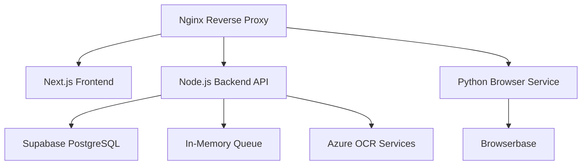

# CFDI Automation Platform - Deployment Guide

## Overview

This guide provides comprehensive instructions for deploying the **CFDI Automation Platform** using Docker containers. The platform consists of multiple microservices designed for Mexican CFDI 4.0 invoice automation.

## Architecture



### Services

| Service | Technology | Port | Purpose |
|---------|------------|------|---------|
| **Frontend** | Next.js 15 + React 19 | 3000 | User interface and dashboard |
| **Backend API** | Node.js + Express | 8000 | RESTful API and WebSocket server |
| **Python Browser** | FastAPI + browser-use | 9000 | Browser automation engine |
| **Nginx** | Nginx Alpine | 80/443 | Reverse proxy and load balancer |

## Prerequisites

### System Requirements

- **OS**: Linux, macOS, or Windows with WSL2
- **CPU**: 2+ cores recommended (4+ for production)
- **RAM**: 8GB minimum (16GB recommended for production)
- **Storage**: 20GB+ available disk space
- **Network**: Stable internet connection for external services

### Software Dependencies

- **Docker**: 24.0+ 
- **Docker Compose**: 2.20+
- **Git**: For cloning the repository
- **curl**: For health checks

### External Services

1. **Supabase Account**
   - PostgreSQL database with Row-Level Security
   - Authentication service
   - Real-time subscriptions

2. **Browserbase Account** (Optional but recommended)
   - Isolated browser sessions
   - Live view capabilities
   - Session management

3. **OpenAI API Key**
   - GPT models for browser automation
   - Supports latest models including GPT-5 Nano

4. **Azure Document Intelligence** (Optional for OCR)
   - Receipt text extraction
   - Form recognition

## Quick Start

### 1. Clone Repository

```bash
git clone https://github.com/your-username/facturacion_agent.git
cd facturacion_agent
```

### 2. Configure Environment

```bash
# Copy environment template
cp docker.env.template docker.env

# Edit configuration (see Configuration section)
nano docker.env
```

### 3. Deploy with Script

```bash
# Make deployment script executable
chmod +x scripts/deploy.sh

# Run deployment
./scripts/deploy.sh
```

### 4. Access Application

- **Frontend**: http://localhost
- **API Documentation**: http://localhost:8000/docs
- **Python Service Docs**: http://localhost:9000/docs

## Manual Deployment

### Step 1: Environment Configuration

Create your `docker.env` file from the template:

```bash
cp docker.env.template docker.env
```

#### Required Configuration

Update these critical environment variables:

```env
# Supabase Configuration
SUPABASE_URL=https://your-project-id.supabase.co
SUPABASE_ANON_KEY=your_64_character_anon_key
SUPABASE_SERVICE_ROLE_KEY=your_64_character_service_key

# Security
JWT_SECRET=your_32_character_minimum_secret
SESSION_SECRET=your_32_character_minimum_secret

# AI Services
OPENAI_API_KEY=sk-your_openai_key
BROWSERBASE_API_KEY=your_browserbase_key
BROWSERBASE_PROJECT_ID=your_browserbase_project_id

# Frontend URLs
NEXT_PUBLIC_SUPABASE_URL=https://your-project-id.supabase.co
NEXT_PUBLIC_SUPABASE_ANON_KEY=your_64_character_anon_key
NEXT_PUBLIC_API_URL=http://localhost/api
```

### Step 2: Build and Deploy

```bash
# Build all services
docker compose build

# Start services in detached mode
docker compose up -d

# Check service status
docker compose ps

# View logs
docker compose logs -f
```

### Step 3: Health Verification

```bash
# Check health endpoints
curl http://localhost/health          # Nginx
curl http://localhost:8000/health     # Backend API
curl http://localhost:9000/health     # Python Service

# Check frontend
curl http://localhost:3000
```

## Production Deployment

### Security Hardening

1. **SSL/TLS Configuration**

```nginx
# Add SSL certificates to nginx/ssl/
server {
    listen 443 ssl http2;
    ssl_certificate /etc/nginx/ssl/cert.pem;
    ssl_certificate_key /etc/nginx/ssl/key.pem;
    # ... SSL configuration
}
```

2. **Environment Security**

```env
# Production environment
NODE_ENV=production
DEBUG_MODE=false
VERBOSE_LOGGING=false

# Strong secrets
JWT_SECRET=your_production_jwt_secret_64_chars_minimum
SESSION_SECRET=your_production_session_secret_64_chars_minimum

# Secure CORS
CORS_ORIGINS=https://your-domain.com
```

3. **Container Security**

```yaml
# docker-compose.prod.yml
services:
  frontend:
    read_only: true
    cap_drop:
      - ALL
    security_opt:
      - no-new-privileges:true
```

### Performance Optimization

1. **Resource Limits**

```yaml
services:
  backend_api:
    deploy:
      resources:
        limits:
          memory: 2G
          cpus: '1.0'
        reservations:
          memory: 512M
          cpus: '0.5'
```

2. **Monitoring Setup**

```env
# Enable monitoring
ENABLE_METRICS=true
ENABLE_PERFORMANCE_MONITORING=true
LOG_LEVEL=info
```

### Scaling Configuration

```bash
# Scale services
docker compose up -d --scale backend_api=3 --scale python_browser=2

# Load balancer configuration in nginx
upstream backend_api {
    server backend_api_1:8000;
    server backend_api_2:8000;
    server backend_api_3:8000;
}
```

## Troubleshooting

### Common Issues

#### Service Not Starting

```bash
# Check service logs
docker compose logs [service-name]

# Check resource usage
docker stats

# Restart specific service
docker compose restart [service-name]
```

#### Database Connection Issues

```bash
# Verify Supabase credentials
curl -H "Authorization: Bearer $SUPABASE_ANON_KEY" \
     "$SUPABASE_URL/rest/v1/"

# Check network connectivity
docker compose exec backend_api ping supabase.co
```

#### Browser Automation Failures

```bash
# Check Python service logs
docker compose logs python_browser

# Verify Browserbase credentials
curl -H "X-BB-API-Key: $BROWSERBASE_API_KEY" \
     https://www.browserbase.com/v1/sessions

# Check browser resources
docker compose exec python_browser ps aux | grep chrome
```

#### Memory Issues

```bash
# Check container memory usage
docker stats --no-stream

# Increase memory limits in docker-compose.yml
deploy:
  resources:
    limits:
      memory: 4G
```

### Health Check Commands

```bash
# Comprehensive health check
curl -s http://localhost/health | jq
curl -s http://localhost:8000/health/detailed | jq
curl -s http://localhost:9000/health | jq

# Service-specific checks
docker compose exec backend_api node -e "console.log('Backend OK')"
docker compose exec python_browser python -c "print('Python Service OK')"
```

### Log Analysis

```bash
# Real-time logs for all services
docker compose logs -f

# Service-specific logs
docker compose logs -f backend_api
docker compose logs -f python_browser

# Log files (if enabled)
ls -la logs/
tail -f logs/backend.log
tail -f logs/python-browser.log
```

## Maintenance

### Backup Procedures

```bash
# Create backup directory
mkdir -p backups/$(date +%Y-%m-%d)

# Backup environment file
cp docker.env backups/$(date +%Y-%m-%d)/

# Export Docker volumes
docker run --rm -v cfdi_automation_backend_data:/data \
    -v $(pwd)/backups:/backup alpine \
    tar czf /backup/backend_data_$(date +%Y%m%d).tar.gz -C /data .
```

### Updates and Upgrades

```bash
# Update container images
docker compose pull

# Rebuild and restart
docker compose build --no-cache
docker compose up -d

# Clean up old images
docker image prune -f
```

### Monitoring and Alerts

```bash
# Resource monitoring
docker stats --no-stream > monitoring/stats_$(date +%Y%m%d_%H%M).log

# Health check monitoring (add to crontab)
*/5 * * * * curl -f http://localhost/health || echo "Alert: Service down" | mail admin@company.com
```

## Advanced Configuration

### Custom Domain Setup

1. **DNS Configuration**
```bash
# Point your domain to server IP
your-domain.com    A    YOUR_SERVER_IP
api.your-domain.com A   YOUR_SERVER_IP
```

2. **SSL Certificate**
```bash
# Using Let's Encrypt
certbot certonly --standalone -d your-domain.com
cp /etc/letsencrypt/live/your-domain.com/* nginx/ssl/
```

3. **Environment Update**
```env
NEXT_PUBLIC_API_URL=https://api.your-domain.com
CORS_ORIGINS=https://your-domain.com
```

### Load Balancing

```yaml
# docker-compose.prod.yml
services:
  backend_api:
    deploy:
      replicas: 3
  
  nginx:
    volumes:
      - ./nginx/nginx-lb.conf:/etc/nginx/nginx.conf
```

### Database Migrations

```bash
# Run database migrations
docker compose exec backend_api npm run migrate

# Seed initial data
docker compose exec backend_api npm run seed
```

## Performance Benchmarks

### Expected Performance

| Metric | Development | Production |
|--------|-------------|-----------|
| **Frontend Load Time** | < 2s | < 1s |
| **API Response Time** | < 200ms | < 100ms |
| **Browser Task Duration** | 30-120s | 15-60s |
| **Concurrent Users** | 10+ | 100+ |
| **Memory Usage** | 4-6GB | 8-12GB |

### Load Testing

```bash
# Install testing tools
npm install -g artillery

# Run load tests
artillery run tests/load-test.yml

# Monitor during load test
watch -n 1 'docker stats --no-stream'
```

## Support and Troubleshooting

### Debug Mode

```env
# Enable debug mode (development only)
DEBUG_MODE=true
VERBOSE_LOGGING=true
LOG_LEVEL=debug
```

### Community Support

- **Documentation**: Check README.md and project docs
- **Issues**: Submit GitHub issues with logs
- **Discussions**: Use GitHub discussions for questions

### Professional Support

For enterprise deployments, consider:
- Custom deployment configurations
- Performance optimization
- Security audits
- 24/7 monitoring setup

---

## Summary

This deployment guide covers:

✅ **Complete containerization** with Docker Compose  
✅ **Production-ready security** configurations  
✅ **Automated deployment scripts** for easy setup  
✅ **Comprehensive monitoring** and health checks  
✅ **Scalable architecture** with load balancing  
✅ **Detailed troubleshooting** guides  

The CFDI Automation Platform is now ready for production deployment with enterprise-grade reliability and security.
