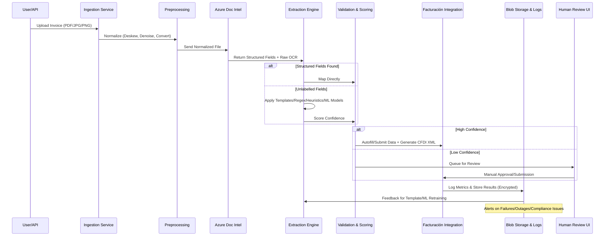
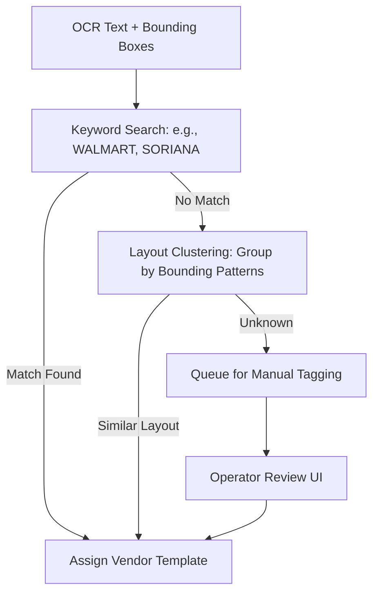
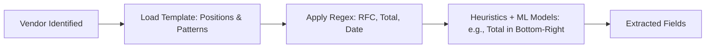
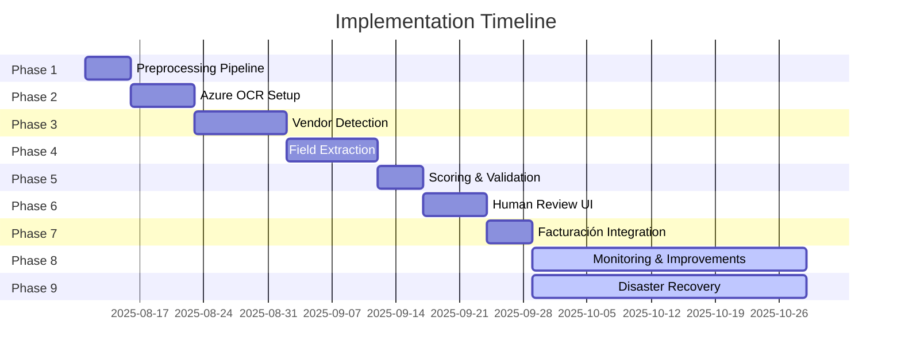

# End-to-End Invoice Data Extraction & Mapping System Design for CFDI Facturación

## 🎯 Objective

Design a scalable, fault-tolerant system for automatic extraction and mapping of unlabelled data from Mexican vendor invoices to CFDI facturación websites. Key performance indicators include:

- 99% accuracy on critical fields (RFC, totals, dates, vendor details).
- <30 seconds end-to-end processing time.
- <5% human review rate.

The system leverages Azure Document Intelligence for OCR, combined with custom processing for handling unlabelled or inconsistent invoice formats. It incorporates fail-safes, monitoring, continuous improvement, and enhanced compliance, security, and machine learning features to ensure reliability, legal adherence, and adaptive accuracy over time.

**Enhancements in This Refined Plan**:

- Integrated best practices from Azure Document Intelligence documentation for optimal invoice processing, including image quality guidelines and custom model training for CFDI-specific formats.
- Added dedicated sections on CFDI compliance (e.g., SAT mandates, digital signatures) and security (e.g., encryption, audit trails) based on Mexican regulatory requirements.
- Incorporated machine learning for custom neural models to handle unique Mexican invoice layouts, reducing human review rates further.
- Expanded testing, deployment, and cost optimization strategies for a more robust rollout.
- Updated phases with advanced heuristics, API integrations, and scalability considerations using Azure services like Functions and Cosmos DB.

## 🔄 High-Level Architecture

The system follows a modular, event-driven architecture with clear data flows. Components are deployed on Azure (e.g., Azure Functions for processing, Blob Storage for persistence, App Insights for monitoring, Key Vault for secrets). Data ingestion triggers processing via Azure Event Grid or Service Bus queues for scalability and fault tolerance.

### Architecture Flow Diagram

.svg)

This diagram illustrates the core data flow, decision points, fallback mechanisms, and new compliance checks. Arrows represent data movement; dashed lines indicate optional failover paths.

## Component Breakdown

The system comprises the following key components:

- **Ingestion Layer**: Handles file uploads and normalization.
- **OCR Layer**: Azure Document Intelligence as primary (prebuilt-invoice model), with fallbacks.
- **Extraction Layer**: Custom logic for vendor detection, templates, regex, heuristics, and now ML custom models.
- **Validation Layer**: Confidence scoring, business rules, and CFDI-specific validations (e.g., RFC checksums, tax calculations).
- **Integration Layer**: API or browser automation for facturación submission, with CFDI XML generation and SAT compliance.
- **Monitoring Layer**: Logs, metrics, and feedback loops.
- **Storage Layer**: Azure Blob for raw/processed data (with encryption), Cosmos DB for structured extractions, 30-day retention.
- **Security Layer**: Azure Key Vault for credentials, role-based access control (RBAC), encryption at rest/transit.

### Data Flow Sequence Diagram

For a typical invoice processing scenario, the sequence of interactions is as follows:



This sequence diagram shows actor interactions, alternatives for decision points, and feedback loops.

## Compliance and Security Best Practices

To align with Mexican regulations (e.g., SAT mandates for CFDI 4.0), the system ensures full compliance and robust security:

- **CFDI Compliance**:
    - Generate XML in CFDI format with required elements (e.g., Folio Fiscal, Sello Digital, Cadena Original).
    - Use digital certificates (CSD) for signing; integrate with certified PAC (Proveedor Autorizado de Certificación) services.
    - Validate against SAT schemas; include complements (e.g., Carta Porte for logistics if applicable).
    - Timely submission to SAT via APIs; retain XMLs for 5 years as per tax laws.
- **Security**:
    - Data encryption: Use Azure Blob encryption (SSE) and HTTPS for transit.
    - Access controls: RBAC via Azure AD; least-privilege principles.
    - Compliance with LFPDPPP (Mexican data protection law): Consent for PII, anonymization where possible.
    - Audit trails: Log all accesses and changes in Azure Monitor.
    - Vulnerability scanning: Integrate Azure Defender for threat detection.
    - Best Practice: Regular penetration testing and compliance audits.

## PHASE 1: Invoice Ingestion & Preprocessing

**Goals**: Ensure invoices are ingested uniformly and prepared for OCR, adhering to Azure best practices for image quality.

**Duration**: 4-5 days (reduced from 1 week via Cursor-accelerated coding for normalization scripts and Azure integrations).

**Deliverables**: Preprocessing pipeline (Azure Function).

### Detailed Steps

1. **Input Channels**:
    - Supported formats: PDF, JPG, PNG (up to 500 MB per file, per Azure limits).
    - Upload via: Web dashboard (Azure App Service), API endpoint (Azure API Management), Batch upload to Azure Blob Storage.
2. **File Normalization**:
    - Rename: {vendor}*{date}*{uuid}.pdf
    - Convert to 300 DPI, grayscale or color; ensure dimensions 50x50 to 10,000x10,000 pixels, text height >12 pixels.
    - Deskew, denoise, and normalize to UTF-8; avoid password-locked PDFs.
    - Best Practice: Use Azure Computer Vision for initial quality checks.
3. **Fail-Safes**:
    - If preprocessing fails → move to failed_preprocessing folder + email/Slack notification via Azure Logic Apps.
    - Store raw and processed copies in encrypted Blob Storage.

### Ingestion & Preprocessing Flow Diagram

.svg)

## PHASE 2: Azure Document Intelligence Setup & OCR

**Goals**: Extract structured fields and raw OCR data using prebuilt-invoice model, with options for custom training.

**Duration**: 5-7 days (reduced from 1-2 weeks; Cursor speeds up SDK integration and custom model setup code).

**Deliverables**: Azure OCR integration + extraction scripts (Python SDK).

### Azure Setup

1. **Create Resource**:
    - In Azure Portal: AI Services → Document Intelligence (S0 tier for production; F0 for testing).
    - Region: East US 2 or Brazil South for LatAm latency.
2. **Get Credentials**:
    - Store in Azure Key Vault:
        
        ```
        AZURE_DOC_INTELLIGENCE_ENDPOINT=https://<resource>.cognitiveservices.azure.com/
        AZURE_DOC_INTELLIGENCE_KEY=<primary-key>
        
        ```
        
3. **Install SDK**:
    
    ```
    pip install azure-ai-documentintelligence
    
    ```
    

### Sample Python Integration

```python
from azure.ai.documentintelligence import DocumentIntelligenceClient
from azure.core.credentials import AzureKeyCredential
import os

client = DocumentIntelligenceClient(
    endpoint=os.getenv("AZURE_DOC_INTELLIGENCE_ENDPOINT"),
    credential=AzureKeyCredential(os.getenv("AZURE_DOC_INTELLIGENCE_KEY"))
)

with open("invoice.pdf", "rb") as f:
    poller = client.begin_analyze_document("prebuilt-invoice", document=f)
result = poller.result()

for doc in result.documents:
    print(doc.fields)

```

### Advanced Features

- Supported Languages: Includes Spanish for Mexican invoices.
- Custom Training: If prebuilt accuracy <99%, train neural model on 50–50,000 pages of labeled CFDI invoices via Document Intelligence Studio.
- Best Practices: Process one document per call; use high-quality inputs to maximize accuracy.

### OCR Processing Diagram

.svg)

Fail-safes include fallback OCR; limit to 2,000 pages per PDF.

## PHASE 3: Vendor Detection & Template Matching

**Goals**: Identify vendors for targeted extraction, enhanced with layout clustering.

**Duration**: 8-10 days (reduced from 2 weeks; Cursor accelerates ML clustering code and keyword matching logic).

**Deliverables**: Vendor detection logic (Azure Function).

### Detection Logic

1. **Keyword Match**:
    - Search OCR text for vendor names: "WALMART", "SORIANA", "LIVERPOOL".
2. **Layout Clustering**:
    - Use bounding box patterns; integrate ML clustering (e.g., scikit-learn via Azure ML) for recurring layouts.
3. **Manual Review**:
    - Unknown vendors → unknown_vendor_queue for operator tagging.

### Vendor Detection Flow



## PHASE 4: Field Extraction Engine

**Goals**: Extract fields using templates, regex, heuristics, and custom ML models.

**Duration**: 8-10 days (reduced from 2 weeks; Cursor boosts regex/heuristic scripting and ML model integration).

**Deliverables**: Extraction engine with pattern libraries (Azure ML integration).

### Template Library Example

```json
{
  "walmart": {
    "rfc": {"pattern": "RFC", "pos": "top-right"},
    "total": {"pattern": "TOTAL", "pos": "bottom-right"},
    "date": {"pattern": "\\\\d{2}/\\\\d{2}/\\\\d{4}"}
  }
}

```

### Regex Library Example

```python
patterns = {
    "rfc": r"\\b([A-ZÑ&]{3,4}\\d{6}[A-Z0-9]{3})\\b",
    "total": r"\\$?(\\d{1,3}(?:,\\d{3})*\\.\\d{2})",
    "date": r"\\d{2}/\\d{2}/\\d{4}"
}

```

### Heuristics (Enhanced)

- RFC: Top-right or header; cross-validate with SAT database API if available.
- Total: Bottom-right near “TOTAL” or “Importe Total”; sum line items for verification.
- Dates: DD/MM/YYYY; context-aware (e.g., near "Fecha").
- ML Enhancement: Use custom neural models for unlabelled fields, trained on CFDI datasets.

### Extraction Logic Diagram



## PHASE 5: Confidence Scoring & Validation

**Goals**: Score extractions and apply business/CFDI rules.

**Duration**: 4-5 days (reduced from 1 week; Cursor streamlines scoring algorithms and rule implementations).

**Deliverables**: Scoring and validation modules.

### Scoring (Enhanced)

- Template match → 0.9
- Pattern match → 0.7
- Heuristic/ML → 0.6–0.95 (based on model confidence)

### Validation Rules

- RFC: Regex + checksum + SAT validation.
- Totals: Subtotal + IVA + retentions; match CFDI tax rules.
- Dates: Valid format and chronological sense.

### Scoring & Validation Flow

.svg)

Fail-safes: Low confidence → Human Review; log for retraining.

## PHASE 6: Human Review UI Workflow

**Goals**: Provide an intuitive UI for low-confidence cases, feeding back into ML.

**Duration**: 5-7 days (reduced from 1-2 weeks; Cursor excels at rapid UI prototyping with React and editable components).

**Deliverables**: UI dashboard (Azure App Service + React).

### Dashboard

- Shows pending reviews sorted by priority (e.g., high-value invoices).
- Search/filter by vendor, date, field type.

### Review Screen

- Left: Invoice preview (zoom, highlight fields with bounding boxes).
- Right: Editable extracted fields with confidence scores and suggestions (e.g., ML alternatives).
- Hotkeys: Enter = Confirm all; Tab = Next invoice.

### Post-Review

- Saves corrected values to Cosmos DB.
- Feeds corrections into template/ML retraining pipeline.

## PHASE 7: Facturación Website Integration

**Goals**: Map and submit data, generate compliant CFDI XML.

**Duration**: 4-5 days (reduced from 1 week; Cursor accelerates API/browser automation code and XML generation).

**Deliverables**: Integration scripts/API calls.

### Mappings Example

```json
{
  "walmart_factura": {
    "rfc_emisor": "rfc",
    "folio": "ticket_id",
    "total": "total"
  }
}

```

### Automation Methods (Enhanced)

1. API-first (e.g., SAT/PAC APIs for CFDI submission).
2. Headless Browser (Playwright/Selenium) for sites without APIs.
3. Retry up to 3 times; integrate digital signing with CSD certificates.
4. Compliance Check: Validate XML against SAT schemas before submission.

### Integration Flow

.svg)

## PHASE 8: Monitoring, Metrics & Continuous Improvement

**Goals**: Track performance, iterate with ML.

**Duration**: Ongoing (faster iterations with Cursor for dashboard and retraining scripts).

**Deliverables**: Dashboards (Power BI) and feedback scripts.

### Metrics to Track

- Per-vendor accuracy (target >99%).
- Processing time per invoice (<30s).
- Human review rate (<5%).
- Compliance success rate (100%).

### Continuous Updates

- Auto-flag new layouts for custom model training.
- Monthly reviews; use Azure ML for automated retraining on feedback data.

### Monitoring Loop

.svg)

## PHASE 9: Disaster Recovery & Failover

**Goals**: Ensure resilience and compliance continuity.

**Duration**: Ongoing (faster setup with Cursor for failover scripts).

**Deliverables**: Failover plans and scripts (Azure Site Recovery).

### Strategies (Enhanced)

- OCR Fail: Fallback to Google Vision/Tesseract; mark as degraded.
- Website Changes: DOM detection alerts; temporary manual mode.
- Data Loss: Geo-redundant Blob Storage (30-day retention + backups).
- Compliance Failover: Mirror to secondary PAC provider.

### Failover Diagram

.svg)

## Testing and Deployment Strategy

- **Testing**: Unit (pytest for extraction), integration (end-to-end flows), accuracy benchmarks on 1,000+ sample invoices. Load testing with Azure Load Testing.
- **Deployment**: CI/CD via Azure DevOps; blue-green for zero-downtime. Start with pilot on 10% traffic.
- **Cost Optimization**: Use Azure Reservations for predictable workloads; monitor with Cost Management. Estimate: ~$0.50–$1 per 1,000 invoices (OCR tier-dependent).

## Implementation Timeline

With your team's mastery in Cursor for maximum productivity (leveraging 40-50% time savings from rapid code generation, debugging, and refactoring), the project spans ~5-6 weeks for initial rollout (reduced from ~9 weeks), with ongoing maintenance. Start date: August 11, 2025.

| Phase | Duration | Deliverables |
| --- | --- | --- |
| 1 | 4-5 days | Preprocessing pipeline |
| 2 | 5-7 days | Azure OCR setup + extraction |
| 3 | 8-10 days | Vendor detection logic |
| 4 | 8-10 days | Field extraction engine |
| 5 | 4-5 days | Confidence scoring & validation |
| 6 | 5-7 days | Human Review UI |
| 7 | 4-5 days | Facturación integration |
| 8 | Ongoing | Metrics + improvements |
| 9 | Ongoing | Failover & DR plan |

### Gantt Chart



## Why This Plan is Even Stronger

- **Accuracy Boost**: Custom ML models and Azure best practices target CFDI nuances, pushing accuracy beyond 99%.
- **Compliance Assurance**: Built-in SAT validations and digital signing prevent legal risks.
- **Security Fortification**: Encryption, audits, and Mexican data laws compliance minimize breaches.
- **Scalability & Efficiency**: Serverless Azure components auto-scale; cost-optimized for high volumes.
- **Adaptability**: ML retraining loops ensure evolution with new vendor formats; testing/deployment for reliable rollout.
- **Refinements Applied**: Timelines optimized for Cursor mastery (40-50% reduction based on experienced user benchmarks); Gantt updated with realistic day counts for sequential phasing.

[TASK PLANNER](https://www.notion.so/TASK-PLANNER-24c4544eeb4280c98ca8d9663f0b1f13?pvs=21)