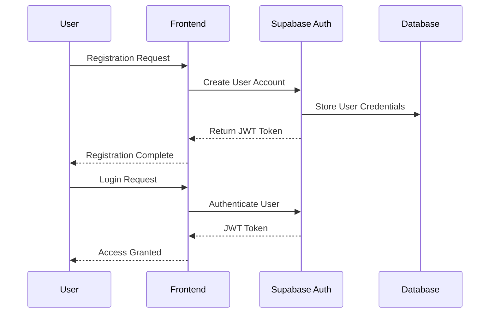
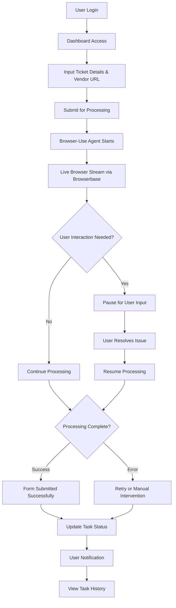
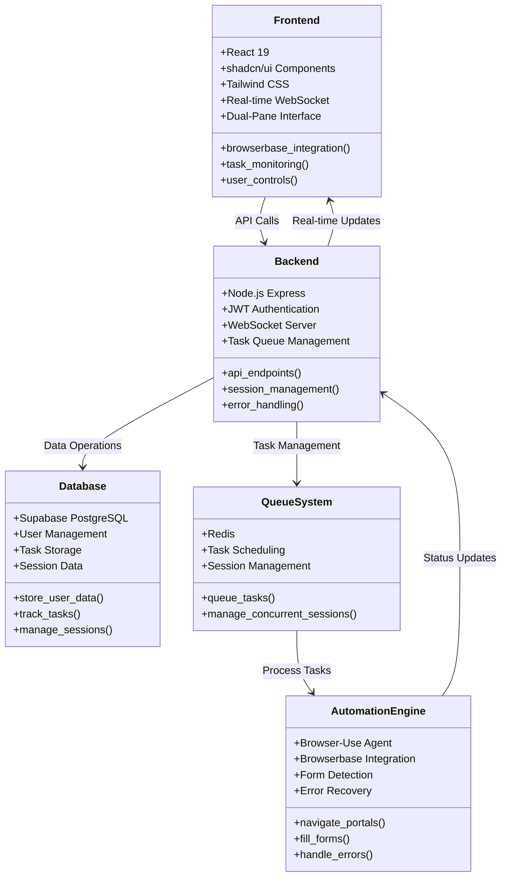
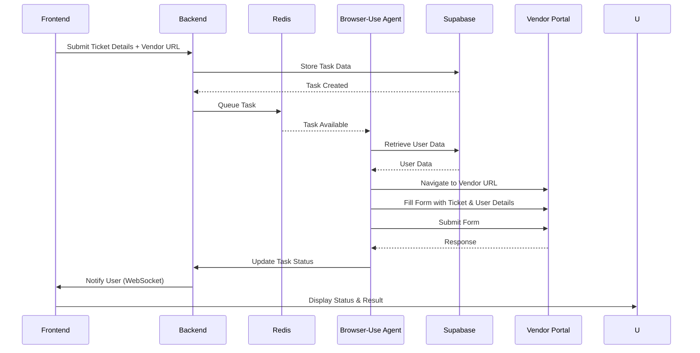
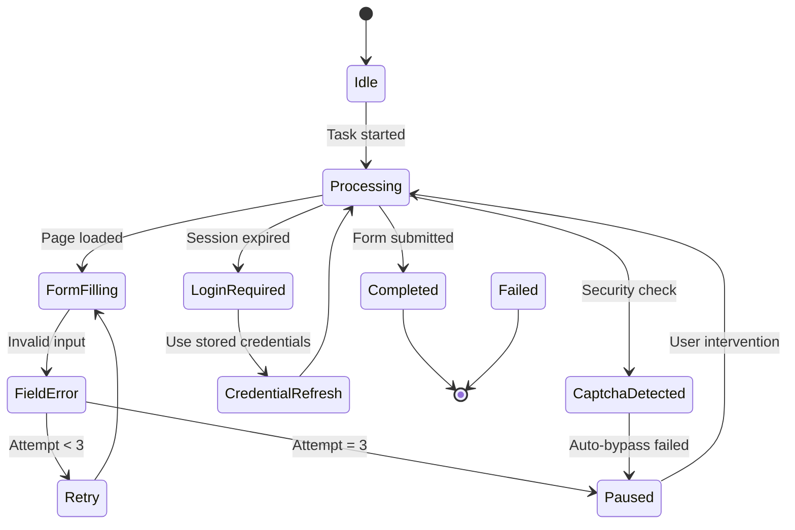
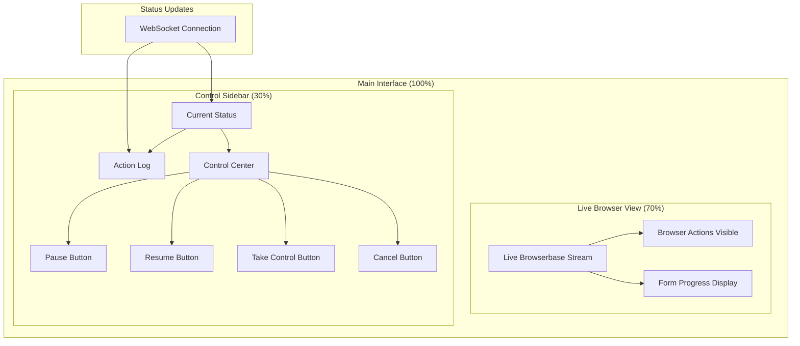
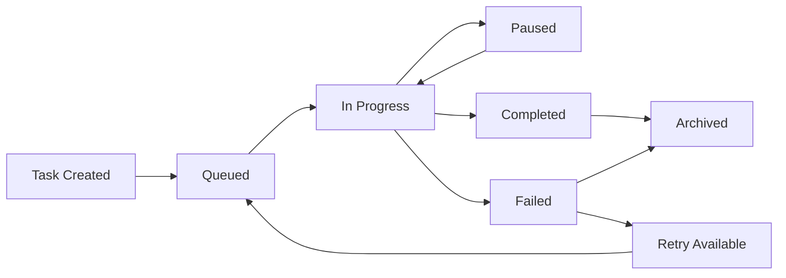
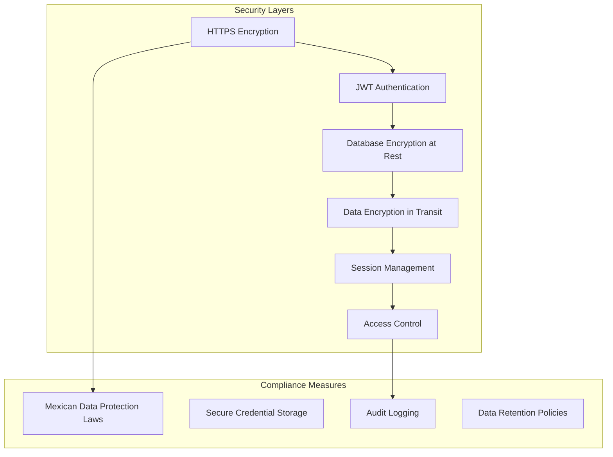

# Application Flow Documentation

---

## **General Description**

This SaaS application automates the manual process of filling out Mexican CFDI 4.0 invoicing forms across vendor portals using an AI-powered **Browser-Use agent**. The system is designed to improve efficiency and transparency for small businesses and freelancers by eliminating repetitive form submission tasks while providing real-time monitoring and user intervention capabilities.

**Primary Objectives:**

- Automate CFDI 4.0 form completion on vendor portals.
- Provide real-time transparency through live browser streaming.
- Enable user intervention when obstacles arise (CAPTCHA, login issues).
- Improve operational efficiency by reducing manual form filling.
- Ensure secure, scalable multi-tenant architecture.

**Key Benefits:**

- Reduces time spent on repetitive administrative tasks.
- Provides full transparency with live browser streaming.
- Supports any vendor portal through generalized automation.
- Offers secure multi-tenant support with JWT authentication.
- Enables real-time monitoring and control.

---

## **User Registration & Authentication**

The application uses JWT-based authentication through Supabase for secure multi-tenant access. Users can register, authenticate, and manage their credentials securely.

**Authentication Flow:**

**User Data Management:**

- User details (RFC, address, contact information) are securely stored in Supabase.
- Session management through JWT tokens.
- Multi-tenant support for business accounts.
- Secure credential storage for vendor portal access.

---

## **Core Application Workflow**

The main application flow follows a streamlined process from task submission to completion with real-time monitoring.

**Complete User Journey:**

---

## **System Architecture**

The application follows a modern microservices architecture with clear separation of concerns between frontend, backend, and automation services.

**High-Level Architecture:**

---

## **Data Processing Flow**

The system processes user data and ticket information through a secure pipeline to automate form submission.

**Data Processing Sequence:**

---

## **Error Handling & Recovery**

The system implements comprehensive error handling with automatic retries and user intervention options.

**Error Handling State Machine:**

**Error Types & Responses:**

- **CAPTCHA Detection**: Pause automation, request user intervention.
- **Login Issues**: Prompt user for manual authentication.
- **Form Validation Errors**: Automatic retry with adjusted parameters.
- **Network Timeouts**: Retry with exponential backoff.
- **Unknown Errors**: Log details, attempt retry, escalate if persistent.

---

## **Real-Time Interface Components**

The dual-pane interface provides comprehensive real-time monitoring and control capabilities.

**Interface Layout:**

**Real-Time Features:**

- Live browser streaming via Browserbase integration.
- WebSocket-based status updates in Spanish.
- Interactive session controls (pause/resume/takeover).
- Continuous action logging with timestamps.
- Progress indicators for form completion stages.

---

## **Task Management System**

The application tracks and manages automation tasks with comprehensive status monitoring.

**Task Lifecycle:**

**Task Status Categories:**

- **Queued**: Task waiting for available agent.
- **In Progress**: Active automation in process.
- **Paused**: User intervention required.
- **Completed**: Form successfully submitted.
- **Failed**: Automation unsuccessful after retries.
- **Archived**: Historical record maintained.

---

## **Security & Compliance Framework**

The system implements comprehensive security measures to protect user data and ensure compliance with Mexican data protection laws.

**Security Architecture:**

**Security Features:**

- End-to-end HTTPS encryption.
- JWT-based authentication with secure token management.
- Encrypted storage of sensitive user data and credentials.
- Secure session management with timeout controls.
- Comprehensive audit logging for compliance tracking.
- Regular security updates and vulnerability assessments.

---

## **Performance & Scalability Specifications**

**Performance Targets:**

- API response time: <200ms for standard operations.
- Session timeout: 3-minute global timeout per automation task.
- Action timeout: 10-second timeout per browser action.
- Concurrent sessions: Support for 10+ simultaneous automation tasks.

**Scalability Design:**

- Multi-tenant architecture supporting 1,000+ concurrent users.
- Redis-based queue management for efficient task distribution.
- Supabase database scaling for growing data volumes.
- Horizontal scaling capability for increased load.

**Monitoring & Reliability:**

- Continuous system health monitoring.
- Automatic retry logic (up to 3 attempts for transient errors).
- Daily backups with point-in-time recovery.
- 99.9% uptime target with redundancy measures.

---

## **Technical Integration Points**

**External Services:**

- **Browserbase**: Live browser streaming and control interface.
- **Supabase**: Database, authentication, and storage services.
- **Redis**: Task queuing and session management.
- **Browser-Use Agent**: Core automation engine for form filling.

**API Endpoints:**

- `POST /api/auth/login` - User authentication.
- `POST /api/task` - Submit new automation task.
- `GET /api/task/{id}/status` - Check task progress.
- `PUT /api/task/{id}/control` - Pause/resume/cancel task.
- `GET /api/dashboard` - User dashboard data.
- `WebSocket /ws/status` - Real-time status updates.

---

## **Future Enhancement Roadmap**

**Planned Features (Post-MVP):**

- Advanced task history with filtering and sorting.
- Invoice content verification through scraping.
- Multi-language support beyond Spanish.
- Integration with popular accounting software.
- Enterprise-level multi-tenant features.
- Advanced analytics and reporting capabilities.
- Mobile application for task monitoring.

**Technical Improvements:**

- Enhanced AI agent capabilities.
- Improved error prediction and prevention.
- Advanced security features.
- Performance optimization for larger scale operations.

---