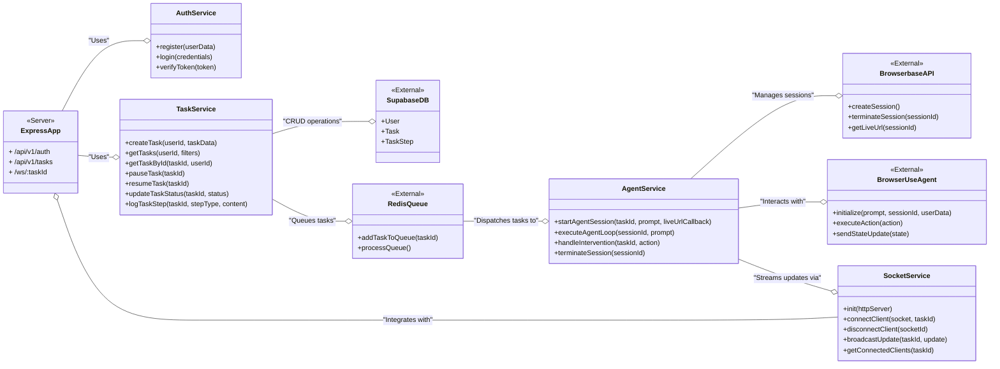
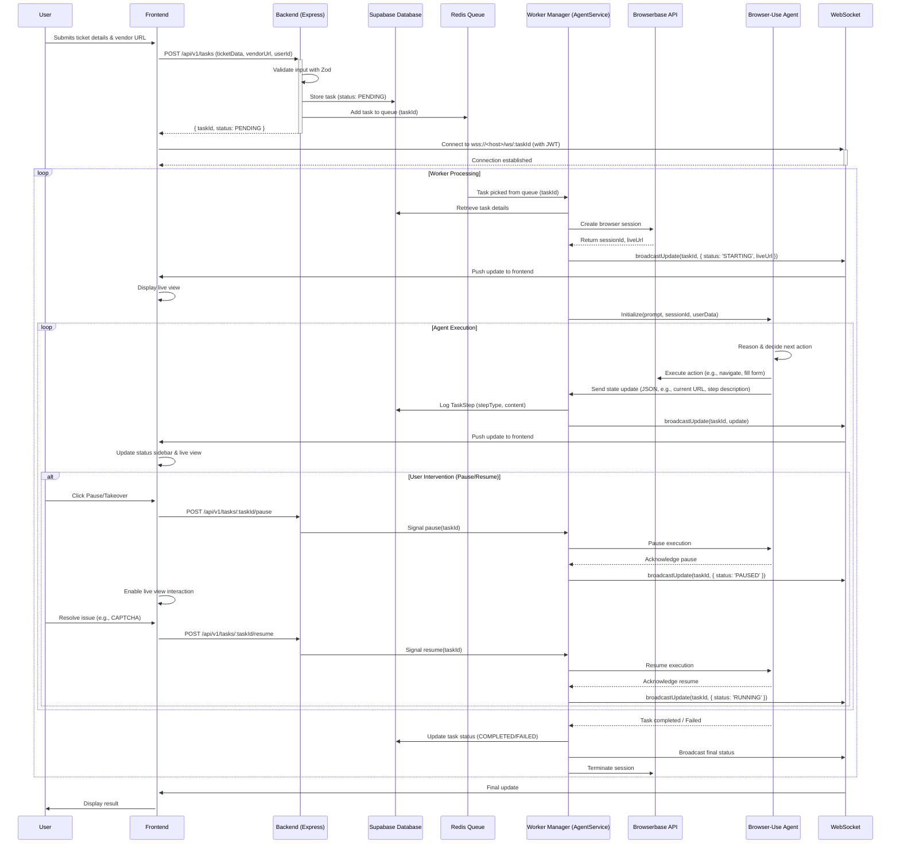
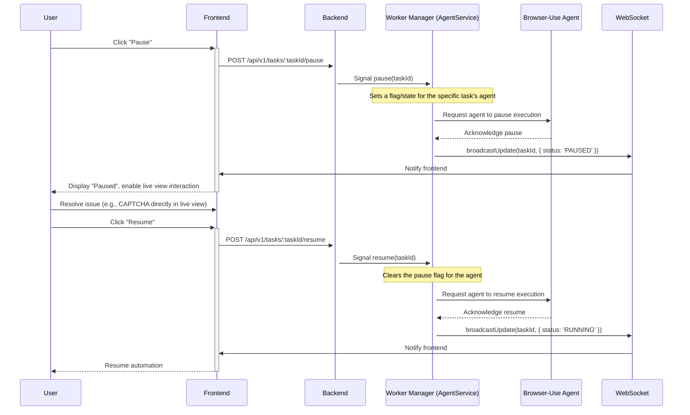
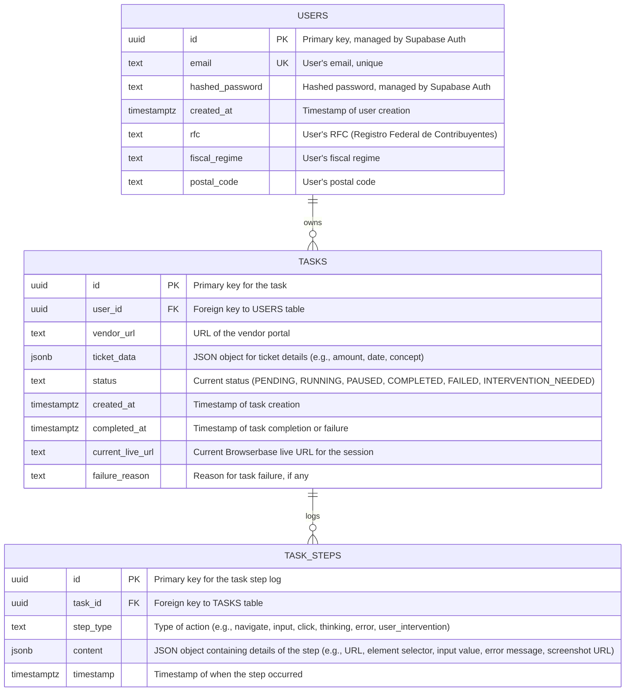

# BACKEND ARCHITECTURE Document

Below is the **final refined and comprehensive backend architecture documentation** tailored to your **Project Requirement Document** for the SaaS application automating CFDI 4.0 form submissions on vendor portals. This version synthesizes the strengths of the provided responses (Gemini, ChatGPT, and my previous Grok response) while ensuring all necessary components are included to kickstart backend development. It aligns with your specified technologies (Node.js/Express, Supabase, Browserbase, Browser-Use), incorporates in-scope features, and addresses scalability, security, and real-time requirements. The documentation is designed to provide a complete roadmap for immediate development.

---

## Backend Architecture Documentation

### **Introduction**

The backend is the backbone of the SaaS application, managing user authentication, task orchestration, real-time communication, and integration with the Browser-Use agent and Browserbase for live automation of CFDI 4.0 form submissions on vendor portals. It is built with a modular, scalable, and secure architecture to support multi-tenant usage, ensuring transparency and user control through live streaming and WebSocket updates. This documentation provides a complete foundation to start backend development, addressing all technical and operational needs.

### **Design Principles**

- **Modularity**: Separate concerns (e.g., authentication, task management, agent orchestration) for maintainability and independent development.
- **Scalability**: Leverage Redis for task queuing and Supabase for database scalability to handle growing user bases and concurrent tasks.
- **Real-Time**: Use WebSockets for live status updates and Browserbase for streaming interactive browser sessions.
- **Security**: Implement JWT authentication, data encryption, and compliance with Mexican data protection laws (e.g., Ley Federal de Protección de Datos Personales).
- **Extensibility**: Design for future enhancements (e.g., advanced task history, multi-language support) without major refactoring.
- **Observability**: Integrate logging, monitoring, and error tracking for operational visibility and quick issue resolution.

### **File Structure**

```
backend/
├── src/
│   ├── index.js             # Express app entry point (server startup)
│   ├── app.js               # Main Express application setup (middleware, routes)
│   ├── config/
│   │   ├── db.js            # Supabase client initialization and configuration
│   │   ├── redis.js         # Redis client configuration
│   │   └── env.js           # Environment variable loading and validation
│   ├── middleware/
│   │   ├── auth.js          # JWT authentication middleware
│   │   ├── validation.js    # Zod/Joi input validation middleware
│   │   └── errorHandler.js  # Centralized error handling middleware
│   ├── models/
│   │   ├── user.js          # User data access layer (Supabase interactions)
│   │   ├── task.js          # Task data access layer (Supabase interactions)
│   │   └── taskStep.js      # Task step log data access layer (Supabase interactions)
│   ├── routes/
│   │   ├── auth.js          # Authentication API routes
│   │   └── tasks.js         # Task management API routes
│   ├── services/
│   │   ├── authService.js   # User authentication business logic
│   │   ├── taskService.js   # Task creation, retrieval, and status management
│   │   ├── agentService.js  # Browser-Use agent orchestration with Browserbase
│   │   └── socketService.js # WebSocket connection management and broadcasting
│   ├── utils/
│   │   ├── logger.js        # Winston logging utility
│   │   ├── asyncHandler.js  # Async error wrapper utility
│   │   └── encryption.js    # Data encryption/decryption utility (AES-256)
│   └── ws/
│       └── taskSocket.js    # WebSocket server setup and task update handling
├── tests/                   # Unit and integration tests
│   ├── unit/
│   └── integration/
├── docker/
│   ├── Dockerfile           # Docker configuration for the backend
│   └── docker-compose.yml   # Docker Compose for local development (Redis, backend)
├── .env                     # Environment variables file (local development)
├── .env.example             # Example environment variables file
└── package.json             # Node.js dependencies and scripts

```

**Notes on File Structure**:

- **`app.js` separation**: Isolates Express app setup from `index.js` for cleaner testing and maintenance.
- **Test directory**: Added for unit and integration tests to ensure code quality.
- **Dockerfile**: Explicitly included for containerization.
- **Utilities**: Added `asyncHandler.js` for async error handling and `encryption.js` for security.

### **Class Diagram**



**Notes on Class Diagram**:

- Added detailed methods to reflect specific operations.
- Included external services (`SupabaseDB`, `RedisQueue`, `BrowserbaseAPI`, `BrowserUseAgent`) with their interaction points.
- Added `liveUrlCallback` to `startAgentSession` for dynamic live view updates.

### **Data Flow and Agent Orchestration**

The backend uses an event-driven workflow, integrating with Browser-Use and Browserbase. The sequence diagram below illustrates the process:



**Notes on Data Flow**:

- Added `Worker Manager (WM)` as part of `AgentService` to handle task queue processing.
- Included `userData` (RFC, fiscal regime, postal code) in `Initialize` call.
- Used `wss://` for secure WebSocket connections.
- Added `TaskStep` logging and session termination steps.

### **User Intervention Flow**



**Notes on User Intervention**:

- Detailed communication between `WM` and `BU` for pause/resume.
- WebSocket updates for status changes.

### **Database Schema**



**Notes on Database Schema**:

- `USERS`: Clarified `id` and `hashed_password` handling by Supabase Auth.
- `TASKS`: Added `current_live_url` and `failure_reason` for debugging and user experience.
- `TASK_STEPS`: Enhanced `step_type` and `content` examples.

### **API Endpoints**

| **Method** | **Endpoint** | **Description** | **Auth** | **Request Body/Query Params (Example)** | **Response (Example)** |
| --- | --- | --- | --- | --- | --- |
| POST | `/api/v1/auth/register` | Register a new user | None | `{ email: "user@example.com", password: "password123", rfc: "ABC123456XYZ", fiscal_regime: "601", postal_code: "03100" }` | `{ message: "User registered" }` |
| POST | `/api/v1/auth/login` | Login and return JWT | None | `{ email: "user@example.com", password: "password123" }` | `{ token: "jwt_token_string" }` |
| GET | `/api/v1/tasks` | List user tasks (paginated) | JWT | `?page=1&limit=10&status=all` | `[{ id, vendor_url, status, created_at, ... }]` |
| POST | `/api/v1/tasks` | Create a new task | JWT | `{ vendorUrl: "<https://vendor.com/invoice>", ticketData: { amount: 100, date: "2024-07-25", ... } }` | `{ taskId: "uuid", status: "PENDING" }` |
| GET | `/api/v1/tasks/:taskId` | Get task details and logs | JWT |  | `{ id, vendor_url, status, task_steps: [{ type, content, timestamp }], ... }` |
| POST | `/api/v1/tasks/:taskId/pause` | Pause a task | JWT |  | `{ message: "Task paused", status: "PAUSED" }` |
| POST | `/api/v1/tasks/:taskId/resume` | Resume a task | JWT |  | `{ message: "Task resumed", status: "RUNNING" }` |
| WS | `/ws/:taskId` | WebSocket for real-time updates | JWT |  | `JSON messages (status, logs, liveUrl)` |

**Notes on API Endpoints**:

- Added examples for request/response bodies for clarity.
- Included pagination/filters for `GET /api/v1/tasks`.
- Specified JWT on WebSocket connection.

### **Security Measures**

- **Authentication**: JWT with Supabase Auth, validated via middleware for all protected endpoints and WebSocket connections.
- **Authorization**: Use Supabase Row-Level Security (RLS) and backend UUID checks to restrict access to user-owned data.
- **Encryption**:
    - Passwords: Handled securely by Supabase Auth.
    - Sensitive Data (RFC, fiscal regime, postal code): Encrypt with AES-256 at rest (via `encryption.js`) and in transit with HTTPS/WSS.
- **Input Validation**: Strict validation with Zod for all API requests.
- **CORS**: Restrict to frontend domain(s) (e.g., `https://yourapp.com`) using Express middleware.
- **Logging**: Use Winston for errors, warnings, and audits, masking sensitive data.
- **Rate Limiting**: Apply `express-rate-limit` to authentication and task creation endpoints.
- **Dependency Security**: Regularly update dependencies with `npm audit`.
- **Helmet**: Add security headers to enhance protection.

### **Implementation Details**

### **Dependencies**

- `express`: Web server framework.
- `@supabase/supabase-js`: Supabase client for database and auth.
- `bullmq`: Robust task queuing with Redis (replacing raw `redis` for better job management).
- `ws`: WebSocket server.
- `jsonwebtoken`: JWT handling (if custom verification needed beyond Supabase).
- `zod`: Schema validation.
- `winston`: Logging.
- `axios`: HTTP client for Browserbase API.
- `dotenv`: Environment variable management.
- `express-rate-limit`: Rate limiting.
- `helmet`: Security headers.
- `compression`: GZIP compression.
- `bcryptjs`: Password hashing (if managing users outside Supabase).
- `pm2`: Process management for production.

### **Configuration**

- Use `dotenv` to load and validate environment variables in `config/env.js`.
- `.env.example`:
    
    ```
    NODE_ENV=development
    PORT=3000
    SUPABASE_URL=https://your-project-id.supabase.co
    SUPABASE_ANON_KEY=your-anon-key
    SUPABASE_SERVICE_ROLE_KEY=your-service-role-key
    REDIS_URL=redis://localhost:6379
    BROWSERBASE_API_KEY=your-browserbase-key
    JWT_SECRET=your_strong_jwt_secret
    ENCRYPTION_KEY=a_32_byte_secret_key_for_aes256
    CORS_ORIGIN=http://localhost:5173,<https://yourapp.com>
    LOG_LEVEL=info
    
    ```
    

### **Startup Steps**

1. **Initialize Express**: Set up `app.js` with middleware (CORS, rate limiting, validation, error handling) and register routes.
2. **Connect to Supabase**: Initialize client in `config/db.js`.
3. **Connect to Redis**: Initialize `bullmq` queue in `config/redis.js`.
4. **Launch WebSocket Server**: Bind `ws` to `httpServer` in `ws/taskSocket.js` via `socketService.init(httpServer)`.
5. **Start Task Workers**: Run a separate `bullmq` worker process to process tasks from the Redis queue, invoking `AgentService`.
6. **Start Express Server**: Call `app.listen()` in `index.js`.

### **Error Handling**

- **Centralized Error Handler (`middleware/errorHandler.js`)**: Logs with Winston and returns Spanish messages (e.g., “Error: Intenta de nuevo”).
- **Async Error Wrapper (`utils/asyncHandler.js`)**: Catches async errors in route handlers.
- **Retry Logic**: Use `bullmq` retries (e.g., 3 attempts with exponential backoff) for transient errors.
- **Custom Errors**: Define `AuthError`, `NotFoundError`, `ValidationError` classes.

### **Scalability and Deployment**

- **Docker Compose**:
    
    ```yaml
    version: '3.8'
    services:
      backend:
        build:
          context: .
          dockerfile: docker/Dockerfile
        ports:
          - "3000:3000"
        env_file:
          - .env
        depends_on:
          - redis
        command: sh -c "npm run start:server & npm run start:worker"
      redis:
        image: redis:7.2.0-alpine
        ports:
          - "6379:6379"
        command: redis-server --appendonly yes
        volumes:
          - redis_data:/data
    volumes:
      redis_data:
    
    ```
    
- **Dockerfile (docker/Dockerfile)**:
    
    ```
    FROM node:20-alpine
    WORKDIR /app
    COPY package*.json ./
    RUN npm install
    COPY . .
    EXPOSE 3000
    CMD ["npm", "start"]
    
    ```
    
- **Zeabur Deployment**: Deploy with auto-scaling based on CPU/memory and queue length. Use persistent storage for Supabase.
- **Worker Scaling**: Run multiple `bullmq` workers for concurrency.
- **Monitoring**: Integrate Sentry for errors, Prometheus/Grafana for metrics, and centralized logging (e.g., ELK stack).

### **Getting Started**

1. **Setup Environment**:
    - Clone repository: `git clone <repo-url>`
    - Navigate: `cd backend`
    - Install dependencies: `npm install`
    - Copy `.env.example` to `.env` and configure all variables.
2. **Run Locally**:
    - Start Docker Compose: `docker-compose up --build`
    - Run server: `npm run start:server` (e.g., `node src/index.js`)
    - Run worker: `npm run start:worker` (e.g., `node src/worker.js` with `bullmq` logic)
    - Define in `package.json`:
        
        ```json
        "scripts": {
          "start:server": "node src/index.js",
          "start:worker": "node src/worker.js",
          "start": "npm run start:server & npm run start:worker"
        }
        
        ```
        
3. **Test Endpoints**:
    - Use Postman/Insomnia:
        - `POST /api/v1/auth/register`
        - `POST /api/v1/auth/login` (get JWT)
        - `POST /api/v1/tasks` (with `Authorization: Bearer <JWT>`)
    - WebSocket: `wscat -c wss://localhost:3000/ws/:taskId --header "Authorization: Bearer <JWT>"`
4. **Integrate with Frontend**:
    - Update API base URL and WebSocket URL in React.
    - Embed `liveUrl` in `LiveBrowserView`.

### **Next Steps**

- **Develop Agent Prompts**: Create and test Browser-Use prompts for 2–3 vendor portals (e.g., Walmart, Soriana).
- **Error Recovery**: Design handling for unrecoverable errors and user interventions.
- **Load Testing**: Simulate 10+ concurrent tasks to optimize Redis and Supabase.
- **Security Audit**: Review encryption, RLS, and input validation.
- **CI/CD Pipeline**: Set up automated testing and deployment to Zeabur.

---

### **Final Notes**

This documentation provides everything needed to start backend development:

- **Complete File Structure**: Ready for coding and testing.
- **Dependencies**: All required packages listed with rationale.
- **Configuration**: Detailed `.env` setup for immediate configuration.
- **Startup Instructions**: Step-by-step guide to run locally.
- **Testing Guidance**: Endpoints and tools for validation.
- **Scalability and Deployment**: Docker and Zeabur setup included.