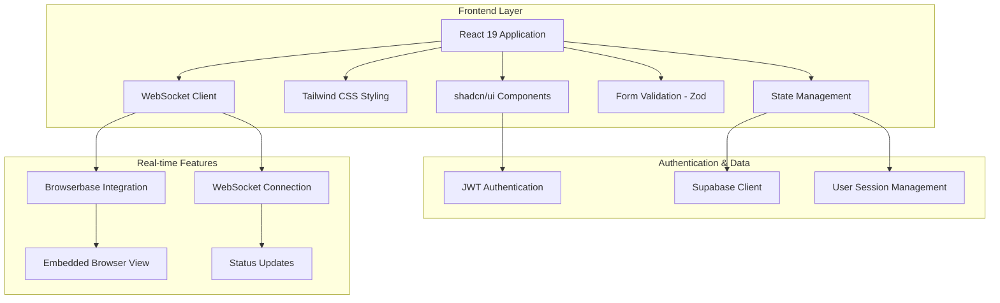
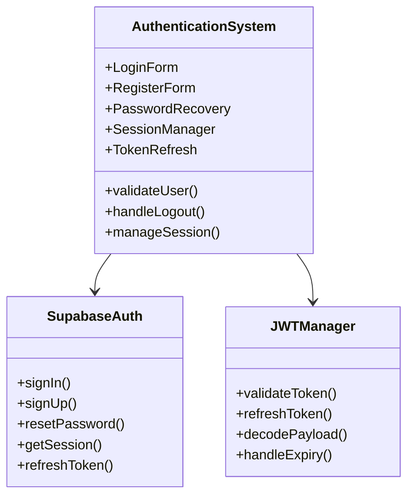
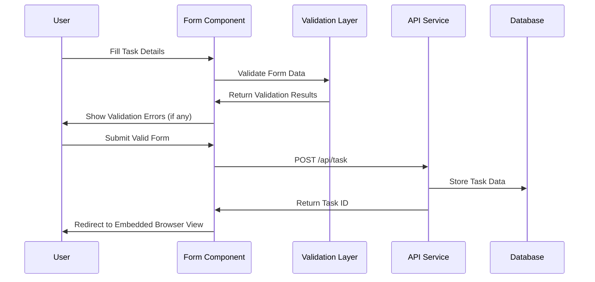
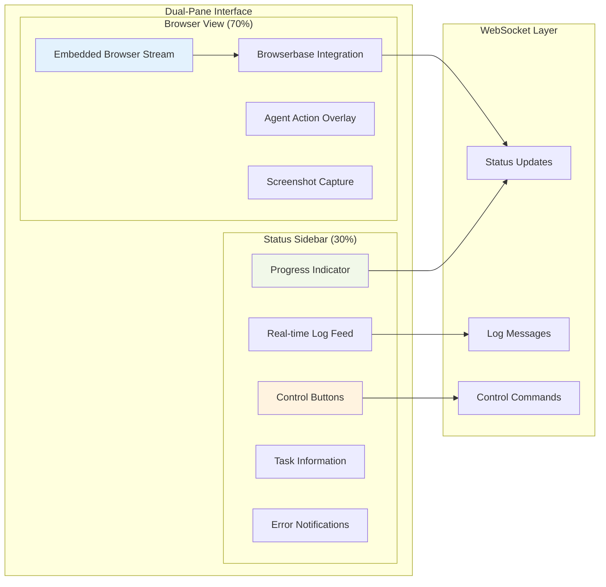
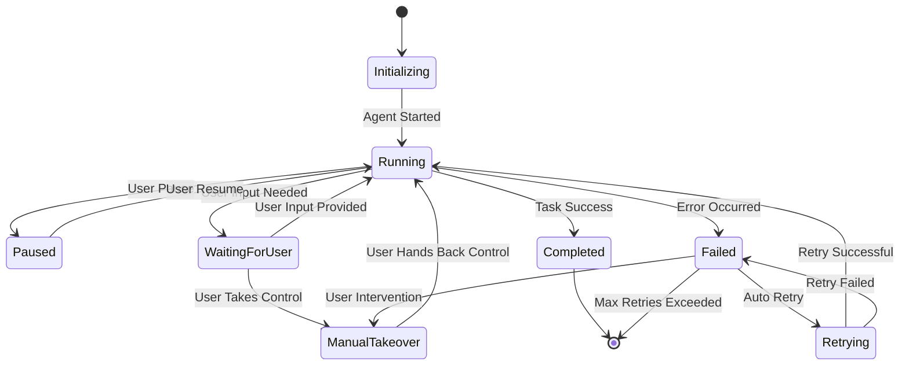
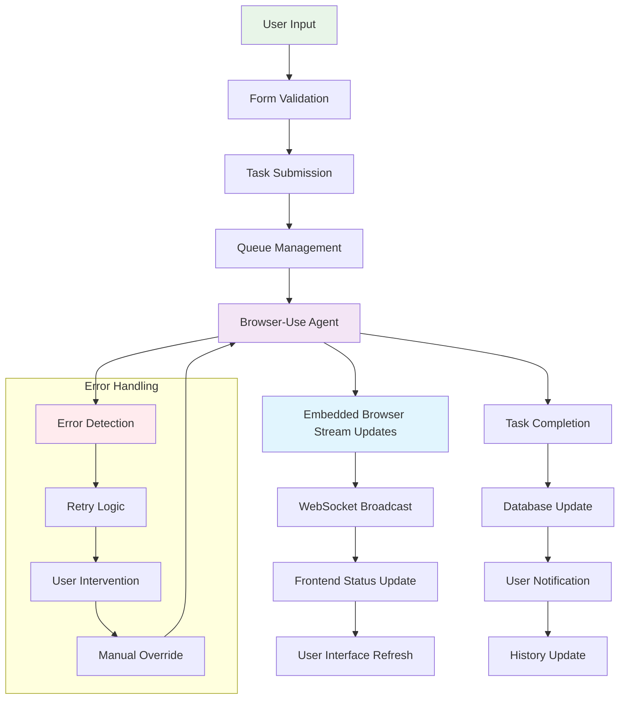

# Frontend Design Guidelines Document

## **Introduction**

This document provides a set of guidelines for the frontend design of the **CFDI 4.0 Invoice Form Automation System**. The application is a SaaS platform designed to automate the manual process of filling out Mexican CFDI 4.0 invoicing forms across vendor portals. Users interact with the system via a user-friendly interface that allows them to submit, monitor, and control automation tasks in real-time.

### **Primary Objectives**:

- **Real-time Transparency**: Enable users to monitor automation via an embedded browser powered by Browserbase.
- **Interactive Control**: Provide users with the ability to pause, resume, or take over the automation task at any point.
- **Spanish Localization**: Ensure that all UI elements, status updates, and error messages are in Spanish.
- **Secure Multi-Tenant Architecture**: Use JWT for authentication to support multiple user sessions securely.

### **Major Functional Areas**:

- **User Authentication**: Secure user login and registration via JWT tokens.
- **Task Submission**: Interface for inputting ticket details and vendor URLs.
- **Real-Time Automation Monitoring**: Dual-pane layout showing the embedded browser view and status updates.
- **Interactive Controls**: Buttons for pausing, resuming, or taking over the automation process.
- **Task History and Status Tracking**: Ability to view past tasks, their status, and interact with them.

---

## **System Architecture Overview**

The frontend is built using **React 19**, utilizing modern best practices for performance, scalability, and maintainability. The frontend architecture supports real-time updates via **WebSockets** and integrates securely with the backend using **JWT** for authentication.

---

## **Core Frontend Components**

### **1. Authentication System**

Handles user login, registration, and session management.

**Components**:

- Login and Register forms with validation
- JWT token management and refresh logic
- Multi-tenant session handling
- Password recovery and account management

**Backend Dependencies**:

- **Supabase** for authentication
- JWT token validation and session management

---

### **2. Dashboard Interface**

Provides an overview of tasks and quick access to task creation.

**Components**:

- Task overview cards with status indicators
- Quick action buttons for creating new tasks
- Recent activity feed and user profile access
- Sidebar navigation and session history

**Backend Dependencies**:

- Task status and history API
- User profile and activity log retrieval

---

### **3. Task Submission Interface**

Form for inputting ticket details and vendor URLs to start a new task.

**Components**:

- Vendor URL input and ticket details form
- File upload for documents
- Real-time validation with Zod
- Preview and confirmation modal

**Backend Dependencies**:

- Task creation API
- File upload service
- Vendor URL validation
- User data pre-population from **Supabase**

---

### **4. Dual-Pane Layout System**

The **Dual-Pane Layout** is the heart of the real-time user experience, consisting of an **Embedded Browser View** and a **Status Sidebar**.

**Main Components**:

- **Embedded Browser View**: Shows the live browser interaction powered by **Browserbase**, occupying 70% of the screen.
- **Status Sidebar**: Displays progress updates, real-time logs, and task control buttons, taking up 30% of the screen.
- **Interactive Controls Bar**: Allows users to pause, resume, or take over the automation session.

---

### **5. Real-Time Status System**

The frontend listens for real-time updates from the backend using **WebSockets** and updates the UI accordingly.

**Components**:

- **WebSocket connection manager** for live updates
- **Real-time status updates** in Spanish
- **Progress indicators** with percentage completion
- **Error handling and retry logic** display

**Backend Dependencies**:

- WebSocket server for real-time communication
- **Browser-Use agent** status reporting
- Error handling and retry queue management

---

### **6. Interactive Session Controls**

Provides users with the ability to manage the automation session.

**Components**:

- **Pause/Resume automation buttons**
- **Manual takeover functionality**
- **Session restart and stop controls**
- **Screenshot capture** for reference
- **Chat interface** for agent communication

---

## **Task Management System**

### **7. Task History Interface**

Displays all past and current tasks with filtering and sorting options.

**Components**:

- **TanStack Table** for task listing
- **Status badges** for task status (Success, In Progress, Failed)
- **Task detail modal** with full execution log
- **Retry and rerun functionality**

**Backend Dependencies**:

- Task history API with pagination
- Detailed task logs and metadata

### **8. Notification System**

Informs users about task status changes and errors.

**Components**:

- **Real-time toast notifications** for task status changes
- **Email notification preferences**
- **In-app notification center**
- **Critical error alerts**

---

## **Data Flow Architecture**

---

## **Technology Stack Implementation**

### **Frontend Technologies**:

- **React 19** for the core UI
- **shadcn/ui** for reusable components
- **Tailwind CSS** for responsive design
- **Zod** for form validation
- **TanStack Table** for task history

**State Management**:

- **React Context** for global state (e.g., user session)
- **useState** and **useReducer** for local component state

---

## **Performance and Security**

### **Frontend Performance Targets**:

- **Load Time Optimization**: <2 seconds
- **Real-Time Streaming**: Browser stream latency <500ms
- **WebSocket Connection**: Establish in <500ms

### **Security Implementation**:

- **JWT token storage** in httpOnly cookies
- **Data encryption** for sensitive user data

---

## **Error Handling Strategy**

### **User-Facing Error Management**:

- Graceful degradation with fallback UIs
- Retry logic with exponential backoff
- Clear and actionable error messages