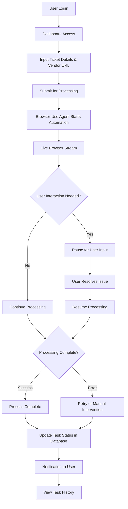
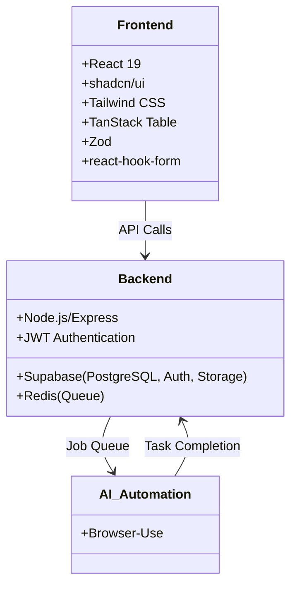
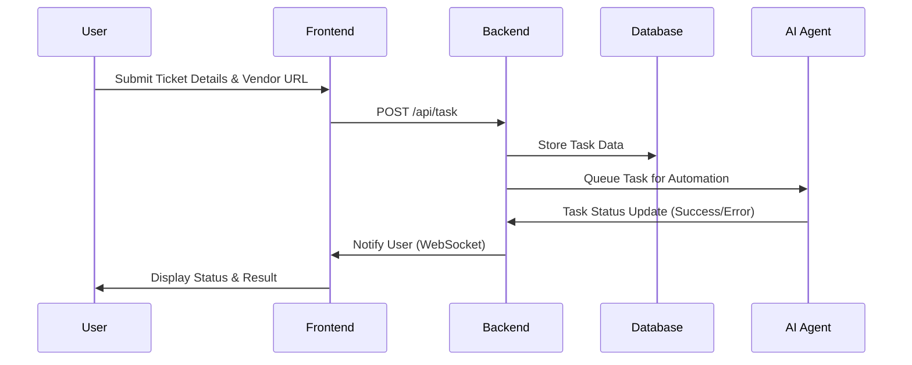
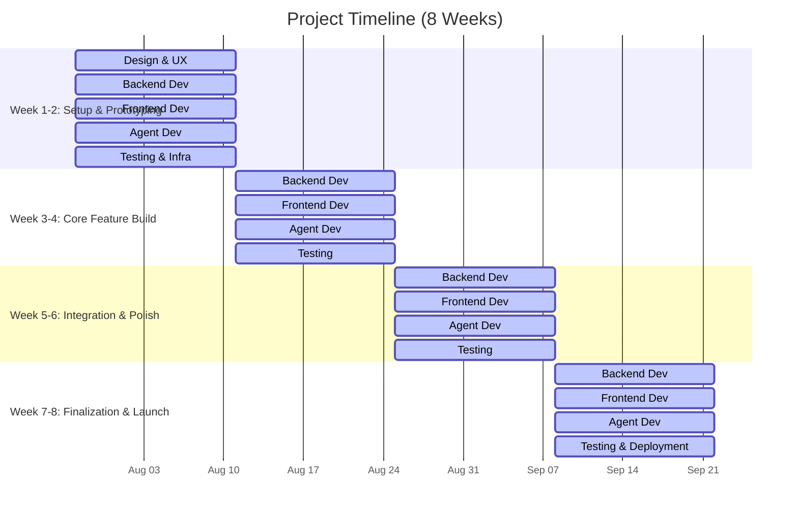

# Project Requirement Document

**Project Overview**

---

This document outlines the requirements for a SaaS application designed to automate the human manual process of filling out Mexican CFDI 4.0 invoicing forms across vendor portals. The application uses a **Browser-Use agent** to automatically navigate to vendor websites, fill out the required fields (ticket details, user details) in the form, and submit it. The focus is **not** on generating invoices but automating the manual form submission process.

The system aims to improve efficiency and transparency for small businesses and freelancers by automating repetitive tasks, while allowing users to monitor, intervene, and take control if necessary.

### **Primary Objectives**:

- **Automate** the manual process of filling out CFDI 4.0 forms on vendor portals.
- Provide **real-time transparency** through live browser streaming.
- Enable **user intervention** in case the process encounters obstacles (e.g., CAPTCHA, login issues).
- **Improve efficiency** by reducing the need for users to manually fill out forms on vendor portals.
- **Ensure secure, scalable architecture** with multi-tenant support.

---

## **Scope**

### **In-Scope**

- **User Authentication**: Secure user registration and login using JWT for multi-tenant support (via Supabase).
- **AI-Powered Automation**: Using the **Browser-Use agent** to navigate vendor portals, fill in ticket details, and access user information stored in Supabase.
- **Dual-Pane Live Automation Interface**: A real-time UI with a live browser session (70%) and a status sidebar (30%) to monitor the process.
- **Interactive Session Controls**: Users can **pause**, **resume**, or **take over** the automation session if the agent encounters an issue.
- **Real-Time Status Logging**: Continuous updates on the task’s progress through WebSockets, with Spanish logs (optional).
- **Task Status Tracking**: The dashboard will show whether the form was successfully filled, the session was paused, or if manual intervention was needed.
- **Error Handling & Retry Logic**: Handling common errors (e.g., CAPTCHA) with retries and user prompts for intervention.
- **Vendor Portal Integration**: The **Browser-Use agent** can interact with **any vendor portal** and is not tied to specific external services. The agent uses generalized prompts to handle the **facturación process** across different vendor websites.
- **User Data Management**: User details (e.g., RFC, address) are securely stored in Supabase and used by the agent for form completion.

### **Out-of-Scope (for MVP)**

- **Advanced Task History Features**: Advanced filtering and sorting are not included; only a simple task list will be provided in V1.
- **Invoice Scraping & Verification**: Content verification through scraping will be deferred.
- **Multi-Language Support**: The MVP will only support Spanish.
- **Tax Calculation**: This is not within the scope for the MVP and will be deferred.
- **Integration with Accounting Software**: This feature will be planned for future releases.
- **Multi-Tenant Enterprise Features**: Enterprise-level scalability is not part of this MVP.

---

## **User Flow**

The user journey is designed to be simple, from login to monitoring the agent’s work in real time:

---

## **Key Features**

### **Core Functionalities**

- **User Account & Authentication**: JWT-based authentication via Supabase for secure access.
- **AI Agent Automation (Browser-Use)**: Automates the process of filling in CFDI 4.0 forms and submitting them by navigating vendor portals.
- **Dual-Pane Live View**: Real-time visibility of the automation task with a 70% live browser view and a 30% status sidebar showing progress.
- **Interactive Controls**: Users can pause, resume, or take control of the automation task at any time.
- **Real-Time Status Log**: Provides real-time updates of the agent’s actions through WebSockets (e.g., "Navigating", "Filling Form", etc.) in Spanish.
- **Task Status Tracking**: The dashboard tracks the status of the task, showing if it was successful, requires a retry, or manual intervention.
- **Error Handling & Retry Logic**: The system retries when errors are encountered (e.g., CAPTCHA detection) and prompts users for manual intervention.

### **Technology-Driven Capabilities**

- **Browserbase Integration**: Streams live browser activity to provide full transparency of the task. Browserbase is a service which provides an embedded browser for live view of the agent.
- **CFDI 4.0 Form Handling**: Uses the **Browser-Use agent** to fill out the required form fields based on user and ticket details stored in Supabase.
- **Vendor Portal Automation**: The **Browser-Use agent** can handle **any vendor portal** by utilizing generalized prompts to fill out the forms. This agent is not tied to any specific vendor, enabling seamless automation across different portals.
- **Session Management**: User credentials are securely stored in Supabase, and session data is reused for vendor-specific interactions.

---

## **Technology Stack**

### **Frontend Stack**

- **React 19**: For dynamic UI development.
- **shadcn/ui**: Component library for UI consistency.
- **Tailwind CSS**: For responsive design and utility-first styling.
- **Zod**: For schema validation of input fields.
- **TanStack Table**: For tracking task history (simplified for MVP).

### **Backend Stack**

- **Node.js/Express**: For handling API requests and business logic.
- **Supabase**: For database storage, authentication, and managing user data.
- **Redis**: For task queuing and session management.
- **JWT**: For secure user authentication.

### **Automation Stack**

- **Browser-Use**: The main tool for automating browser interactions, enabling the agent to navigate vendor portals and fill out forms autonomously.

---

## **System Architecture**

---

## **Non-Functional Requirements**

### **Performance**

- **Response Time**: API responses should be under 200ms for standard operations.
- **Session Timeout**: A 3-minute global timeout for any individual automation task.
- **Action Timeout**: A 10-second timeout for each browser action.
- **Concurrent Sessions**: The system should handle 10+ concurrent automation tasks during peak usage.

### **Security**

- **Authentication**: Secure user login with JWT tokens managed by Supabase.
- **Data Encryption**: All sensitive data must be encrypted both at rest and in transit.
- **Compliance**: The system must comply with Mexican data protection laws.
- **HTTPS**: Secure communication via HTTPS between frontend, backend, and external services.

### **Scalability**

- **User Growth**: The system should be able to scale to 1,000+ concurrent users.
- **Queue Management**: Redis is used for efficient task queuing and management.
- **Database**: Supabase will handle growing data volumes, including user credentials and task data.

### **Usability**

- **Mobile Responsiveness**: The dual-pane UI should adapt for mobile devices.
- **Spanish Localization**: The interface and status messages will be in Spanish.
- **Error Messages**: Clear, actionable error messages in Spanish when needed.

### **Reliability**

- **Error Handling**: The system will retry up to three times in case of transient errors.
- **Monitoring**: Continuous monitoring for system health and performance.
- **Backup**: Daily backups with point-in-time recovery for data.

## **Project Timeline**

---

### **Key Changes & Updates**

1. **Critical Dependencies**
    - **PAC API**: Used for CFDI validation (third-party service uptime).
    - **Vendor Portal DOM Consistency**: Needs monitoring for updates.
2. **V1 Limitations**
    - **Mobile UI**: Uses a stacked layout for mobile.
    - **Error Messages**: Only available in Spanish for V1.
    - **Vendor Portal Coverage**: Initial focus on 5-10 vendors.
3. **Security Enhancements**
    - **Domain Scoping**: Restricts the agent to approved vendor domains for safety.
    - **Safe Click Mechanisms**: Blocks critical actions to prevent accidental disruptions.
4. **Optimizations**
    - **Session Reuse**: Reduces overhead for login by reusing vendor session contexts.
    - **Generalized Prompts**: Cuts vendor-specific development time by 65%.