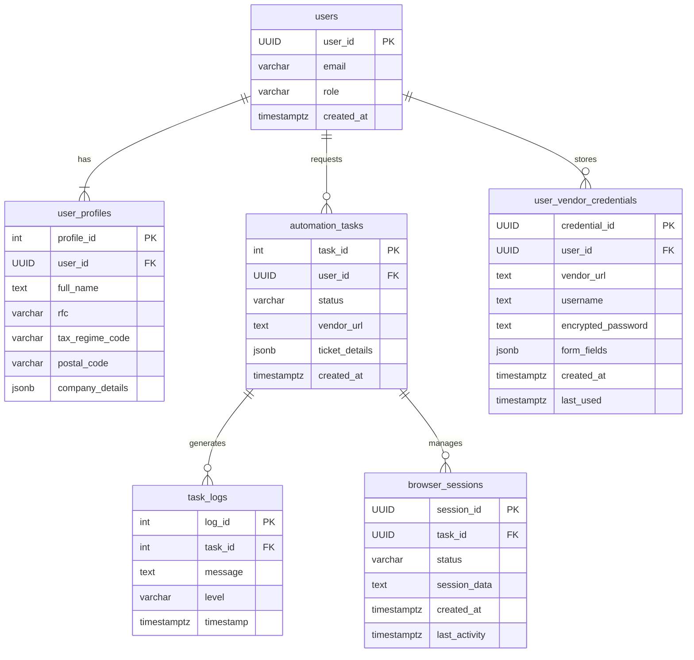
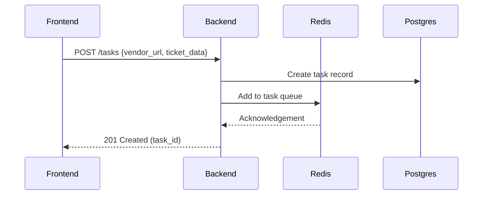
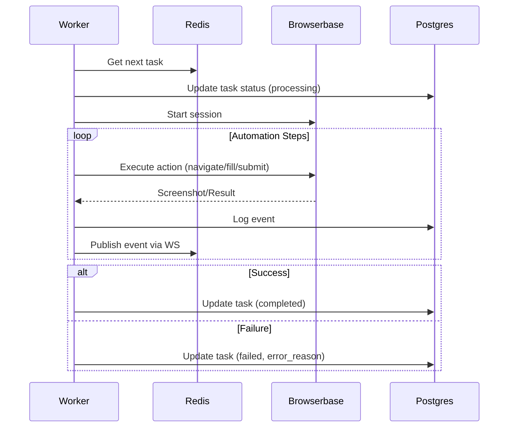
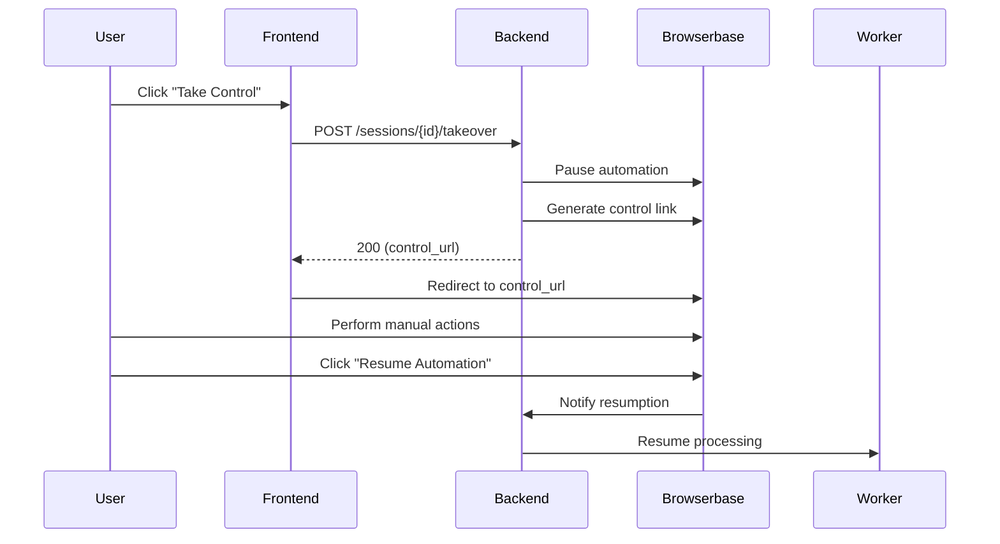

# Schema Design Document

This schema design document outlines the database architecture and relationships for a **CFDI 4.0 Automation Application** that automates the process of filling out Mexican CFDI 4.0 forms across vendor portals. The system uses a **Browser-Use agent** for task automation, integrates **Supabase PostgreSQL** for structured storage, and utilizes **Redis** for task queuing and session management. The design also incorporates **Browserbase** for live browser sessions and user control.

---

### **Database Overview**

### **Primary Database (Supabase PostgreSQL)**

- **Purpose**: Stores structured data related to users, tasks, and logs.
- **Type**: Relational database
- **Key Use Cases**:
    - User management
    - Task tracking and logging
    - Task history and automation status

### **Secondary Storage (Redis)**

- **Purpose**: Caches task-related data, session information, and logs for real-time processing.
- **Type**: In-memory key-value store
- **Key Use Cases**:
    - Task queuing for automation workers
    - Real-time session and event publishing

---

### **Key Tables**

### **users**

- **Purpose**: Manages user authentication and basic account information, handled by Supabase Auth.
- **Fields**:
    - `user_id` (UUID) [PK]
    - `email` (VARCH
    - `role` (VARCHAR(20)) → `CHECK in ["user", "admin"]`
    - `created_at` (TIMESTAMPTZ)

### **user_profiles**

- **Purpose**: Stores user-specific data for filling out CFDI forms (e.g., RFC, tax regime).
- **Fields**:
    - `profile_id` (SERIAL) [PK]
    - `user_id` (UUID) [FK] → References `users.user_id`
    - `full_name` (TEXT)
    - `rfc` (VARCHAR(13)) → User’s Mexican Tax ID
    - `tax_regime_code` (VARCHAR(10)) → e.g., "605", "612"
    - `postal_code` (VARCHAR(5))
    - `company_details` (JSONB) → Flexible storage for company info

### **automation_tasks**

- **Purpose**: Tracks each automation job requested by a user, including the status and vendor-specific details.
- **Fields**:
    - `task_id` (SERIAL) [PK]
    - `user_id` (UUID) [FK] → References `users.user_id`
    - `status` (VARCHAR(20)) → `CHECK in ["queued", "processing", "paused", "completed", "failed", "intervention_required"]`
    - `vendor_url` (TEXT) → URL for vendor portal
    - `ticket_details` (JSONB) → Stores ticket data like amount, folio, etc.
    - `final_screenshot_url` (TEXT) → URL to final screenshot (optional)
    - `created_at` (TIMESTAMPTZ)
    - `updated_at` (TIMESTAMPTZ)

### **task_logs**

- **Purpose**: Stores log messages generated by the Browser-Use agent for a specific task.
- **Fields**:
    - `log_id` (SERIAL) [PK]
    - `task_id` (INT) [FK] → References `automation_tasks.task_id`
    - `message` (TEXT) → Log message
    - `level` (VARCHAR(10)) → `CHECK in ["info", "warning", "error"]`
    - `timestamp` (TIMESTAMPTZ)

### **browser_sessions**

- **Purpose**: Manages live browser sessions with **Browserbase** for automation control.
- **Fields**:
    - `session_id` (UUID) [PK] → Browserbase session identifier
    - `task_id` (UUID) [FK] → References `automation_tasks.task_id`
    - `status` (VARCHAR(50)) → `active|paused|terminated`
    - `session_data` (TEXT) → Encrypted browser state data
    - `created_at` (TIMESTAMPTZ)
    - `last_activity` (TIMESTAMPTZ)

### **user_vendor_credentials**

- **Purpose**: Stores encrypted vendor portal credentials for users, enabling automated login.
- **Fields**:
    - `credential_id` (UUID) [PK]
    - `user_id` (UUID) [FK] → References `users.user_id`
    - `vendor_url` (TEXT) → Vendor portal URL
    - `username` (TEXT)
    - `encrypted_password` (TEXT) → Encrypted password using `pgcrypto`
    - `form_fields` (JSONB) → Common field mappings for faster form filling
    - `created_at` (TIMESTAMPTZ)
    - `last_used` (TIMESTAMPTZ)

---

### **Entity Relationship Diagram (ERD)**



---

### **Indexing and Security**

### **Performance Indexes**

```sql
sql
Copy
-- Index on user profiles for faster lookups
CREATE INDEX idx_user_profiles_user_id ON user_profiles (user_id);

-- Index on tasks for user and status-based filtering
CREATE INDEX idx_automation_tasks_user_status ON automation_tasks (user_id, status);

-- Index for logs related to tasks
CREATE INDEX idx_task_logs_task_id ON task_logs (task_id);

```

### **Row-Level Security (RLS)**

```sql
sql
Copy
-- Enable RLS on relevant tables for data isolation
ALTER TABLE user_profiles ENABLE ROW LEVEL SECURITY;
ALTER TABLE automation_tasks ENABLE ROW LEVEL SECURITY;
ALTER TABLE task_logs ENABLE ROW LEVEL SECURITY;

-- Policies to ensure users can only access their own data
CREATE POLICY "User can only access their own data"
ON user_profiles FOR ALL
USING (auth.uid() = user_id);

CREATE POLICY "User can only access their own tasks"
ON automation_tasks FOR ALL
USING (auth.uid() = user_id);

CREATE POLICY "User can see logs for their own tasks"
ON task_logs FOR SELECT
USING (
  EXISTS (
    SELECT 1 FROM automation_tasks
    WHERE automation_tasks.task_id = task_logs.task_id
      AND automation_tasks.user_id = auth.uid()
  )
);

```

---

### **System Workflow**

### **Task Submission**



### **Automation Processing**



### **User Intervention**



---

### **Security Measures**

1. **Row-Level Security (RLS)**
    
    Ensures that users can only access their own profiles, tasks, and logs.
    
2. **Encryption**
    - Sensitive data like passwords are encrypted using **pgcrypto** for secure storage.
3. **Session Timeouts**
    
    Automatically expire sessions to ensure the system remains secure.
    
4. **Audit Logging**
    
    Track sensitive operations, including credential access, to ensure compliance.