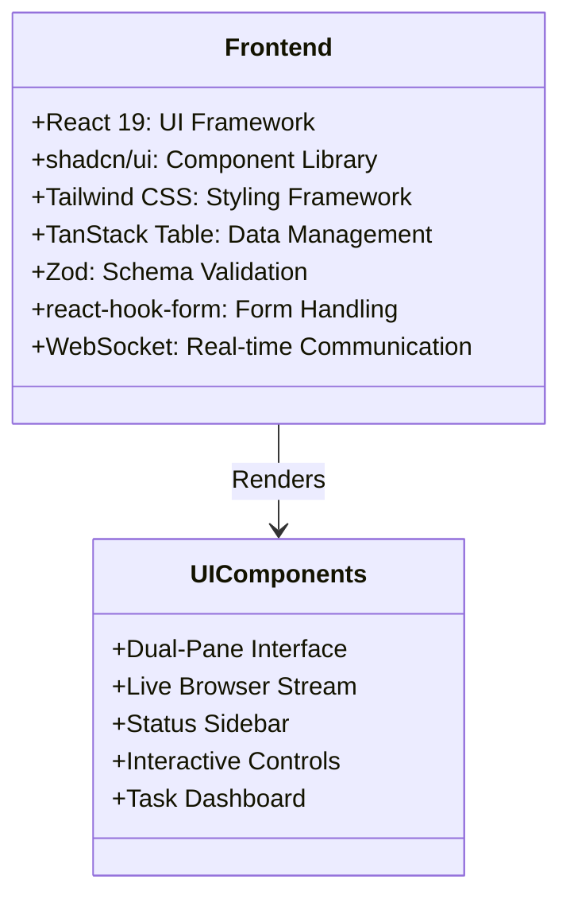
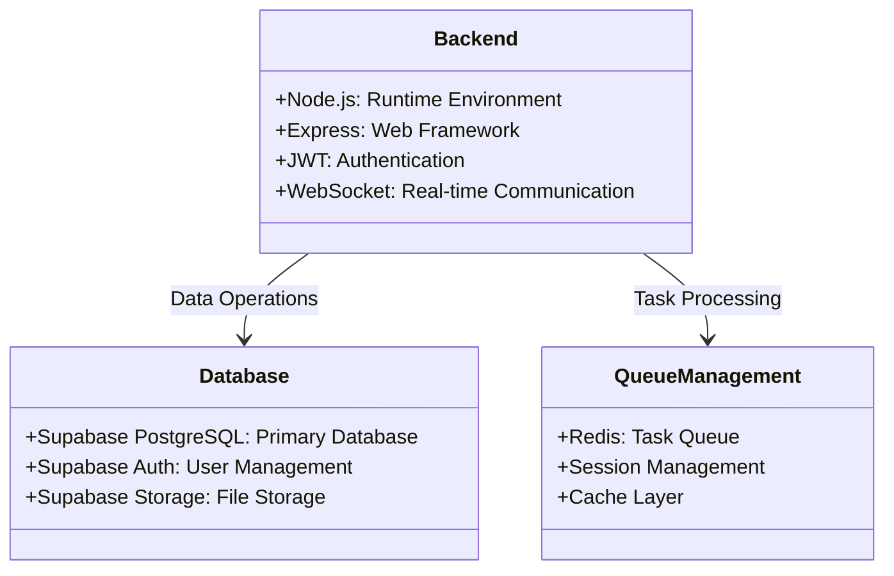
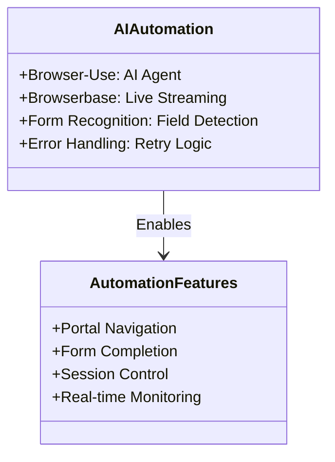
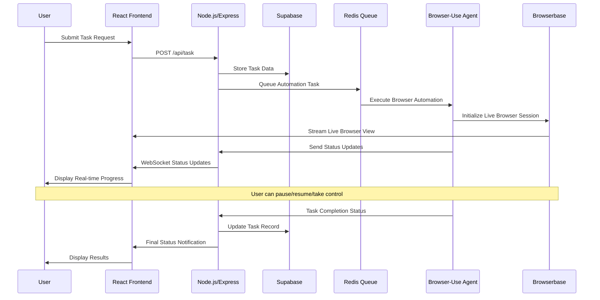
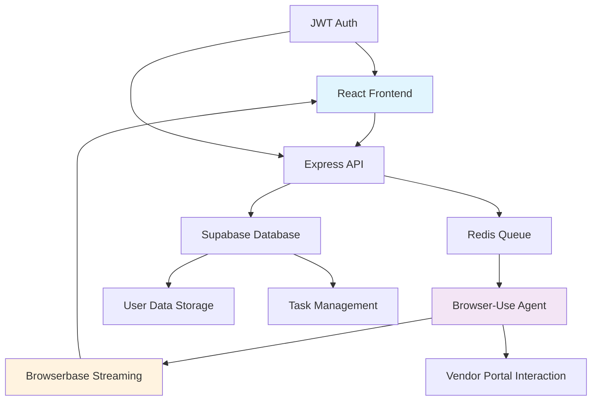
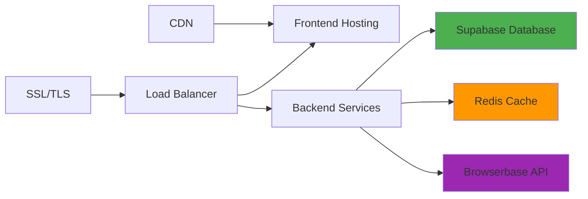

# Technology Stack Documentation

## Technology Stack Overview

The technology stack is designed to support a SaaS application that automates the manual process of filling out Mexican CFDI 4.0 invoicing forms across vendor portals. The stack leverages AI-powered browser automation with real-time transparency, enabling small businesses and freelancers to automate repetitive form submission tasks while maintaining full visibility and control over the process.

**Primary Objectives:**

- Automate CFDI 4.0 form completion across diverse vendor portals
- Provide real-time transparency through live browser streaming
- Enable seamless user intervention capabilities
- Ensure secure, scalable multi-tenant architecture
- Deliver efficient task processing with robust error handling

---

## Frontend Technologies

The frontend is built as a dynamic and responsive single-page application (SPA), enabling user interactions, live browser streaming, and real-time updates.

### Core Framework & Libraries:

- **React 19**: Modern UI framework for dynamic user interfaces and component-based architecture
- **shadcn/ui**: Component library ensuring UI consistency and adherence to design systems
- **Tailwind CSS**: Utility-first CSS framework for responsive design and rapid styling
- **TanStack Table**: Data grid solution for task history tracking and management
- **Zod**: TypeScript-first schema validation for form inputs and data integrity
- **react-hook-form**: Performance-focused form library for handling user inputs

### Authentication & State Management:

- **JWT Authentication**: Secure token-based authentication integrated with Supabase
- **Real-time WebSocket Integration**: Live status updates and communication with backend services

---

## Backend Technologies

The backend is responsible for handling API requests, managing business logic, orchestrating automation tasks, and interacting with the database. It ensures secure authentication, task management, and data storage.

### Core Backend Components:

- **Node.js/Express**: Server-side runtime and web framework for API development
- **Supabase**: Comprehensive backend-as-a-service providing PostgreSQL database, authentication, and storage
- **Redis**: In-memory data structure store for task queuing and session management
- **JWT**: JSON Web Tokens for secure authentication and authorization

### Database & Storage:

- **PostgreSQL (via Supabase)**: Primary database for user data, task records, and application state
- **Supabase Auth**: Managed authentication service with multi-tenant support
- **Supabase Storage**: Secure file storage for user documents and session data

---

## AI & Automation Technologies

This layer is responsible for automating interactions with vendor portals, filling out CFDI 4.0 forms, and handling user interventions.

### Browser Automation Stack:

- **Browser-Use**: Primary AI agent for automated browser interactions and form completion
- **Browserbase**: Live browser streaming service enabling real-time visibility and user control

### Automation Capabilities:

- **Vendor Portal Navigation**: Generalized automation across diverse vendor websites
- **Form Field Recognition**: AI-powered identification and completion of CFDI 4.0 form fields
- **Error Detection & Handling**: Automated retry logic and user intervention triggers

---

## System Architecture

The system follows a modular and scalable architecture, consisting of frontend, backend, AI automation, and a database. The integration between these components ensures seamless functionality, real-time updates, and secure task execution.

### Data Flow Architecture:

### Component Integration:

---

## Deployment Infrastructure

### Hosting & Infrastructure:

- **Frontend**: Modern web hosting platform (Vercel/Netlify recommended)
- **Backend**: Cloud application platform (Railway/Render/Heroku)
- **Database**: Supabase managed PostgreSQL
- **Cache/Queue**: Redis Cloud or managed Redis service
- **AI Services**: Browserbase cloud infrastructure

### Performance Requirements:

- **API Response Time**: <200ms for standard operations
- **Session Timeout**: 3-minute global timeout per automation task
- **Action Timeout**: 10-second timeout per browser action
- **Concurrent Sessions**: Support for 10+ simultaneous automation tasks

---

## Security Architecture

### Authentication & Authorization:

- **Multi-tenant JWT Authentication**: Secure token-based access control via Supabase
- **HTTPS Encryption**: End-to-end secure communication
- **Data Encryption**: At-rest and in-transit data protection
- **Session Management**: Secure session handling with Redis

### Compliance & Data Protection:

- **Mexican Data Protection Laws**: Compliance with local regulations
- **User Data Security**: Encrypted storage of sensitive information (RFC, addresses)
- **Access Control**: Role-based permissions and secure API endpoints

---

## Scalability Considerations

### Growth Planning:

- **User Scalability**: Architecture supports 1,000+ concurrent users
- **Database Scaling**: Supabase handles growing data volumes with automatic scaling
- **Queue Management**: Redis provides efficient task distribution and processing
- **Microservices Ready**: Modular architecture enables future service separation

### Performance Optimization:

- **Caching Strategy**: Redis-based caching for frequently accessed data
- **Database Optimization**: Indexed queries and connection pooling
- **CDN Integration**: Static asset delivery optimization
- **Load Balancing**: Horizontal scaling capabilities

---

## Technology Dependencies

### External Services:

- **Supabase**: Database, authentication, and storage services
- **Browserbase**: Live browser streaming and automation infrastructure
- **Redis**: Queue management and caching
- **Browser-Use**: AI-powered browser automation capabilities

### Development Dependencies:

- **TypeScript**: Type safety across frontend and backend
- **ESLint/Prettier**: Code quality and formatting standards
- **Testing Frameworks**: Jest, React Testing Library for quality assurance
- **CI/CD Pipeline**: Automated testing and deployment processes

---

## Monitoring & Observability

### Health Monitoring:

- **System Health Checks**: Continuous monitoring of all services
- **Performance Metrics**: Response times, throughput, and error rates
- **Error Tracking**: Comprehensive logging and error reporting
- **User Analytics**: Task completion rates and user engagement metrics

### Backup & Recovery:

- **Daily Backups**: Automated database backups with point-in-time recovery
- **Disaster Recovery**: Multi-region backup strategy
- **Data Retention**: Configurable retention policies for user data and logs

Technology Docs: 

 https://supabase.com/docs

https://docs.browserbase.com/introduction/what-is-browserbase

https://docs.browser-use.com/introduction

[https://github.com/browser-use/browser-use](https://github.com/browser-use/browser-use)

https://redis.io/docs/latest/