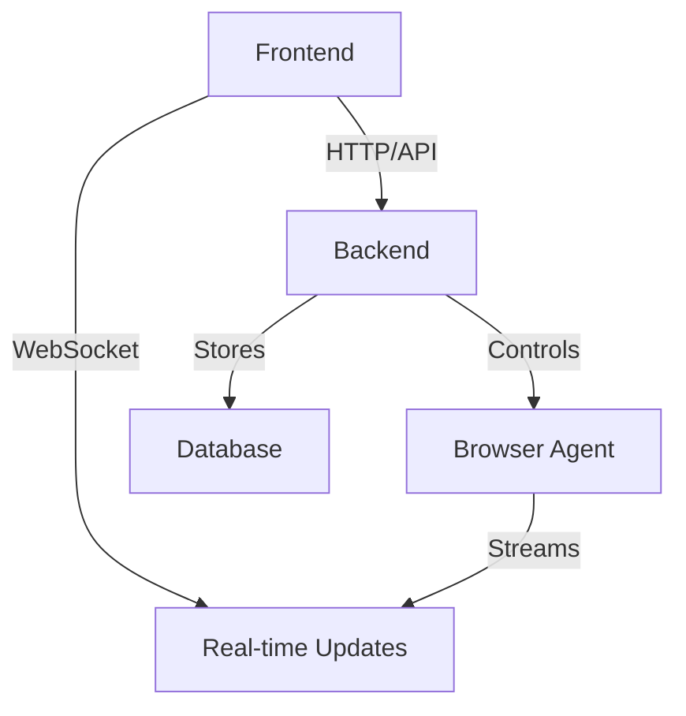

# Browser Automation Agent

A full-stack web application for managing and monitoring sophisticated browser automation tasks using natural language commands. Built with React/TypeScript frontend and Python/FastAPI backend, leveraging the powerful `browser-use` library for browser automation.

## 🌟 Features

- **Natural Language Tasking**: Submit complex automation tasks using plain English
- **Real-time Monitoring**: Live browser preview and agent activity logs
- **Interactive Controls**: Pause, resume, and take control of automation tasks
- **Multi-LLM Support**: OpenAI, Anthropic, Google, and more
- **WebSocket Communication**: Real-time updates between frontend and backend
- **Comprehensive Logging**: Detailed task execution history and debugging
- **Modern UI**: Clean, responsive interface with real-time status indicators

## 🚀 Quick Start

### Prerequisites

- **Python 3.11+** with pip
- **Node.js 18+** with npm
- **Git** for version control

### 1. Clone and Setup

```powershell
git clone https://github.com/your-username/facturacion_agent.git
cd facturacion_agent
```

### 2. Verify Setup

Run the comprehensive setup verification:

```powershell
.\verify-setup.ps1
```

To automatically fix common issues:

```powershell
.\verify-setup.ps1 -Fix
```

### 3. Configure Environment

#### Backend Configuration (`backend/.env`)
```bash
# Database
DATABASE_URL=sqlite:///./browser_agent.db

# API Configuration
HOST=0.0.0.0
PORT=8000
API_V1_STR=/api/v1

# LLM Configuration
OPENAI_API_KEY=your_openai_api_key_here
ANTHROPIC_API_KEY=your_anthropic_api_key_here
GOOGLE_API_KEY=your_google_api_key_here
DEFAULT_LLM_PROVIDER=openai
DEFAULT_LLM_MODEL=gpt-4o

# Browser Settings
BROWSER_HEADLESS=false
BROWSER_TYPE=chromium

# CORS Origins
BACKEND_CORS_ORIGINS=["http://localhost:3000", "http://localhost:5173", "http://localhost:8000"]
```

#### Frontend Configuration (`frontend/.env.local`)
```bash
# API Configuration
NEXT_PUBLIC_API_BASE_URL=http://localhost:8000
NEXT_PUBLIC_WS_BASE_URL=ws://localhost:8000
NEXT_PUBLIC_API_TIMEOUT=30000

# Development Settings
NEXT_PUBLIC_ENVIRONMENT=development
NEXT_PUBLIC_DEBUG=true
```

### 4. Install Dependencies

#### Backend
```powershell
cd backend
python -m venv venv
venv\Scripts\Activate.ps1
pip install -r requirements.txt
```

#### Frontend
```powershell
cd frontend
npm install
```

### 5. Start Services

Use the enhanced startup script:

```powershell
.\start-services.ps1
```

This script will:
- ✅ Check prerequisites
- 🐍 Start backend (FastAPI) on port 8000
- ⚛️ Start frontend (Next.js) on port 3000
- 🧪 Run connection tests
- 📊 Display service status

### 6. Access the Application

- **Frontend UI**: http://localhost:3000
- **Backend API**: http://localhost:8000
- **API Documentation**: http://localhost:8000/docs
- **Browser Agent Viewer**: http://localhost:8000/api/v1/browser-agent/viewer

## 📋 Available Scripts

### Service Management
- `.\start-services.ps1` - Start all services with health checks
- `.\stop-services.ps1` - Stop all services and clean up resources
- `.\verify-setup.ps1` - Verify complete setup and configuration

### Development
- `.\backend\test_connections.py` - Test all backend connections
- `.\start-dev.ps1` - Start development environment (legacy)

### Script Options
```powershell
# Start services without running tests
.\start-services.ps1 -SkipTests

# Start with verbose output
.\start-services.ps1 -Verbose

# Verify setup and auto-fix issues
.\verify-setup.ps1 -Fix
```

## 🏗️ Architecture

### Backend (Python/FastAPI)
- **API Routes**: RESTful endpoints for task management
- **WebSocket**: Real-time communication for live updates
- **Browser Agent**: Integration with browser-use library
- **Database**: SQLite for task and session persistence

### Frontend (React/Next.js)
- **Components**: Modern UI with real-time updates
- **Services**: API and WebSocket communication
- **State Management**: React hooks with proper error handling
- **Styling**: TailwindCSS with component library

### Communication Flow


## 🔧 Configuration

### Environment Variables

#### Backend Required
- `OPENAI_API_KEY` - OpenAI API key for LLM
- `DATABASE_URL` - Database connection string
- `HOST` - Server host (default: 0.0.0.0)
- `PORT` - Server port (default: 8000)

#### Frontend Required
- `NEXT_PUBLIC_API_BASE_URL` - Backend API URL
- `NEXT_PUBLIC_WS_BASE_URL` - WebSocket base URL

### Port Configuration
- **Backend**: 8000 (FastAPI)
- **Frontend**: 3000 (Next.js)
- **Database**: SQLite (file-based)

## 🧪 Testing

### Connection Tests
```powershell
cd backend
python test_connections.py
```

Tests include:
- ✅ Basic connectivity
- 🔗 API endpoints
- 📡 WebSocket connections
- 🌐 CORS configuration
- ⚙️ Environment settings

### Manual Testing
1. Start services with `.\start-services.ps1`
2. Open frontend at http://localhost:3000
3. Navigate to Browser Agent Realtime
4. Submit a test task: "Search for OpenAI on Google"
5. Watch real-time execution

## 🐛 Troubleshooting

### Common Issues

#### Backend Won't Start
- Check Python version: `python --version`
- Verify virtual environment: `backend\venv\Scripts\Activate.ps1`
- Install dependencies: `pip install -r requirements.txt`
- Check port availability: `netstat -an | findstr :8000`

#### Frontend Won't Connect
- Verify backend is running on port 8000
- Check `.env.local` configuration
- Ensure CORS origins include `http://localhost:3000`
- Check browser console for errors

#### WebSocket Connection Failed
- Verify backend WebSocket endpoint: `ws://localhost:8000/api/v1/browser-agent/ws/{session_id}`
- Check firewall settings
- Ensure no proxy interference

#### API Connection Errors
- Check backend API at: http://localhost:8000/health
- Verify CORS configuration in backend
- Check network connectivity

### Debug Mode
Enable debug mode in frontend:
```bash
NEXT_PUBLIC_DEBUG=true
```

### Log Levels
Set backend log level:
```bash
LOG_LEVEL=DEBUG
```

## 📁 Project Structure

```
facturacion_agent/
├── backend/                 # Python/FastAPI backend
│   ├── src/
│   │   ├── api/            # API routes
│   │   ├── core/           # Configuration
│   │   ├── db/             # Database models
│   │   ├── services/       # Business logic
│   │   └── agent/          # Browser agent
│   ├── venv/               # Virtual environment
│   ├── main.py             # FastAPI entry point
│   └── requirements.txt    # Dependencies
├── frontend/               # React/Next.js frontend
│   ├── components/         # UI components
│   ├── services/           # API/WebSocket services
│   ├── pages/              # Next.js pages
│   └── package.json        # Dependencies
├── memory-bank/            # Documentation
├── start-services.ps1      # Service startup
├── stop-services.ps1       # Service cleanup
├── verify-setup.ps1        # Setup verification
└── README.md              # This file
```

## 🔄 Development Workflow

1. **Setup**: Run `.\verify-setup.ps1 -Fix`
2. **Start**: Use `.\start-services.ps1`
3. **Develop**: Edit code with hot-reload
4. **Test**: Use connection tests and manual testing
5. **Stop**: Use `.\stop-services.ps1`

## 🚀 Production Deployment

### Backend
- Use production WSGI server (e.g., Gunicorn)
- Set `BROWSER_HEADLESS=true`
- Use PostgreSQL for database
- Configure proper CORS origins

### Frontend
- Build: `npm run build`
- Deploy to CDN or static hosting
- Update API URLs for production

## 📊 Memory Bank

The `memory-bank/` directory contains comprehensive documentation:

- **Application Flow Documentation.md** - User workflows
- **Backend Architecture Document.md** - Technical architecture
- **Electronic Billing Agent.md** - Project overview
- **Frontend Design Guidelines.md** - UI/UX guidelines
- **Project Requirement Document.md** - Requirements
- **Technology Stack.md** - Technical decisions

## 🤝 Contributing

1. Fork the repository
2. Create a feature branch
3. Make your changes
4. Run tests: `.\verify-setup.ps1`
5. Submit a pull request

## 📄 License

This project is licensed under the MIT License.

## 🆘 Support

For issues and questions:
1. Check the troubleshooting section
2. Review memory-bank documentation
3. Run diagnostic scripts
4. Check logs for detailed error messages

---

## 🎯 Quick Reference

### Essential Commands
```powershell
# Setup and verify
.\verify-setup.ps1 -Fix

# Start services
.\start-services.ps1

# Stop services
.\stop-services.ps1

# Test connections
cd backend && python test_connections.py
```

### Key URLs
- Frontend: http://localhost:3000
- Backend API: http://localhost:8000
- API Docs: http://localhost:8000/docs
- Health Check: http://localhost:8000/health

### Status Indicators
- 🟢 **Connected**: Services running normally
- 🟡 **Connecting**: Services starting up
- 🔴 **Disconnected**: Services stopped or failed

---

*Built with ❤️ using browser-use, FastAPI, and Next.js* 