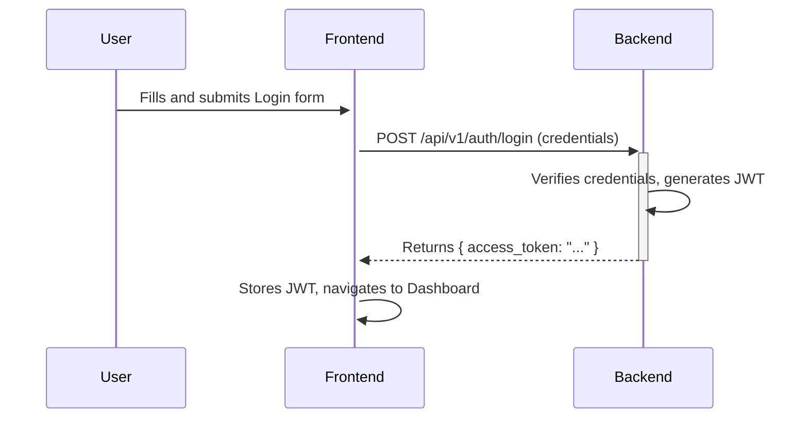
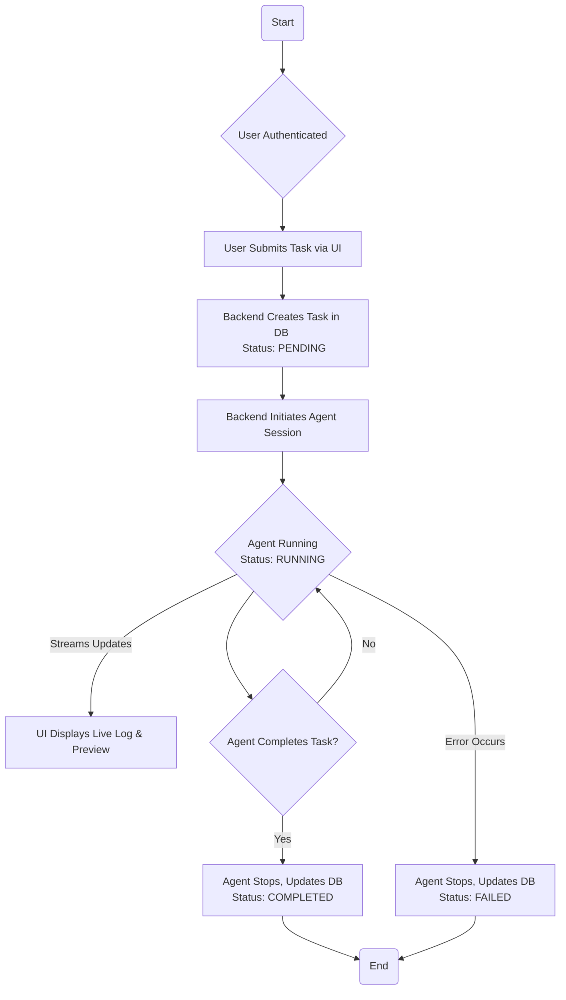
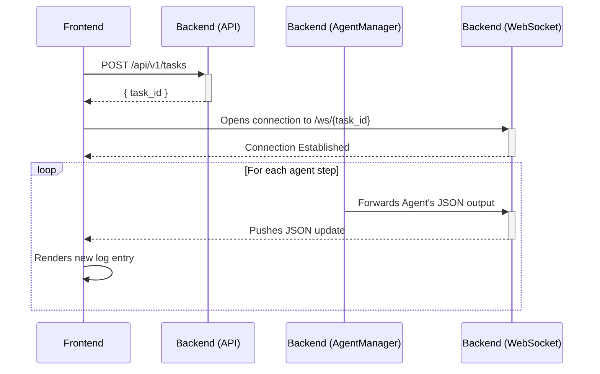
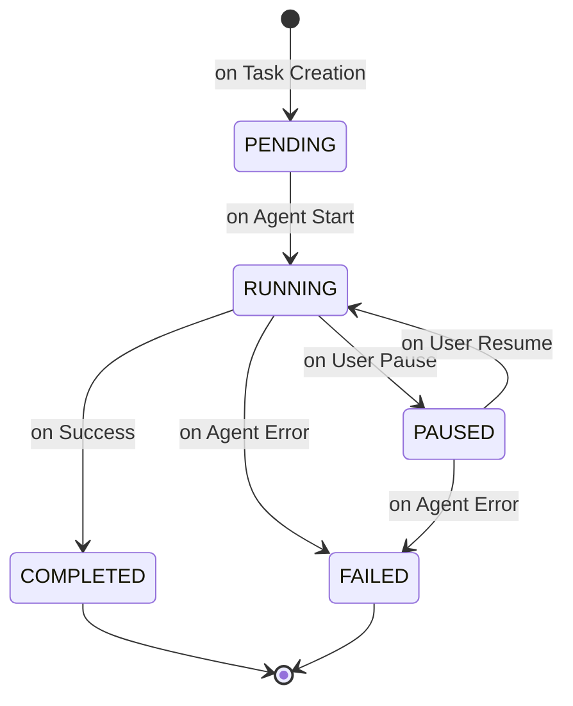

# Application Flow Documentation

```markdown
# Application Flow Documentation

## General Description

The application is a web-based platform designed to simplify browser automation. Its primary objective is to allow users to execute complex, multi-step tasks on the web using natural language commands. The key benefit is providing a transparent, interactive, and user-friendly window into the agent's operations, transforming a typically opaque process into a manageable and observable workflow.

## User Registration and Authentication

User access is managed through a standard email and password authentication system. All task-related operations require a valid user session.

- **Registration**: A new user signs up with an email and password. The backend validates the data, hashes the password for secure storage, and creates a new user account.
- **Login**: A registered user submits their credentials. The backend verifies them and, upon success, returns a JSON Web Token (JWT).
- **Session Management**: The frontend stores the JWT securely and includes it in the `Authorization` header of all subsequent API requests to access protected routes.



## Core Workflow: Task Creation and Execution

This flow describes the primary user journey of creating, running, and completing an automation task. The system is designed around a state machine where a task progresses through several statuses.



## Data Processing and Real-Time Updates

A critical feature is the real-time feedback loop between the agent and the user. This is achieved through a combination of REST API calls for initial setup and WebSockets for continuous updates.

1. The user initiates a task via a standard `POST` request.
2. The backend acknowledges the request immediately by providing a `task_id`.
3. The frontend uses this `task_id` to open a WebSocket connection.
4. The `AgentManager` on the backend continuously receives structured JSON output from the `browser-use` agent.
5. Each JSON update is immediately broadcasted over the WebSocket to the connected frontend client.
6. The frontend parses the JSON and renders the `thinking`, `action`, and other fields into the human-readable Activity Log.



## User Intervention and Control Flow

The application allows for a "human-in-the-loop" approach, where a user can pause the automation, interact with the browser manually, and then resume the agent.

1. **Pause**: The user clicks "Pause". The frontend sends a `POST` request to the `/pause` endpoint. The `AgentManager` receives this signal and halts the agent's execution loop after its current step is complete. The task status is updated to `PAUSED`.
2. **Take Control**: [Missing Information: The exact mechanism for giving the user control, whether via a remote debug URL or making the preview iframe interactive, needs to be finalized]. The user performs the necessary manual actions.
3. **Resume**: The user clicks "Resume". The frontend sends a `POST` request to the `/resume` endpoint. The `AgentManager` resumes the agent's execution loop, allowing it to analyze the new browser state and continue its task. The task status is updated back to `RUNNING`.

## Error Handling and Recovery

The system is designed to handle failures gracefully at both the application and agent levels.

- **API Errors**: Standard HTTP errors (e.g., 401 Unauthorized, 404 Not Found, 500 Internal Server Error) are caught by the frontend's API service. A user-friendly notification is displayed.
- **Agent Errors**: If the `browser-use` agent encounters an unrecoverable error during its execution (e.g., it cannot find a required element), it will terminate its run. The `AgentManager` catches this failure, updates the task's status in the database to `FAILED`, and broadcasts the final error state over the WebSocket. The UI will clearly display the error in the activity log and persist the failed state.

