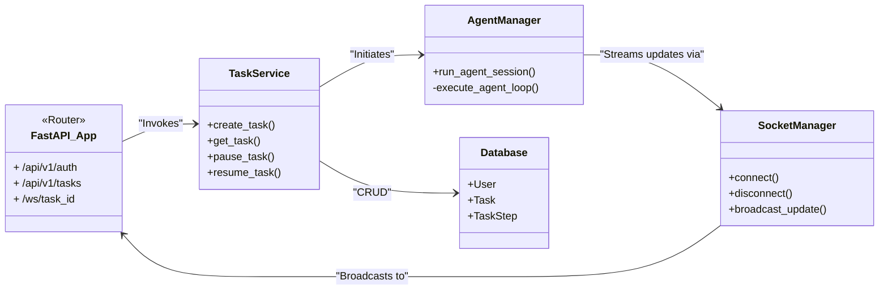
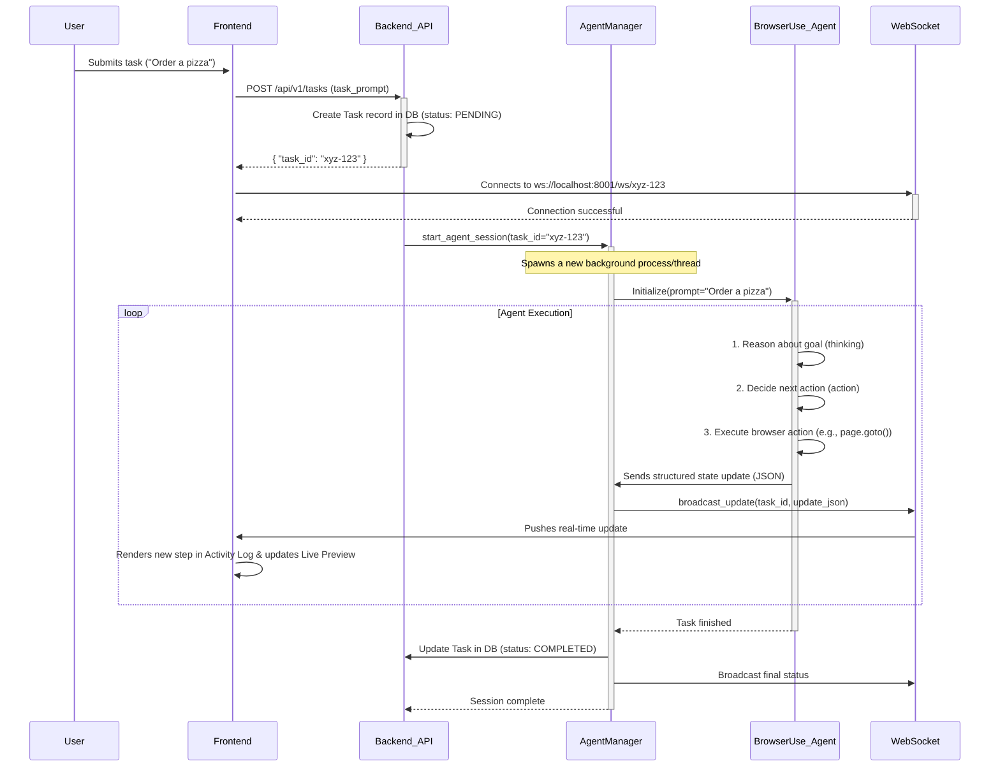
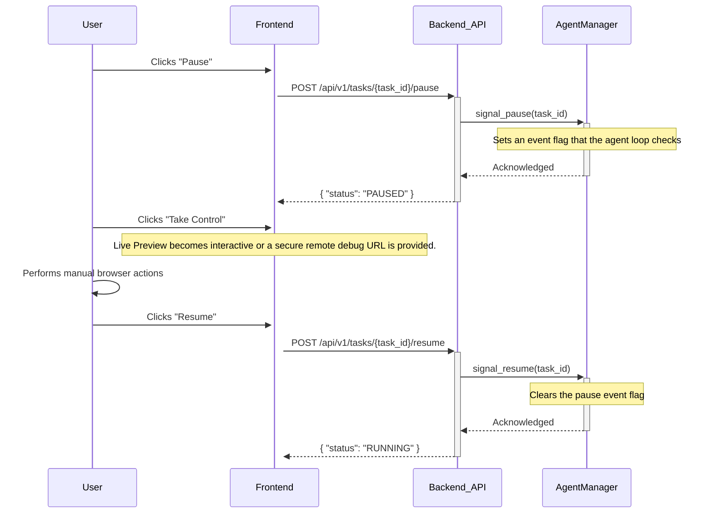
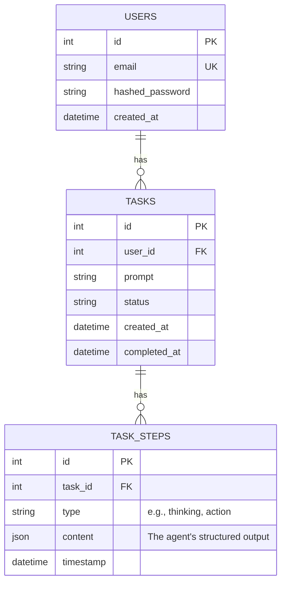
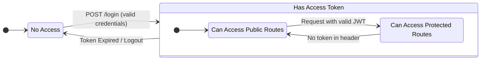

# Backend Architecture Document

---

## **Introduction**

The backend system serves as the central nervous system for the browser automation application. Its primary objective is to manage the entire lifecycle of an automation task—from receiving a natural language command to orchestrating the `browser-use` agent and streaming real-time progress back to the user. It is responsible for API services, user authentication, WebSocket communication, agent management, and database operations, providing a robust and scalable foundation for the entire platform.

---

## **Modular Design**

The backend will adopt a modular, service-oriented architecture inspired by the Netflix Dispatch model, as referenced in the `browser-use` documentation. This promotes a clean separation of concerns and enhances maintainability. The core logic will be organized into distinct services, each with a specific responsibility.

### Proposed File Structure

```
src/
├── main.py             # FastAPI app entry point
├── core/
│   ├── config.py       # Configuration management
│   └── security.py     # Security helpers (password hashing, JWT)
├── db/
│   ├── database.py     # Database session management
│   └── models.py       # SQLAlchemy ORM models (User, Task)
├── api/
│   ├── deps.py         # FastAPI dependencies
│   └── endpoints/
│       ├── auth.py     # Authentication routes
│       └── tasks.py    # Task management routes
├── services/
│   ├── user_service.py # User-related business logic
│   └── task_service.py # Task creation and management logic
├── agent/
│   ├── agent_manager.py # Handles the lifecycle of browser-use agents
│   └── socket_manager.py # Manages WebSocket connections and broadcasts
└── schemas/
    ├── task.py         # Pydantic schemas for tasks
    ├── user.py         # Pydantic schemas for users
    └── token.py        # Pydantic schemas for JWT tokens

```

### Class Diagram



---

## **Data Flow and Agent Orchestration**

The entire system is event-driven, centered around the lifecycle of a task. The following sequence diagram illustrates the data flow when a user submits a new task.



---

## **User Intervention Flow**

A key feature is allowing the user to pause the agent and take manual control. This requires careful state management.



---

## **Database Schema**

A relational database will be used to persist users, tasks, and task steps. SQLAlchemy will be our ORM.



---

## **API Endpoints**

The backend will expose a RESTful API for all operations.

- **Authentication**
    - `POST /api/v1/auth/register`: Create a new user.
    - `POST /api/v1/auth/login`: Authenticate and receive a JWT token.
- **Task Management**
    - `POST /api/v1/tasks`: Create a new automation task.
    - `GET /api/v1/tasks`: Get a list of all tasks for the authenticated user.
    - `GET /api/v1/tasks/{task_id}`: Get details for a single task.
- **Task Control**
    - `POST /api/v1/tasks/{task_id}/pause`: Pause a running task.
    - `POST /api/v1/tasks/{task_id}/resume`: Resume a paused task.
- **WebSocket**
    - `WS /ws/{task_id}`: Establish a WebSocket connection for real-time updates.

---

## **Security Measures**

Security is a primary consideration, handled at multiple layers.



- **Authentication**: JWT (JSON Web Tokens) will be used for securing API endpoints. Users receive a token upon login, which must be included in the `Authorization` header for protected routes.
- **Authorization**: Standard password-based authentication with password hashing (e.g., using `passlib`).
- **CORS**: Cross-Origin Resource Sharing (CORS) will be configured in FastAPI to only allow requests from the designated frontend domain.
- **Environment Variables**: All sensitive information, including database connection strings, secret keys, and API keys for LLM providers, will be managed through environment variables and a `.env` file, never hardcoded.
- **Input Validation**: FastAPI's use of Pydantic models automatically validates incoming request data, preventing many common injection-style vulnerabilities.

---