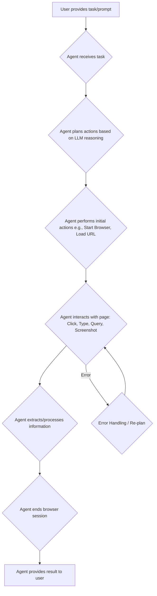
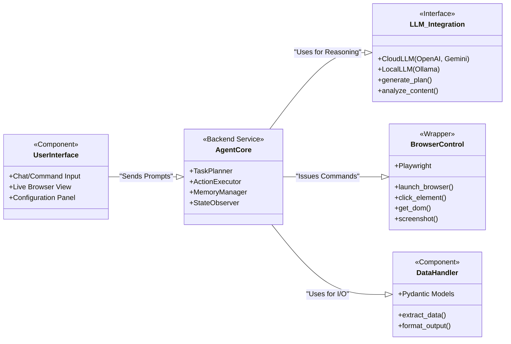
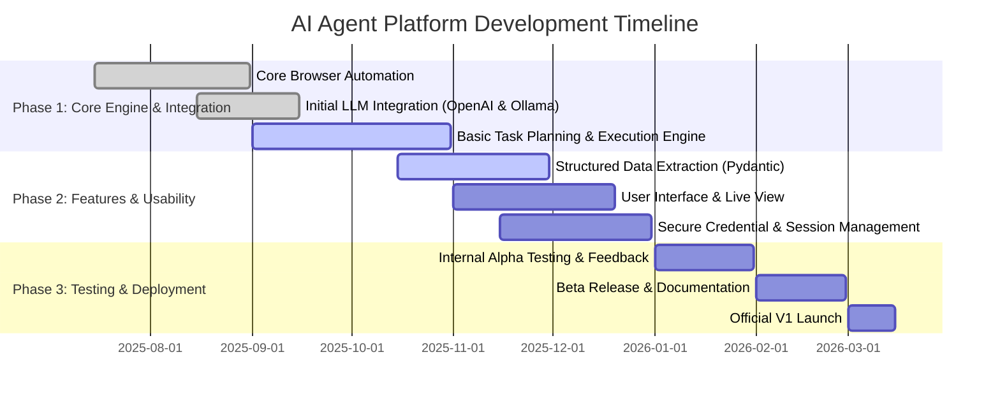

# Electronic Billing Agent

[Project Requirement Document](Project%20Requirement%20Document%2022c4544eeb42805db456e8d7bc5102f0.md)

[Backend Architecture Document](Backend%20Architecture%20Document%2022c4544eeb428050b1fefe8cd89dfe34.md)

[Technology Stack](Technology%20Stack%2022c4544eeb4280358d30f880181b6681.md)

[Frontend Design Guidelines](Frontend%20Design%20Guidelines%2022c4544eeb4280a685d4c1735206d994.md)

[File Structure Documentation](File%20Structure%20Documentation%2022c4544eeb428098a5b5f6aa0dc866e1.md)

[Application Flow Documentation](Application%20Flow%20Documentation%2022c4544eeb42806da9fed6a27168a239.md)

[Schema Design Document](Schema%20Design%20Document%2022c4544eeb428025a42fdb967d93acf5.md)

### Project Overview

This document outlines the requirements for an **AI Agent Platform** designed to automate web-based tasks through natural language commands. The core objective is to create a user-friendly framework that allows AI agents to control web browsers, interact with websites, and parse unstructured information into structured data. The platform will prioritize flexibility in Large Language Model (LLM) integration, user control, data privacy through local execution options, and overall trustworthiness. The ultimate goal is to empower both general users and enterprises to automate complex and repetitive digital workflows seamlessly and securely.

---

### Scope

### In-Scope

- **Browser Automation**: The system will launch, manage, and control web browsers (Chrome, Edge) to perform actions like navigation, clicking, typing, and form submission.
- **Natural Language Control**: Users will instruct the agent using plain English, which the system will translate into browser actions.
- **Flexible LLM Integration**: The platform will support API connections to major cloud-based LLMs (e.g., OpenAI, Gemini, Anthropic) and allow integration with locally-hosted models (e.g., via Ollama).
- **Structured Data Extraction**: Agents will be capable of identifying and extracting information from web pages and formatting it into structured outputs like JSON.
- **Session & State Management**: The system will leverage existing browser sessions and cookies to interact with sites requiring authentication.
- **User Oversight and Control**: Users will have a real-time view of the agent's actions and the ability to pause or terminate its operation.
- **Secure Credential Handling**: The platform will manage sensitive data (like passwords) using secure methods that prevent exposure to the LLM.
- **Basic File System Interaction**: Agents will be able to access local files, such as reading from a document or using a downloaded file.

### Out-of-Scope

- **Advanced Domain Expertise**: Infusing agents with specialized domain knowledge (e.g., for legal or medical analysis) is a future consideration.
- **Workflow Recording and Replay**: A feature to record user actions and create a replayable workflow is not included in the initial version.
- **Advanced Debugging Tools**: Enhanced visualization tools for debugging the agent's internal thought processes are planned for a future release.
- **Native Cross-Platform Desktop Application**: While the framework will be cross-platform, a unified, standalone desktop application is part of the future roadmap.

---

### User Flow

The core user flow involves a user providing a high-level task, which the AI agent then breaks down into a series of browser-based actions. The agent continuously observes the state of the web page to inform its next step, handling errors by re-planning its approach until the task is complete.

Code snippet

---

### Key Features

- **Natural Language Tasking**: Users can assign complex tasks like "Find the top three posts about AI on Twitter from the last 24 hours and save them to a file" using simple language.
- **Live Browser View**: Provides a real-time stream of the browser window the agent is controlling, allowing users to monitor its actions live.
- **Multi-Agent Architecture**: Allows for the use of specialized agents for different sub-tasks (e.g., a Navigator agent and a Validator agent) that can use different LLMs.
- **Structured Output Definition**: Users can define a desired output structure (e.g., using Pydantic models), and the agent will format the extracted data accordingly.
- **Interactive Content Analysis**: Enables users to upload documents (PDFs, spreadsheets) or summarize web content and then ask follow-up questions in a conversational manner.
- **Configurable Initial Actions**: Users can pre-define a set of startup actions (e.g., logging into a specific service) to make task execution faster and cheaper.
- **Error Correction**: The agent can detect when an action fails (like a button click) and attempt to recover by trying an alternative method.

---

### Technology Stack

The system is architected to be a modular layer between the user, the LLM, and the web browser. The core logic is handled in a Python backend, with Playwright managing browser interactions.

Code snippet

- **Programming Language**: Python
- **Browser Automation**: Playwright
- **LLM Integration**: OpenAI API, Anthropic API, Google Gemini API, Ollama
- **Data Structuring**: Pydantic
- **Compatibility**: Windows, macOS, Linux

---

### Non-Functional Requirements

- **Performance**: The agent must execute tasks with minimal latency. Resource usage, especially LLM token consumption, should be optimized to reduce operational costs.
- **Security**: All sensitive data, particularly user credentials, must remain on the local machine and must not be passed to external LLM APIs. The agent's actions must be governable, with clear boundaries and human-in-the-loop controls.
- **Scalability**: The architecture must be agnostic to the LLM provider, allowing for new models to be integrated easily. The system should be designed to eventually support parallel execution of tasks.
- **Usability**: The platform must be accessible to users with minimal coding experience. Documentation must be clear, comprehensive, and provide easy-to-follow examples for setup and common use cases.
- **Reliability**: The agent must feature robust error handling to recover from unexpected website changes or failed interactions. All agent actions, decisions, and outcomes should be logged for auditing and debugging.

---

### Project Timeline

*Note: The following timeline is an illustrative example, as specific dates were not provided.*

Code snippet

| **Day** | **What I Have Done** | **What I Will Do** | **Reflection** |
| --- | --- | --- | --- |
| 02/07/2025 | Research about Ai agents, how to build AI agents, browser use and other browser agents.  | Research about Ai agents and browser agents. study and plan how can we build an ai agent for our requirement | Created a Project requirement document using browser agent.
[Electronic Billing Agent](Electronic%20Billing%20Agent%202244544eeb428025b5a3c625bafff3a2.md)  |
| 03/07/2025 | Build a base application, with input parsing working, gathered all the components, did plan documents in cursor | I will start building the Ai agentic solution for electronic billing automation.
Provide support to the beta tester | we are going to use browser-use agent with enhancement and customization.  |
|  |  |  |  |
|  |  |  |  |
|  |  |  |  |
|  |  |  |  |
|  |  |  |  |