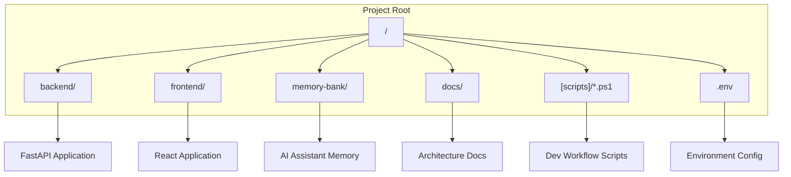
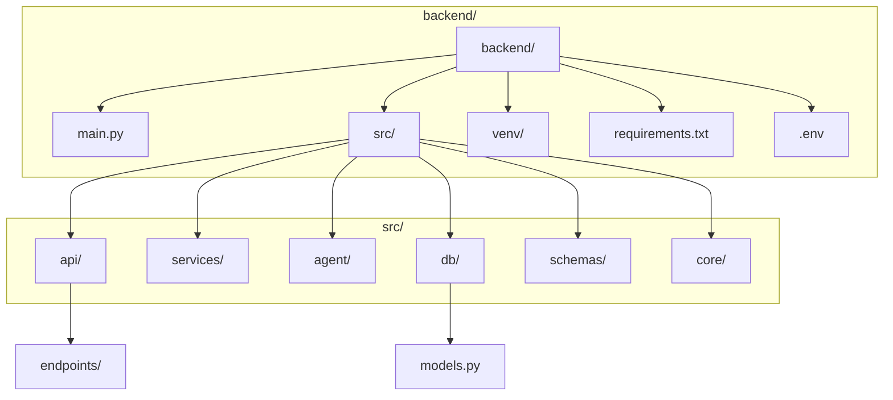
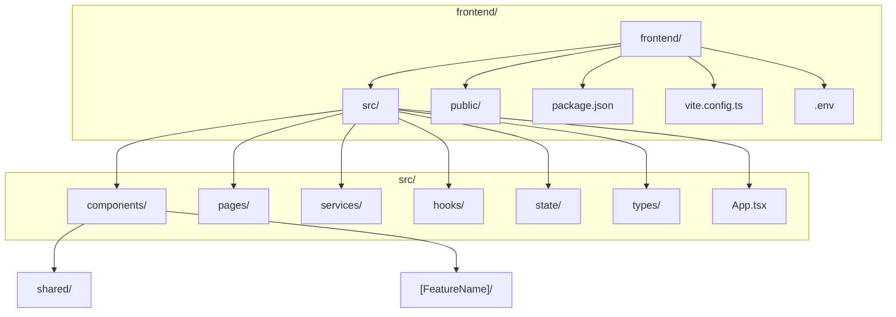

# File Structure Documentation

```markdown
# File Structure Documentation

## Introduction

A well-organized file structure is the backbone of a scalable and maintainable software project. It provides a logical framework that enhances developer onboarding, simplifies debugging, and promotes a clear separation of concerns. This document outlines the standardized file and directory structure for our application, ensuring consistency and clarity across the entire codebase.

## Technology Stack Influence

Our technology choices directly shape our file organization. The project is a monorepo-style structure with two distinct sub-projects: a Python backend and a TypeScript frontend.

- **Backend (Python/FastAPI)**: The structure is influenced by Python's module system and best practices for building scalable APIs. The use of a virtual environment (`venv`) isolates dependencies, which are listed in `requirements.txt`. The modular design we've adopted encourages breaking down logic into `services`, `api` endpoints, and `db` models.
- **Frontend (React/TypeScript)**: The structure is dictated by modern React development standards. Node.js package management (`npm`) organizes dependencies in `node_modules` and `package.json`. The component-based architecture of React naturally leads to a separation of UI elements into `pages` and reusable `components`.

## Root Directory Structure

The root directory separates the major components of the application—backend, frontend, and documentation—and contains essential configuration and development scripts.



- **`backend/`**: Contains the entire Python FastAPI application.
- **`frontend/`**: Contains the entire React TypeScript application.
- **`memory-bank/`**: Stores markdown files that provide context and memory for AI-assisted development.
- **`docs/`**: A proposed directory for storing high-level documentation like the PRD and architecture guides.
- **`.ps1`**: PowerShell scripts (`start-dev.ps1`, `cleanup-ports.ps1`, etc.) for managing the development environment.
- **`.env`**: Root environment file for shared configurations (if any).

## Backend Directory Structure

The backend follows a service-oriented architecture to ensure a clean separation of concerns.



- **`main.py`**: The entry point for the FastAPI application.
- **`src/`**: The main source code directory.
    - **`api/`**: Contains the FastAPI routers and endpoint definitions (e.g., `tasks.py`, `auth.py`).
    - **`services/`**: Holds the core business logic (e.g., `task_service.py`).
    - **`agent/`**: Contains the `AgentManager` and `SocketManager` responsible for orchestrating the `browser-use` agent and handling WebSockets.
    - **`db/`**: Includes database session management (`database.py`) and SQLAlchemy ORM models (`models.py`).
    - **`schemas/`**: Contains Pydantic schemas for data validation and serialization.
    - **`core/`**: Holds application-wide logic like configuration (`config.py`) and security utilities.
- **`venv/`**: The Python virtual environment directory (ignored by git).
- **`requirements.txt`**: Lists all Python dependencies.
- **`.env`**: Backend-specific environment variables (e.g., database URL, secret keys).

## Frontend Directory Structure

The frontend is organized around features and component types, a standard practice for scalable React applications.



- **`src/`**: The main source code directory.
    - **`App.tsx`**: The root component of the application, which handles routing.
    - **`components/`**: Contains reusable UI components, further organized into `shared/` (e.g., Button, Input) and feature-specific directories.
    - **`pages/`**: Holds top-level components that correspond to application routes (e.g., `DashboardPage.tsx`, `TaskExecutionPage.tsx`).
    - **`services/`**: Contains modules for communicating with the backend (`apiService.ts`, `webSocketService.ts`).
    - **`hooks/`**: For custom React hooks that encapsulate reusable logic.
    - **`state/`**: For state management configuration, such as setting up TanStack Query providers.
    - **`types/`**: Holds shared TypeScript type definitions and interfaces.
- **`public/`**: Contains static assets like `index.html`, favicons, and images.
- **`package.json`**: Defines project metadata and lists all Node.js dependencies.
- **`vite.config.ts`**: Configuration for the Vite build tool.
- **`.env`**: Frontend-specific environment variables (e.g., `VITE_API_BASE_URL`).