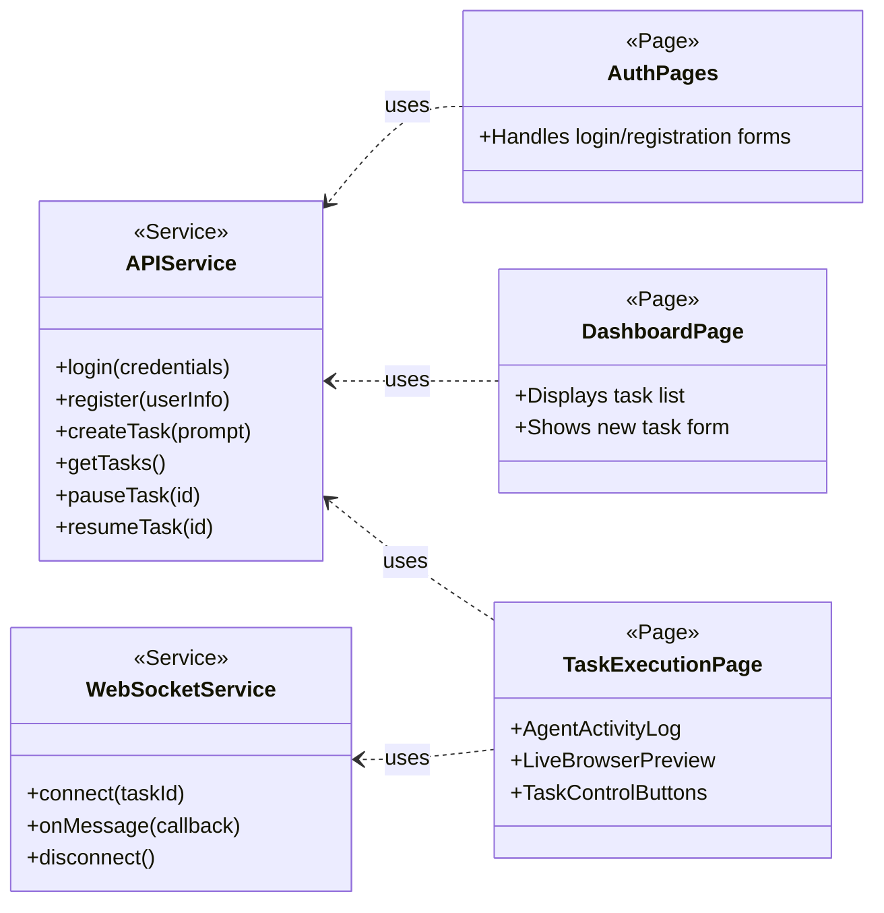
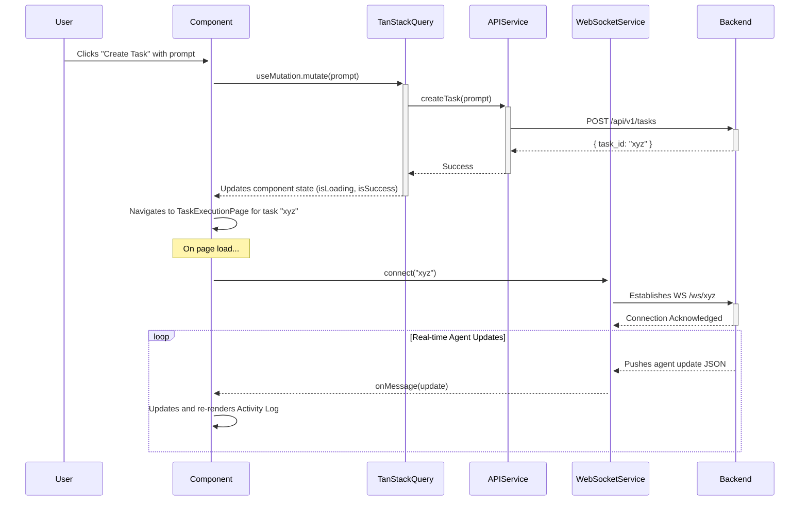
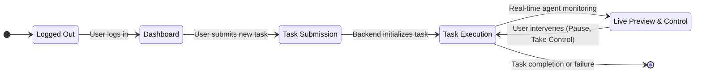

# Frontend Design Guidelines

```markdown
# Frontend Design Guidelines Document

## Introduction

The frontend system of this application is designed to provide users with a highly interactive, real-time interface for managing and monitoring the execution of browser automation tasks. Users can assign tasks using natural language, observe the agent's actions, and take control when necessary. The application offers transparency into the agent's reasoning and actions, with live browser previews, real-time activity logs, and interactive controls for task management. The core objective is to enhance the user experience by integrating the `browser-use` agent, fine-tuning it for specialized tasks such as "facturación", while providing seamless control over task execution.

### Major Functional Areas:
- **User Authentication**: Enabling users to log in and access their personalized dashboard.
- **Task Management**: Allowing users to submit, monitor, pause, and resume tasks.
- **Real-time Agent Activity Monitoring**: Displaying agent status, logs, and real-time browser actions.
- **Interactive Controls**: Enabling users to intervene in ongoing tasks for manual control.

## Core Application Modules

The frontend will consist of several key components, each serving a distinct purpose in the overall workflow.

### Frontend Components:
- **`AuthPages`**: Components for user registration, login, and authentication processes.
- **`DashboardPage`**: The landing page after authentication, providing task creation forms and a list of past and active tasks.
- **`TaskExecutionPage`**: A detailed view for task control, combining the **Agent Activity Log**, **Live Browser Preview**, and **Task Control Buttons** for seamless interaction.
- **`AgentActivityLog`**: Displays real-time updates of the agent’s activities, including its reasoning and decision-making steps.
- **`LiveBrowserPreview`**: Shows the visual output of the agent’s browser interactions. Initially, this will be a read-only stream that becomes interactive when the user takes control.
- **`TaskControlButtons`**: A set of buttons for pausing and resuming tasks, as well as taking manual control of the agent.

### Backend Dependencies:
- **`REST API`**: The frontend communicates with the backend via HTTP requests for user authentication, task creation, task status updates, and more. We will use `axios` to manage API interactions.
- **`WebSocket API`**: Real-time updates from the agent are handled via WebSocket. The frontend establishes a persistent WebSocket connection to receive live agent updates and update the user interface in real-time.

## Component Architecture and Services

The application architecture is built around a modular system with distinct pages, components, and services to manage user interaction, backend communication, and state management.



## State Management and Data Flow

The frontend will utilize a hybrid state management strategy to handle server and real-time data efficiently.

### Server State:

We will use **TanStack Query** to manage server-side state and handle all asynchronous requests. This library provides automatic caching, background refetching, and efficient data mutations.

### Real-time State:

Data streamed via WebSocket will be handled by the **WebSocketService** and stored in the frontend’s state using **React’s** `useState` or `useReducer` hooks for real-time updates.

### Global UI State:

Global UI state, such as the user’s authentication status, will be managed using **React's Context API**.

The following diagram illustrates how a user creates a task and receives real-time updates.



## Styling and UI Library

### Styling:

**TailwindCSS** will be used for styling the frontend. Tailwind's utility-first approach makes it easy to apply consistent styles across the application while allowing rapid iteration and a responsive design system.

### Component Library:

For UI consistency and maintainability, we will use **Shadcn/UI**, a headless component library compatible with TailwindCSS. This library will provide customizable components for user interface elements such as buttons, forms, and modal dialogs, ensuring a cohesive look and feel throughout the application.

## User Workflow

The following diagram outlines the primary user interaction flow from login to task completion, illustrating the user’s journey through task submission, agent monitoring, and control.



This document outlines the key components, features, architecture, and user flows of the frontend system, providing a comprehensive guide for developing and maintaining the UI for the browser automation application.

```

```