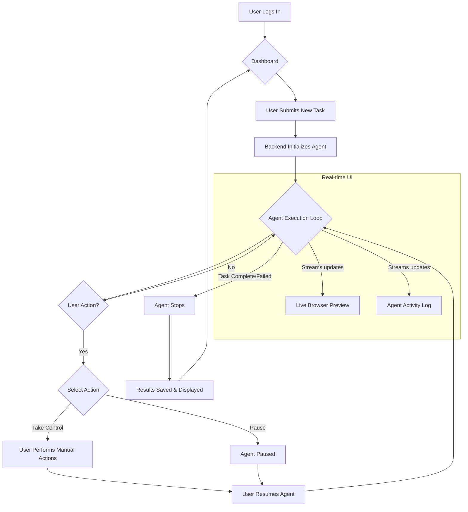
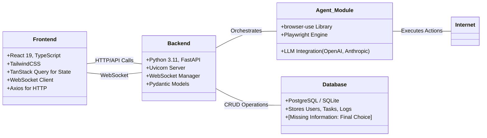
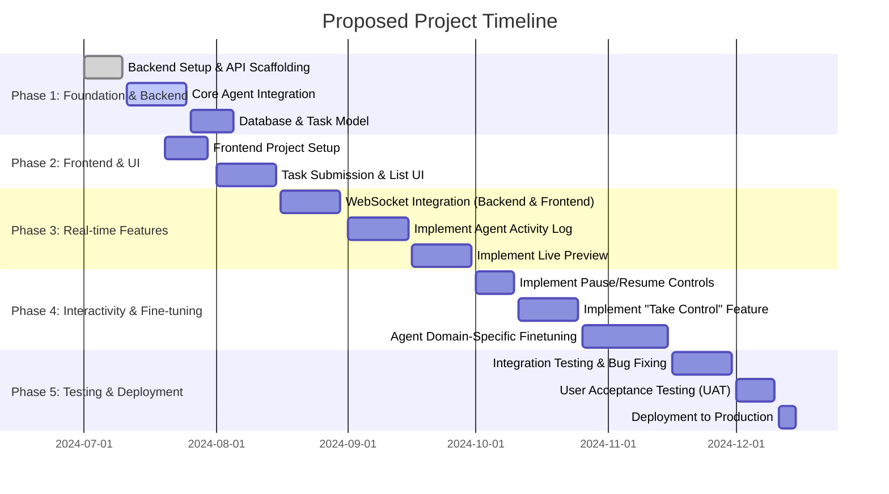

# Project Requirement Document

---

## **Project Requirements Document**

### **1. Project Overview**

**Objective**

The project's primary objective is to develop a full-stack web application that provides a user-friendly interface for managing and monitoring a sophisticated browser automation agent. The application will enable users to assign complex web-based tasks using natural language. It will offer a real-time, transparent view into the agent's execution, including its reasoning, actions, and a live preview of the browser it controls. The core technical goal is to leverage the existing `browser-use` agent, adapting it for specialized, domain-specific tasks (e.g., "facturación" or other automated processes), while providing a user experience similar to the `browser-use` cloud platform, with interactive controls for pausing, manual intervention, and resuming automation.

---

### **2. Scope**

### **In-Scope**

- **Full-Stack Application**: A React/TypeScript frontend and a Python/FastAPI backend.
- **Natural Language Tasking**: Users can submit tasks in plain English.
- **Real-time Agent Activity Log**: A "chat-style" log displaying the agent's `thinking`, `evaluation_previous_goal`, `memory`, `next_goal`, and `action` steps as they happen.
- **Interactive Live Preview**: An embedded view showing the agent's browser screen in real-time.
- **User Intervention Controls**: Functionality for users to **Pause** the agent, **Take Control** to perform manual browser actions, and then **Resume** the automated process.
- **Core Agent Integration**: Utilize the existing `browser-use` Python library as the core automation engine.
- **Domain-Specific Adaptation**: Fine-tuning the agent's prompts and logic to optimize performance for a specific set of tasks.
- **Task History**: Storing and displaying a list of past and current tasks and their final status.
- **User Authentication**: Basic user login and session management.

### **Out-of-Scope**

- **Building a New Agent from Scratch**: This project will adapt the existing `browser-use` agent, not create a new one.
- **Advanced User/Team Management**: Features like multi-tenancy, role-based access control (RBAC), and team collaboration are not in scope for the initial version.
- **Native Mobile Application**: The application will be web-based and responsive, but no native iOS or Android app will be developed.
- **Offline Functionality**: The application requires an active internet connection to function.
- **Development of the core `browser-use` library**: We are consumers and adapters of the library, not core maintainers.

---

### **3. User Flow**

The user journey begins with logging in and submitting a task. The system then visualizes the agent's progress, allowing the user to monitor, intervene, and finally review the completed task.

---

### **4. Key Features**

- **Interactive Agent Control Center**: A centralized UI to define, run, and monitor browser automation tasks. The UI will be heavily inspired by the browser-use cloud interface.
- **Real-time Agent Activity Log**: This feature directly surfaces the agent's structured JSON output (`thinking`, `action`, etc.) into a human-readable, step-by-step log, providing transparency into its decision-making process.
- **Live Browser Preview**: An embedded browser view that streams the agent's interactions with the web page, allowing users to see exactly what the agent is doing.
- **"Take Control & Resume" Functionality**: A powerful feature allowing users to pause the automated workflow, take over manual control of the browser to navigate complex situations (like captchas or unexpected pop-ups), and then seamlessly hand control back to the agent to resume its task.
- **Domain-Adapted Agent**: The `browser-use` agent will be fine-tuned through prompt engineering and logic adjustments to excel at a specific set of business-critical tasks (e.g., "facturación").
- **Task Persistence**: All tasks, including their logs and final outcomes, are stored and can be reviewed later.

---

### **5. Technology Stack**

The application will be built on a modern web stack, separating frontend and backend concerns, and integrating with the powerful `browser-use` library for its core automation capabilities.

---

### **6. Non-Functional Requirements**

- **Performance**: WebSocket updates for the activity log and live preview must have minimal latency (<500ms). The backend must support running at least **[Missing Information: e.g., 5-10]** concurrent agent sessions without significant degradation.
- **Security**: All communication between the frontend and backend will be over HTTPS. User credentials and sensitive data handled by the agent must be encrypted. API keys and secrets will be managed via environment variables and not be hardcoded.
- **Scalability**: The architecture should be stateless where possible, allowing for horizontal scaling of the backend service in the future. The number of concurrent agents will be the primary scaling constraint.
- **Usability**: The user interface must be intuitive, clean, and closely mirror the look and feel of the "browser-use cloud" reference. The agent's activity log must be easy to follow for non-technical users.
- **Reliability**: The system must include robust error handling for both API requests and agent execution failures. A resilient WebSocket connection with automatic reconnection logic is required. The system should aim for **99.5%** uptime.

---

### **7. Project Timeline**

---

### **8. Open Questions**

1. **Database Sharding**: Should we implement sharding for horizontal scaling of data?
No need for now, because this is an MVP.
2. **Backup Strategy**: What is the acceptable RPO (Recovery Point Objective) for the database?
No need for now
3. **Cache Strategy**: Should session data be cached per user or globally?
Not required
4. **Monitoring Solution**: Which monitoring tool should be used—Prometheus, Datadog, or something else?
Not required for now.

---