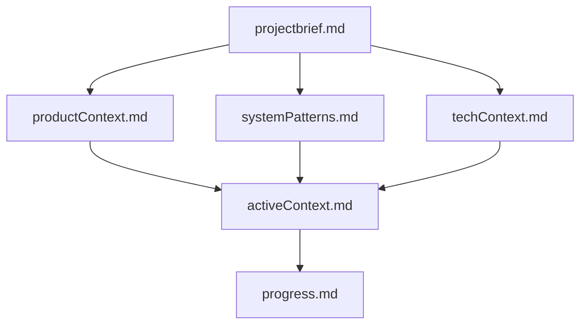

# Memory Bank - CFDI 4.0 Automation System

## Overview

This Memory Bank contains comprehensive documentation for the **CFDI 4.0 Invoice Form Automation System** - a SaaS application that automates Mexican CFDI invoicing forms across vendor portals using our custom-enhanced Browser-Use AI agent integrated with Browserbase infrastructure.

## Memory Bank Structure

### Core Files (Required)
These files build upon each other and should be read in order when starting fresh:

1. **`projectbrief.md`** - Foundation document with core mission, objectives, and project scope
2. **`productContext.md`** - Market problems, solution approach, user personas, and business model
3. **`systemPatterns.md`** - Technical architecture, design patterns, and component relationships
4. **`techContext.md`** - Technology stack, development setup, constraints, and dependencies
5. **`activeContext.md`** - Current work focus, recent decisions, next steps, and active challenges
6. **`progress.md`** - Implementation status, what's working, what's left to build, and known issues

### File Hierarchy & Dependencies

## Key Project Information

### **Core Mission**
Automate CFDI 4.0 form completion across vendor portals with real-time transparency through embedded Browserbase Live View iFrames and seamless user intervention capabilities.

### **Technology Stack**
- **Frontend**: React 19, shadcn/ui, Tailwind CSS, WebSocket client
- **Backend**: Node.js/Express, Supabase (PostgreSQL + Auth), Redis/bullmq
- **Automation**: Custom Browser-Use agent, Browserbase headless browser infrastructure
- **Database**: PostgreSQL with Row-Level Security, AES-256 encryption for sensitive data

### **Architecture Pattern**
- **Dual-pane interface**: 70% embedded browser view, 30% status sidebar
- **Real-time updates**: WebSocket at `/ws/:taskId` for live status
- **User intervention**: Seamless takeover via Browserbase Live View
- **Multi-tenant security**: JWT authentication with Supabase Auth + RLS

### **Current Status** (Week 1 of 8)
- **Documentation**: ✅ Complete (100%)
- **Infrastructure**: 🔄 In Progress (15%)
- **Frontend**: 🔄 Planning (5%)
- **Integration**: ⏳ Not Started (0%)

## How to Use This Memory Bank

### **For New Team Members**
1. Start with `projectbrief.md` to understand the core mission
2. Read `productContext.md` to grasp the market opportunity and user needs
3. Review `systemPatterns.md` for technical architecture understanding
4. Study `techContext.md` for development environment and technology decisions
5. Check `activeContext.md` for current priorities and recent decisions
6. Review `progress.md` for implementation status and next steps

### **For Development Sessions**
- **Daily Work**: Always check `activeContext.md` for current priorities
- **Technical Decisions**: Reference `systemPatterns.md` for established patterns
- **Technology Questions**: Consult `techContext.md` for constraints and standards
- **Status Updates**: Update `progress.md` after significant changes
- **New Patterns**: Document discoveries in appropriate core files

### **For Context Refresh (After Memory Reset)**
Read ALL files in order - this Memory Bank is your complete link to previous work and decisions. The effectiveness of continued development depends entirely on this documentation accuracy.

## Key External Services

### **Critical Dependencies**
- **Supabase**: Database (PostgreSQL), Authentication, Storage, Real-time subscriptions
- **Browserbase**: Headless browser infrastructure with Live View iFrame generation
- **Redis**: Task queuing via bullmq, session caching, rate limiting
- **Custom Browser-Use Agent**: Enhanced open-source library with CFDI-specific patterns

### **Performance Targets**
- **API Response**: <200ms standard operations
- **WebSocket Latency**: <300ms for real-time updates
- **Task Processing**: 3 minutes max per automation
- **Concurrent Capacity**: 50+ simultaneous automation sessions
- **Success Rate**: >85% forms completed without intervention

## Development Standards

### **Code Quality**
- **TypeScript**: Strict configuration with >95% coverage
- **ESLint + Prettier**: Automated code quality and formatting
- **Testing**: Jest (unit), Supertest (integration), Playwright (E2E)
- **Security**: AES-256 encryption, HTTPS/WSS, LFPDPPP compliance

### **API Standards**
- **REST Endpoints**: Standardized HTTP methods and response formats
- **WebSocket**: Real-time bidirectional communication
- **Authentication**: JWT with Supabase Auth integration
- **Error Handling**: Consistent error types and recovery patterns

### **Documentation Requirements**
- **New Patterns**: Must be documented in systemPatterns.md
- **API Changes**: Update techContext.md with endpoint modifications
- **Progress Updates**: Update progress.md with implementation status
- **Decision Records**: Log in activeContext.md with rationale

## Project Timeline

### **8-Week Development Plan**
- **Weeks 1-2**: Foundation setup (infrastructure, authentication, database)
- **Weeks 3-4**: Core features (automation, real-time interface, user intervention)
- **Weeks 5-6**: Advanced features (analytics, error handling, performance optimization)
- **Weeks 7-8**: Polish and deployment (testing, security audit, production deployment)

### **Current Phase: Foundation Setup**
Focus on establishing robust infrastructure before implementing business logic. All external services must be connected and tested before proceeding to automation development.

## Success Metrics

### **MVP Success Criteria**
- ✅ **Documentation Complete**: All Memory Bank files comprehensive
- ⏳ **Authentication Working**: JWT + Supabase Auth end-to-end
- ⏳ **Database Operational**: All tables with RLS policies active
- ⏳ **Task Processing**: bullmq queue processing basic jobs
- ⏳ **Live View Integration**: Browserbase iFrame embedded successfully
- ⏳ **Real-time Updates**: WebSocket communication functional

### **Production Readiness**
- **Automation Success Rate**: >85% forms completed without intervention
- **User Intervention Response**: <30 seconds from pause to takeover
- **System Performance**: All response time targets met
- **Security Compliance**: Full LFPDPPP compliance with audit trail
- **User Experience**: >4.5/5 rating for transparency and control

---

**Remember**: This Memory Bank is the single source of truth for project context. Keep it updated as the project evolves, and always reference it when making technical decisions or architectural changes. 