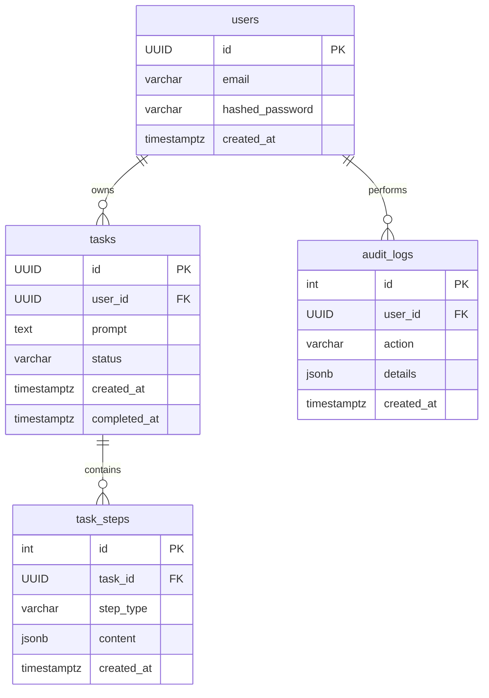

# Schema Design Document

```markdown
# Database Schema Documentation

## Introduction

This document outlines the database schema, data models, and relationships for the browser automation application. The design is centered on **PostgreSQL**, chosen for its robustness, reliability, and support for complex queries and data types like JSONB. The schema is designed to support the core functionalities of the application: user management, task orchestration, and detailed, step-by-step logging of agent activities, while prioritizing security and scalability.

## Database Overview

### Primary Database (PostgreSQL)

- **Purpose**: To be the single source of truth for all persistent data, including user accounts, task definitions, and the granular logs generated by the browser agent during execution.
- **Type**: Relational DB (e.g., self-hosted PostgreSQL or a managed service like Supabase).
- **Key Use Cases**:
    - Storing and retrieving user and task data.
    - Logging every agent action for transparency and debugging.
    - Enforcing data integrity through foreign key constraints.
    - Applying row-level security to ensure users can only access their own data.

### Secondary Storage (Not in Scope for MVP)

- **Purpose**: While not part of the initial implementation, a secondary in-memory store like **Redis** could be introduced in the future.
- **Potential Use Cases**:
    - Caching user session data to reduce database load.
    - Implementing rate limiting for API endpoints.

## Key Tables

The following tables form the core of the application's data layer.

1. **users**
    - **Purpose**: Manages user authentication and profile information.
    - **Fields**:
        - `id` (UUID) [PK]
        - `email` (VARCHAR(255)) [UNIQUE]
        - `hashed_password` (VARCHAR(255))
        - `created_at` (TIMESTAMPTZ)
2. **tasks**
    - **Purpose**: Stores the high-level information for each automation task initiated by a user.
    - **Fields**:
        - `id` (UUID) [PK]
        - `user_id` (UUID) → References `users.id`
        - `prompt` (TEXT) → The initial natural language command from the user.
        - `status` (VARCHAR(20)) → CHECK in ["pending", "running", "paused", "completed", "failed"]
        - `created_at` (TIMESTAMPTZ)
        - `completed_at` (TIMESTAMPTZ) [NULLABLE]
3. **task_steps**
    - **Purpose**: Provides a detailed, chronological log of every step the agent takes. This is crucial for the "Real-time Agent Activity Log" feature.
    - **Fields**:
        - `id` (SERIAL) [PK]
        - `task_id` (UUID) → References `tasks.id`
        - `step_type` (VARCHAR(50)) → e.g., "thinking", "action", "evaluation", "memory".
        - `content` (JSONB) → Stores the structured JSON output from the agent for that specific step.
        - `created_at` (TIMESTAMPTZ)
4. **audit_logs**
    - **Purpose**: Records key user actions and system events for security and monitoring.
    - **Fields**:
        - `id` (SERIAL) [PK]
        - `user_id` (UUID) [NULLABLE] → References `users.id`
        - `action` (VARCHAR(100)) → e.g., "user_login", "user_login_failed", "task_created".
        - `details` (JSONB) → Additional context, like IP address or affected resource ID.
        - `created_at` (TIMESTAMPTZ)

## Relationships

The relationships between tables are designed to ensure data integrity and provide a clear, traceable path from a user to their tasks and the individual steps within those tasks.

### Entity Relationship Diagram



### Relationship Highlights

1. **User-Task Link**:
    - **`tasks.user_id` → `users.id`**: This is a critical link that associates every task with a specific user, which is essential for security and data retrieval.
2. **Task-Step Traceability**:
    - **`task_steps.task_id` → `tasks.id`**: This ensures every detailed agent log entry is tied back to its parent task, allowing us to reconstruct the full history of any given automation run.
3. **Auditing**:
    - **`audit_logs.user_id` → `users.id`**: Connects system-level events to the user who triggered them.

## Indexing and Optimization

To ensure responsive queries, especially as the `tasks` and `task_steps` tables grow, the following indexes are recommended.

1. **Foreign Key Indexes**:
    
    ```sql
    -- To speed up fetching tasks for a specific user
    CREATE INDEX idx_tasks_user_id ON tasks (user_id);
    
    -- To speed up fetching all steps for a specific task
    CREATE INDEX idx_task_steps_task_id ON task_steps (task_id);
    
    ```
    
2. **Status and Timestamp Indexes**:
    
    ```sql
    -- To efficiently query tasks by their current status
    CREATE INDEX idx_tasks_status ON tasks (status);
    
    -- To optimize time-based queries on logs
    CREATE INDEX idx_task_steps_created_at ON task_steps (created_at DESC);
    
    ```
    

## Security and Compliance

Data security and privacy are paramount. The schema design incorporates several layers of security.

1. **Row-Level Security (RLS)**:
    
    We will enforce a strict policy ensuring that users can only view and manage their own tasks.
    
    ```sql
    -- Enable RLS on the tasks table
    ALTER TABLE tasks ENABLE ROW LEVEL SECURITY;
    
    -- Create a policy that checks the current user's ID
    CREATE POLICY "User can only access their own tasks"
    ON tasks FOR ALL
    USING (user_id = auth.uid()); -- auth.uid() is a common function in Supabase
    
    ```
    
    A similar policy would be applied to `task_steps` by joining through the `tasks` table.
    
2. **Encryption**:
    - **At Rest**: Passwords stored in the `users` table will be hashed using a strong algorithm like bcrypt via `passlib`.
    - **In Transit**: All connections to the PostgreSQL database must be configured to use TLS to prevent eavesdropping.
3. **Backup & Recovery**:
    - A standard Point-In-Time-Recovery (PITR) strategy is recommended. This involves enabling Write-Ahead Logging (WAL) and performing regular backups, allowing for restoration to any point in time.