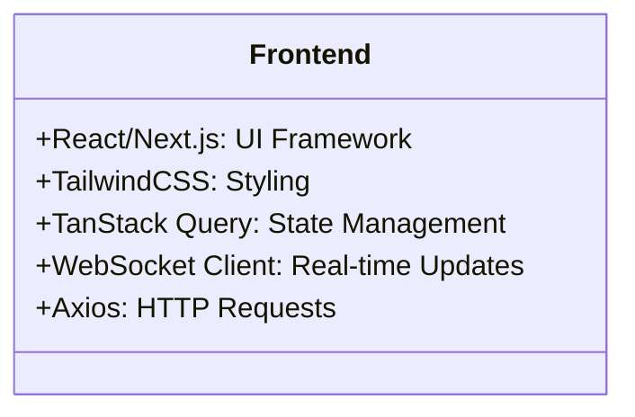
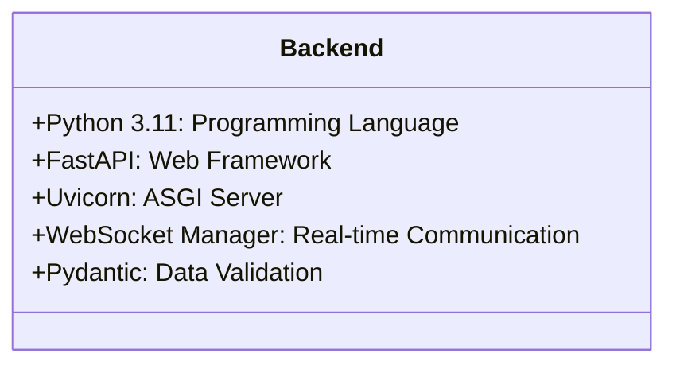
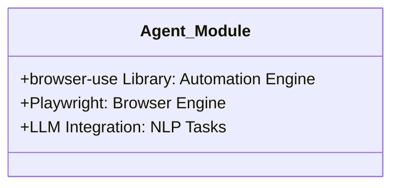
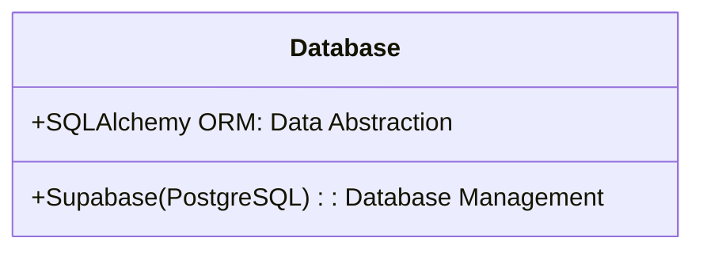
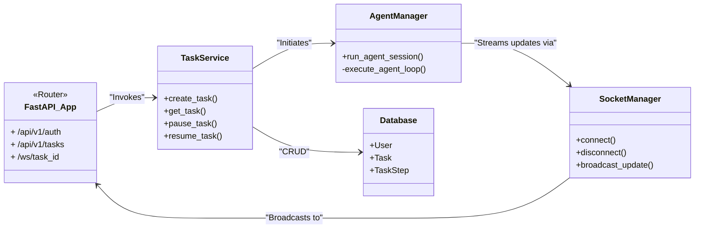
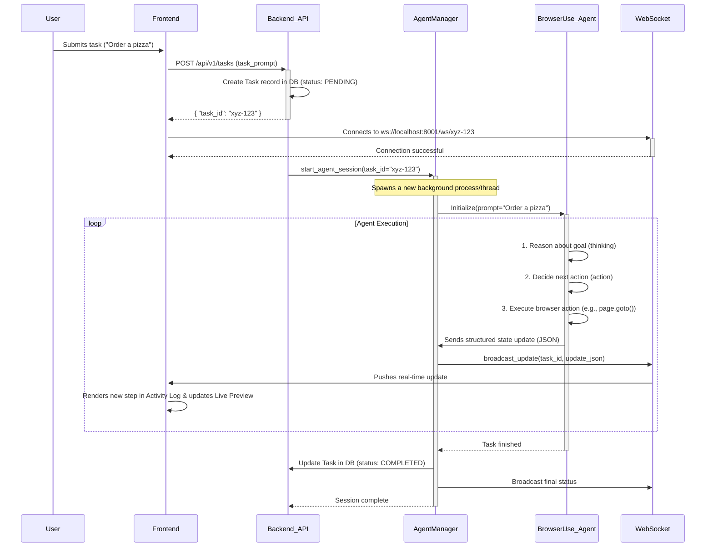
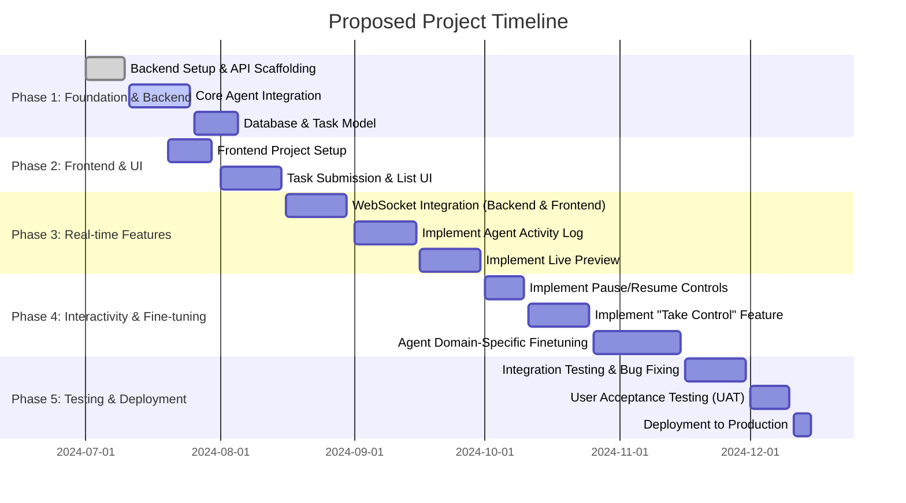

# Technology Stack

```markdown
# Technology Stack Documentation

## Technology Stack Overview

The technology stack for the full-stack web application is designed to support a sophisticated browser automation agent system. The stack is modular, separating frontend and backend concerns, and integrates with the `browser-use` Python library to handle browser automation. The frontend is built with React/TypeScript, offering a user-friendly interface for task submission and agent monitoring, while the backend utilizes FastAPI and Python to manage user authentication, API services, and agent orchestration. Real-time updates are delivered via WebSockets, and tasks and user data are stored in **Supabase**, a powerful backend-as-a-service platform that offers scalable storage and authentication.

## Frontend Technologies

The frontend is responsible for providing an intuitive user interface for interacting with the system. It allows users to input natural language commands, monitor agent activity, and intervene in ongoing tasks.

### Key Frontend Technologies:
- **React/Next.js**: Used for building the user interface, offering a reactive and component-based approach for creating the application's views.
- **TailwindCSS**: Utilized for styling the UI, providing utility-first CSS for fast and flexible design.
- **TanStack Query**: Manages state and data fetching for the frontend.
- **WebSocket Client**: Enables real-time communication between the frontend and backend.
- **Axios**: Used for making HTTP requests to the backend API.

### Authentication Mechanism:
- **Next.js Authentication**: Implements simple authentication using Next.js's API routes and a session management mechanism (e.g., `next-auth`) or custom JWT-based authentication.



## Backend Technologies

The backend is built with Python and FastAPI to handle core business logic, API interactions, and automation management. It integrates with the `browser-use` library for browser automation and uses **Supabase** for storing user and task information.

### Key Backend Technologies:

- **Python 3.11**: Primary programming language for backend development.
- **FastAPI**: Web framework used to build RESTful APIs for task management, user authentication, and control.
- **Uvicorn**: ASGI server to run FastAPI in an asynchronous environment.
- **WebSocket Manager**: Manages WebSocket connections to stream real-time updates to the frontend.
- **Pydantic**: Handles data validation and serialization, ensuring robust input handling.

### Authentication & Security:

- **JWT (JSON Web Tokens)**: Used for securing API endpoints. Tokens are generated upon login and required for protected routes.
- **Supabase Authentication**: Leveraging Supabase for user management, including authentication (login/signup) and session handling.



## Agent Module

The agent module integrates the existing `browser-use` Python library to handle browser automation tasks. It is responsible for executing tasks assigned by the user, providing real-time updates, and allowing for user intervention when needed.

### Key Technologies:

- **browser-use Library**: The core automation engine for managing browser-based tasks.
- **Playwright**: Used as an alternative engine for browser control if needed.
- **LLM Integration (OpenAI, Anthropic)**: Leverages large language models for natural language processing and task interpretation.



## Database Technologies

The application uses **Supabase** for storage. Supabase provides scalable, PostgreSQL-based storage and simplifies data access with its integrated services for authentication, database management, and real-time updates.

### Key Technologies:

- **Supabase (PostgreSQL)**: A managed database solution for storing user, task, and task-related data.
- **SQLAlchemy ORM**: Provides an abstraction layer for database interaction, simplifying query and data manipulation tasks.



## System Architecture

The backend is structured in a modular, service-oriented architecture with clear separation of concerns. This approach enhances scalability, maintainability, and ease of debugging.



## Data Flow

The system operates in an event-driven fashion. When a user submits a task, the backend orchestrates the task's execution by interacting with the `browser-use` agent, while providing real-time updates to the frontend through WebSockets.



## Deployment Infrastructure

The system will be deployed using a cloud infrastructure to ensure scalability and availability. This includes using a server for running the FastAPI application, a separate container for the agent, and **Supabase** as the managed backend service for persistent storage.

