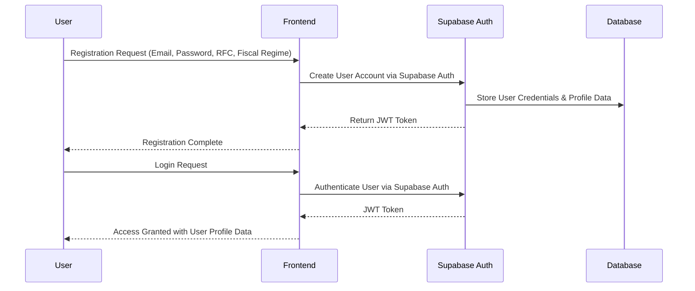
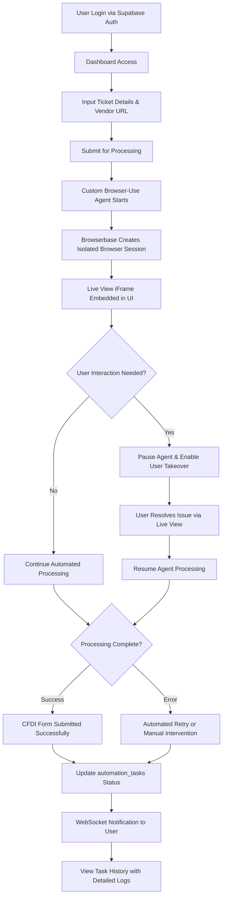
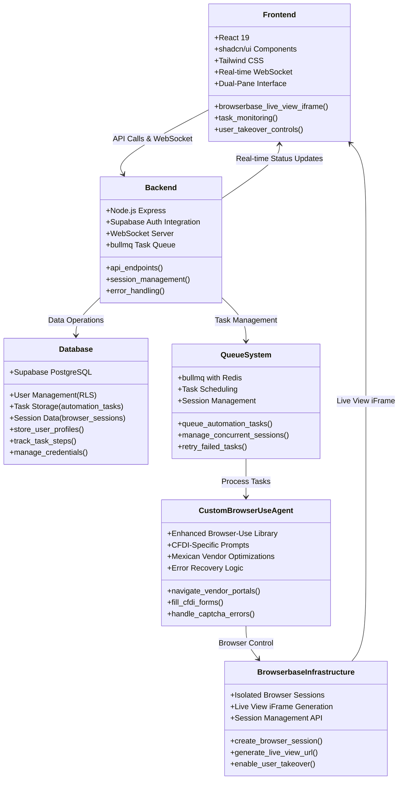
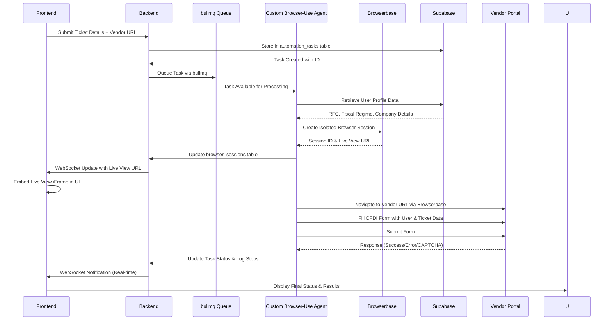
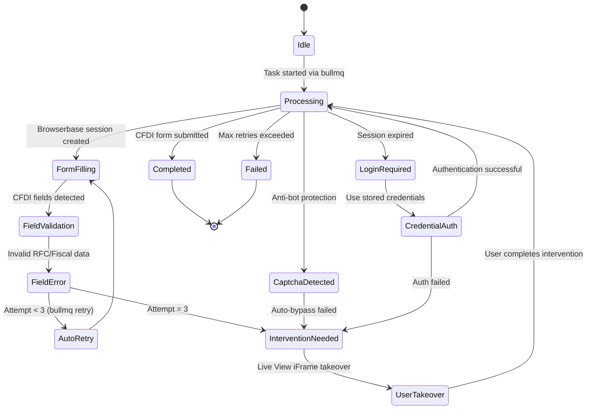
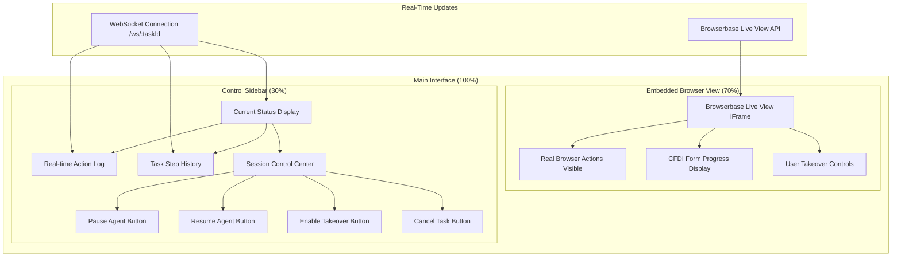
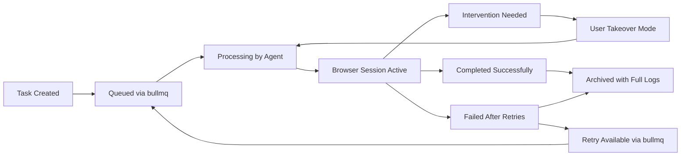
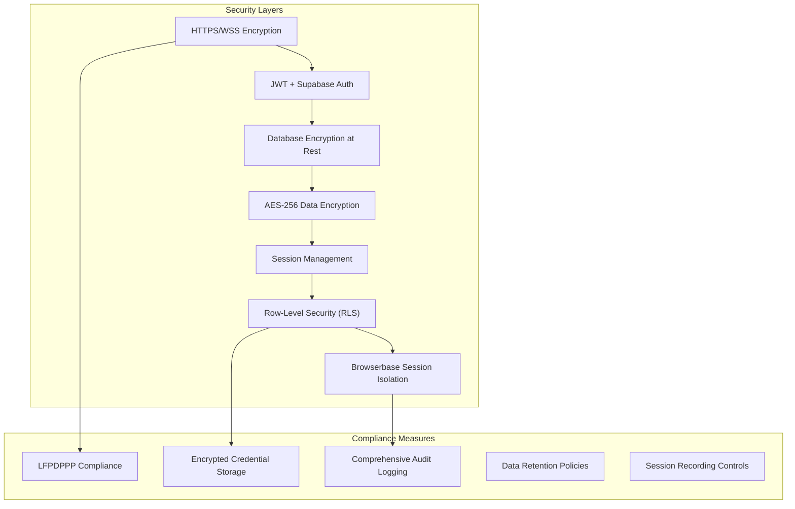

# Application Flow Documentation

---

## **General Description**

This SaaS application automates the manual process of filling out Mexican CFDI 4.0 invoicing forms across vendor portals using a **custom AI-powered Browser-Use agent**. The system is designed to improve efficiency and transparency for small businesses and freelancers by eliminating repetitive form submission tasks while providing real-time monitoring and user intervention capabilities through **Browserbase's embedded Live View iFrames**.

**Primary Objectives:**

- Automate CFDI 4.0 form completion on vendor portals using our enhanced Browser-Use agent.
- Provide real-time transparency through embedded browser Live View iFrames via Browserbase.
- Enable user intervention when obstacles arise (CAPTCHA, login issues) with seamless takeover capabilities.
- Improve operational efficiency by reducing manual form filling time by 85%+.
- Ensure secure, scalable multi-tenant architecture with JWT authentication and Supabase backend.

**Key Benefits:**

- Reduces time spent on repetitive administrative tasks from hours to minutes.
- Provides full transparency with embedded browser session monitoring.
- Supports any vendor portal through generalized automation patterns.
- Offers secure multi-tenant support with JWT authentication via Supabase.
- Enables real-time monitoring and seamless user takeover control.

---

## **User Registration & Authentication**

The application uses JWT-based authentication through Supabase Auth for secure multi-tenant access. Users can register, authenticate, and manage their credentials securely with their CFDI-specific information.

**Authentication Flow:**

**User Data Management:**

- User authentication managed by Supabase Auth (users table)
- CFDI profile data (RFC, fiscal regime, postal code) stored in user_profiles table
- Session management through JWT tokens with automatic refresh
- Multi-tenant support for business accounts with Row-Level Security (RLS)
- Encrypted vendor portal credentials stored in user_vendor_credentials table

---

## **Core Application Workflow**

The main application flow follows a streamlined process from task submission to completion with real-time monitoring through embedded browser sessions.

**Complete User Journey:**

---

## **System Architecture**

The application follows a modern microservices architecture with clear separation of concerns between frontend, backend, and automation services, integrated with Browserbase infrastructure.

**High-Level Architecture:**

---

## **Data Processing Flow**

The system processes user data and ticket information through a secure pipeline to automate form submission with real-time visibility.

**Data Processing Sequence:**

---

## **Error Handling & Recovery**

The system implements comprehensive error handling with automatic retries, intelligent recovery, and seamless user intervention options.

**Enhanced Error Handling State Machine:**

**Error Types & Enhanced Responses:**

- **CAPTCHA Detection**: Pause automation, update status to `INTERVENTION_NEEDED`, enable Live View iFrame takeover
- **Login Issues**: Attempt stored credentials from `user_vendor_credentials`, fallback to user intervention
- **RFC Validation Errors**: Automatic retry with corrected data format, log in `task_steps`
- **Network Timeouts**: Exponential backoff retry via bullmq with session recovery
- **Browserbase Session Errors**: Automatic session recreation with state preservation
- **Unknown Vendor Portal Changes**: Adaptive prompt adjustment and user notification

---

## **Real-Time Interface Components**

The dual-pane interface provides comprehensive real-time monitoring and control capabilities through embedded Browserbase Live View iFrames.

**Enhanced Interface Layout:**

**Real-Time Features:**

- **Embedded Live View iFrame**: Direct browser session visibility via Browserbase Live View API
- **WebSocket Status Updates**: Real-time task progress and step logging in Spanish
- **Seamless User Takeover**: One-click transition from agent control to manual control
- **Continuous Action Logging**: Detailed step-by-step progress with timestamps in `task_steps` table
- **CFDI Progress Indicators**: Form completion stages with field-level validation status

---

## **Task Management System**

The application tracks and manages automation tasks with comprehensive status monitoring and detailed logging.

**Enhanced Task Lifecycle:**

**Standardized Task Status Categories:**

- **PENDING**: Task queued in bullmq but not started
- **RUNNING**: Active automation with Browserbase session
- **PAUSED**: User-initiated pause (agent stopped)
- **INTERVENTION_NEEDED**: Requires user input (CAPTCHA, login, validation errors)
- **COMPLETED**: CFDI form successfully submitted
- **FAILED**: Automation unsuccessful after maximum retries
- **ARCHIVED**: Historical record with complete step logs

---

## **Security & Compliance Framework**

The system implements comprehensive security measures to protect user data and ensure compliance with Mexican data protection laws (LFPDPPP).

**Enhanced Security Architecture:**

**Enhanced Security Features:**

- **End-to-end HTTPS/WSS encryption** for all communications
- **JWT-based authentication** with Supabase Auth and automatic token refresh
- **AES-256 encryption** for sensitive data (RFC, credentials, company details)
- **Browserbase session isolation** with dedicated VM instances per task
- **Row-Level Security (RLS)** ensuring users only access their own data
- **Comprehensive audit logging** for compliance tracking and forensic analysis
- **Configurable session recording** with privacy controls via Browserbase API

---

## **Performance & Scalability Specifications - UPDATED TARGETS**

**Performance Targets:**

- **API Response Time**: <200ms for standard operations, <100ms for cached data
- **Global Task Timeout**: 3 minutes maximum per automation task
- **Browser Action Timeout**: 10 seconds per individual browser action
- **Concurrent Sessions**: Support for 50+ simultaneous automation tasks via Browserbase
- **WebSocket Latency**: <300ms for real-time status updates
- **Live View iFrame Load Time**: <2 seconds for embedded browser visibility
- **Task Queue Processing**: <5 seconds from submission to agent start

**Scalability Design:**

- **Multi-tenant architecture** supporting 5,000+ concurrent users via Supabase scaling
- **bullmq with Redis** for efficient task distribution and retry management
- **Browserbase auto-scaling** for growing browser session demands
- **Horizontal scaling capability** through containerized deployment
- **Database connection pooling** for optimal Supabase performance

**Monitoring & Reliability:**

- **Continuous system health monitoring** with automated alerts
- **Automated retry logic** (up to 3 attempts via bullmq with exponential backoff)
- **Daily automated backups** with point-in-time recovery via Supabase
- **99.9% uptime target** with Browserbase infrastructure redundancy
- **Real-time performance metrics** tracking via comprehensive logging

---

## **Technical Integration Points - UPDATED**

**External Services:**

- **Browserbase**: Isolated headless browser infrastructure with Live View iFrame generation and session management API
- **Supabase**: PostgreSQL database, Supabase Auth, and secure file storage services
- **Redis**: Task queuing via bullmq and session state management
- **Custom Browser-Use Agent**: Enhanced open-source library with CFDI-specific automation patterns

**Standardized API Endpoints:**

- `POST /api/v1/auth/register` - User registration with CFDI profile data
- `POST /api/v1/auth/login` - JWT authentication via Supabase Auth
- `POST /api/v1/tasks` - Submit new automation task with vendor URL and ticket details
- `GET /api/v1/tasks/:id/status` - Real-time task progress and step logs
- `PUT /api/v1/tasks/:id/control` - Pause/resume/enable takeover controls
- `GET /api/v1/dashboard` - User dashboard with task summary and statistics
- `WebSocket /ws/:taskId` - Real-time status updates and step logging

**Browserbase Integration Endpoints:**

- **Session Creation**: Integration with Browserbase API for browser session management
- **Live View URL**: Dynamic generation of embedded iFrame URLs for real-time visibility
- **Session Control**: API calls for pause/resume and user takeover functionality

---

## **Future Enhancement Roadmap - UPDATED**

**Planned Features (Post-MVP):**

- **Advanced Task Analytics**: Detailed performance metrics and success rate analysis
- **Multi-vendor Portal Templates**: Pre-configured automation patterns for major Mexican vendors
- **Invoice Verification**: Content scraping and validation of submitted forms
- **Bulk Processing**: Parallel processing of multiple CFDI submissions
- **Mobile Application**: Native mobile app for task monitoring and control
- **API Integrations**: Connections with popular Mexican accounting software (CONTPAQi, Aspel)
- **Advanced Reporting**: Comprehensive dashboards with export capabilities

**Technical Improvements:**

- **Enhanced AI Agent Capabilities**: Machine learning-based form field recognition
- **Predictive Error Prevention**: Pattern recognition for common failure points
- **Multi-language Support**: English and indigenous language support
- **Advanced Security Features**: Biometric authentication and enhanced compliance tools
- **Performance Optimization**: Sub-second response times and improved concurrent session handling

---

**Integration Testing Strategy:**

- **End-to-end automation testing** with real vendor portals
- **Load testing** with 100+ concurrent sessions via Browserbase
- **Security penetration testing** for compliance verification
- **User acceptance testing** with actual CFDI form submissions
- **Performance benchmarking** against manual processing times