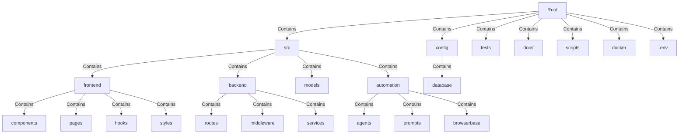
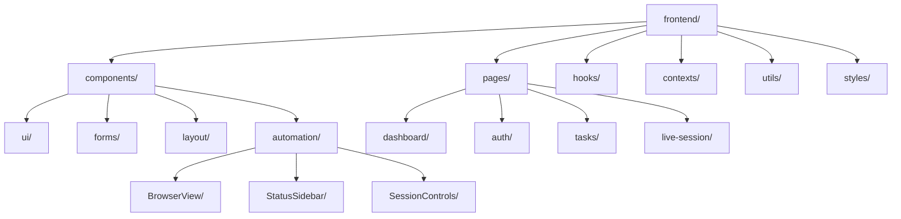
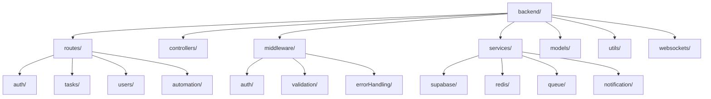
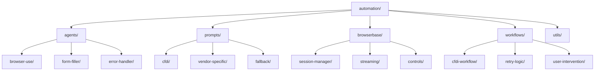
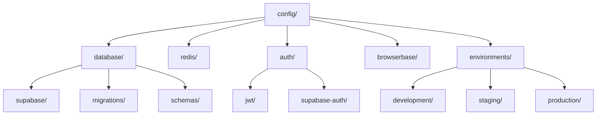
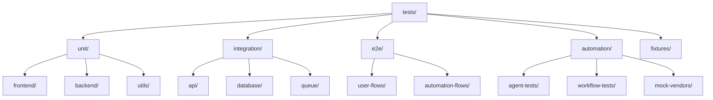
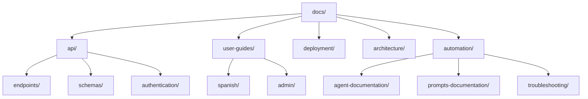

# File Structure Documentation

### **Introduction**

A well-organized file structure is critical for supporting development, collaboration, and scalability in software projects. For the CFDI 4.0 Automation SaaS application, a structured file system is essential for enabling efficient workflows, clear separation of concerns, and ease of collaboration between developers. This structure supports both frontend and backend development, task automation via AI agents, and integration with external services like Browserbase and Supabase. It ensures maintainability and scalability, allowing the application to accommodate future feature additions and growing user bases.

---

### **Technology Stack Influence**

The chosen technology stack significantly shapes the project’s file structure. Each tool and framework influences the way files are organized:

- **Frontend Technologies**: React 19, shadcn/ui, and Tailwind CSS require a modular structure for components, pages, and styles to support the dual-pane live automation interface.
- **Backend Technologies**: Node.js/Express and Supabase necessitate directories for API routes, middleware, and database interactions to manage user authentication and task data.
- **AI Automation Tools**: Browser-Use and Browserbase require specific directories for automation scripts, session management, and live streaming integration.
- **Data Validation**: Zod is used for schema validation, influencing the organization of shared models and validation logic.
- **Task Queuing**: Redis requires configuration files for managing task queues and job processing.

---

### **Root Directory Structure**

The root directory is organized into major directories, each serving a distinct purpose for the project:

### **Core Directories**

1. **`/src/` - Source Code Root**
    - Contains all core application code, organized by architectural layers.
    - **`frontend/`**: Contains the React frontend code, including components, pages, and styles.
    - **`backend/`**: Contains the Node.js backend code, including routes, services, and middleware.
    - **`models/`**: Shared data models, schemas, and validation logic (e.g., user data, ticket data).
    - **`automation/`**: AI automation scripts and configuration files for Browser-Use and Browserbase.
2. **`/config/` - Configuration Management**
    - Holds configuration files for different environments, database connections, and third-party integrations.
    - Includes environment variable files (`.env`) and service-specific configurations (e.g., Supabase, Redis, Browserbase).
3. **`/tests/` - Testing Suite**
    - Organized testing structure supporting unit tests, integration tests, and end-to-end tests for all application components, including automation workflows.
4. **`/docs/` - Documentation**
    - Comprehensive documentation including API specifications, user guides, deployment instructions, and architectural decisions.

---

### **Frontend Structure (`/src/frontend/`)**

### **Key Frontend Directories:**

- **`components/`**: Reusable UI components (e.g., live browser view, status sidebar).
- **`pages/`**: Page-specific components for the dashboard, authentication, task submission, and live automation.
- **`hooks/`**: Custom React hooks for WebSocket connections, authentication, and session state management.
- **`contexts/`**: React contexts for global state (auth, session, notifications).
- **`styles/`**: Tailwind CSS configuration and custom styles.

---

### **Backend Structure (`/src/backend/`)**

### **Key Backend Directories:**

- **`routes/automation/`**: API endpoints for starting, stopping, and monitoring automation tasks.
- **`services/queue/`**: Redis-based task queue management for Browser-Use agent jobs.
- **`websockets/`**: Real-time communication for live status updates and browser streaming.
- **`middleware/auth/`**: JWT authentication and authorization middleware.
- **`services/supabase/`**: Database operations and user data management.

---

### **Automation Structure (`/src/automation/`)**

### **Key Automation Directories:**

- **`agents/browser-use/`**: Core Browser-Use agent implementation for form automation.
- **`prompts/cfdi/`**: Specialized prompts for CFDI 4.0 form recognition and completion.
- **`browserbase/session-manager/`**: Integration with Browserbase for live browser sessions.
- **`workflows/cfdi-workflow/`**: Complete automation workflow orchestration.
- **`workflows/user-intervention/`**: Handlers for pause/resume and manual takeover functionality.

---

### **Configuration Structure (`/config/`)**

### **Key Configuration Areas:**

- **`database/migrations/`**: Supabase database schema migrations.
- **`browserbase/`**: Browserbase API configuration and session settings.
- **`environments/`**: Environment-specific configurations for development, staging, and production.
- **`auth/jwt/`**: JWT token configuration and signing keys.

---

### **Testing Structure (`/tests/`)**

### **Key Testing Areas:**

- **`automation/agent-tests/`**: Testing Browser-Use agent functionality with mock vendor portals.
- **`e2e/automation-flows/`**: End-to-end testing of complete CFDI automation workflows.
- **`fixtures/`**: Test data including sample CFDI forms and vendor portal responses.
- **`automation/mock-vendors/`**: Mock vendor portal implementations for testing.

---

### **Documentation Structure (`/docs/`)**

### **Key Documentation Areas:**

- **`user-guides/spanish/`**: Spanish-language user documentation for the CFDI automation process.
- **`automation/agent-documentation/`**: Technical documentation for Browser-Use agent configuration.
- **`api/endpoints/`**: Complete API documentation including WebSocket endpoints.
- **`deployment/`**: Deployment guides for different environments including Docker configurations.

---