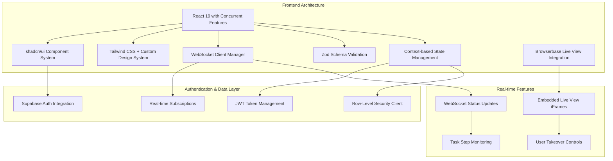
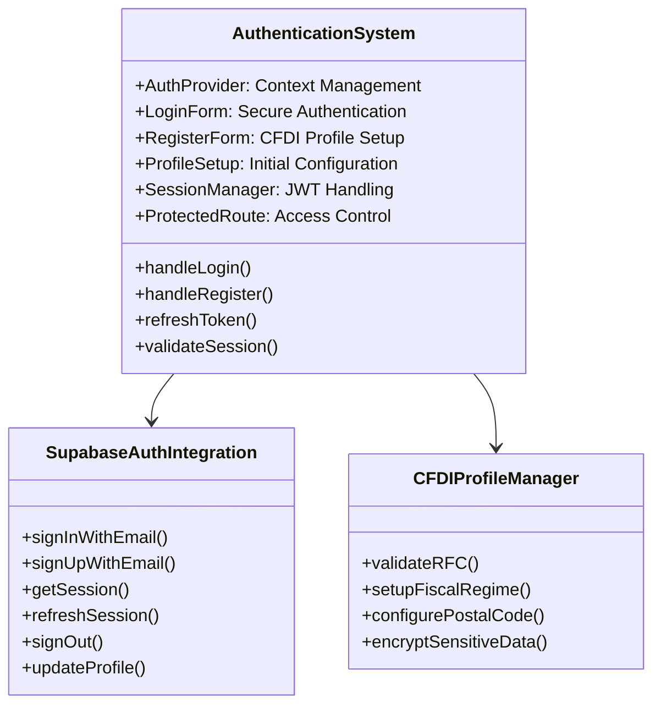
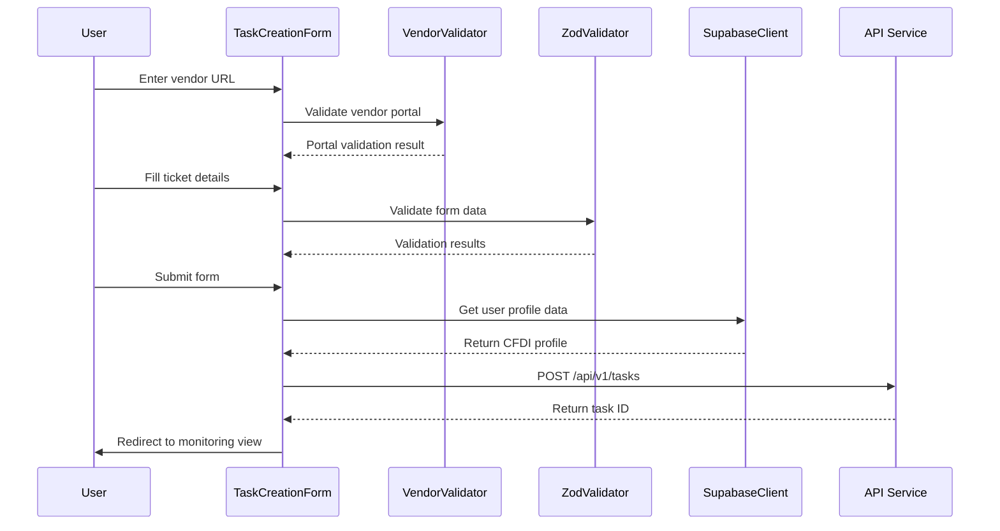
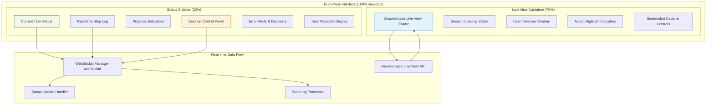
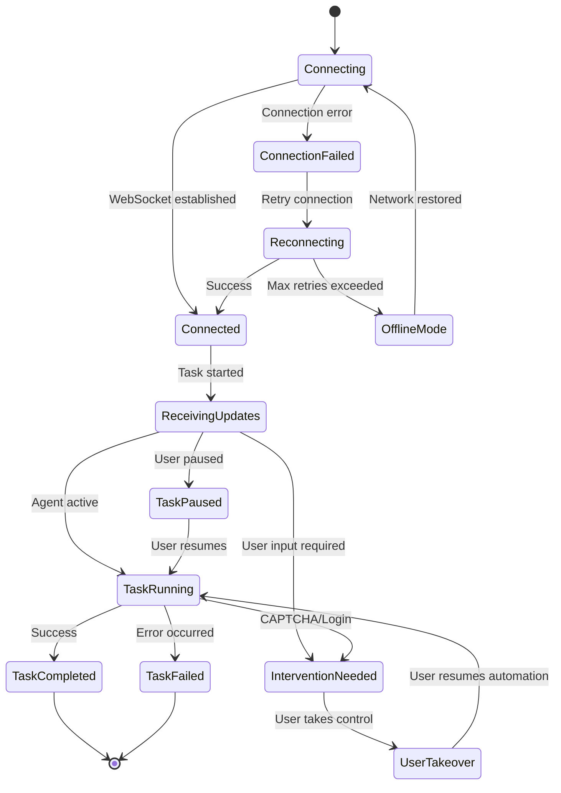
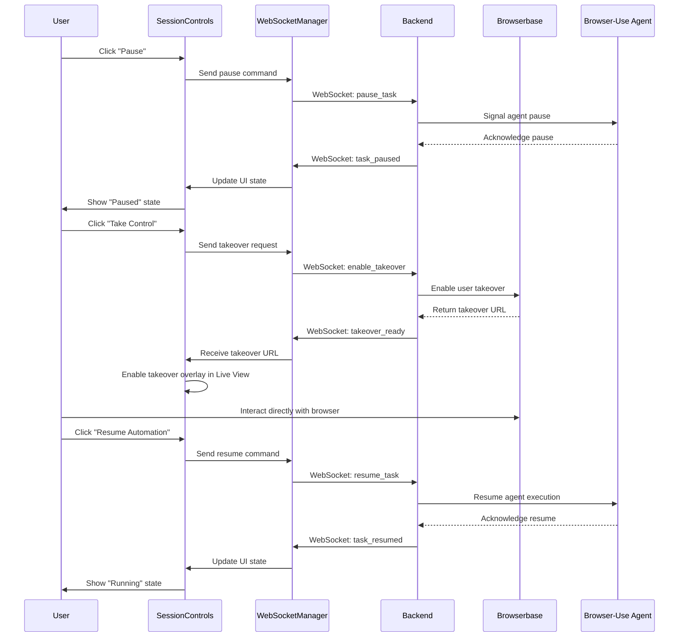
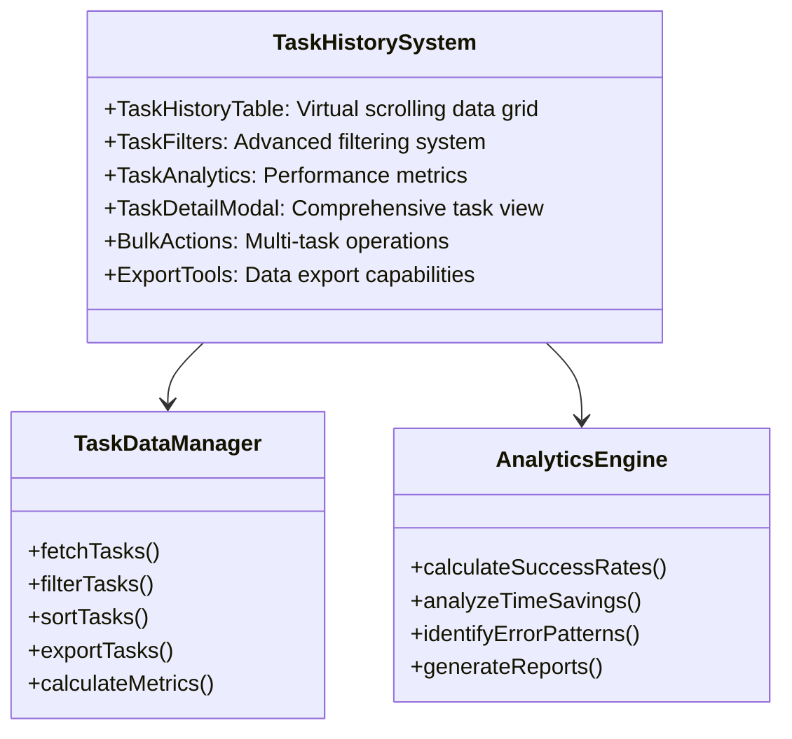
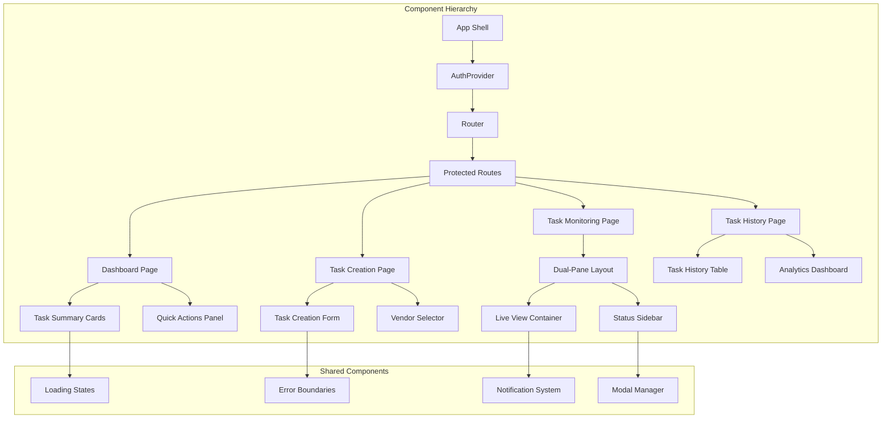
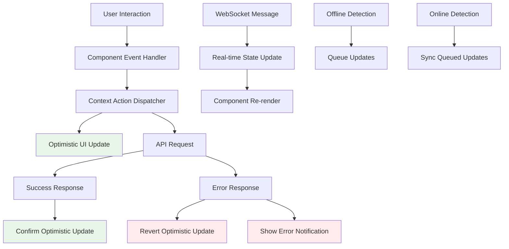

# Frontend Design Guidelines Document

## **Introduction**

This document provides comprehensive guidelines for the frontend design of the **CFDI 4.0 Invoice Form Automation System**. The application is a SaaS platform designed to automate the manual process of filling out Mexican CFDI 4.0 invoicing forms across vendor portals using our **custom-enhanced Browser-Use agent** integrated with **Browserbase's headless browser infrastructure**. Users interact with the system via an intuitive interface that allows them to submit, monitor, and control automation tasks in real-time through embedded Live View iFrames.

### **Primary Objectives**:

- **Real-time Transparency**: Enable users to monitor automation via embedded Browserbase Live View iFrames (not streaming)
- **Interactive Control**: Provide seamless user intervention with one-click takeover capabilities
- **Spanish Localization**: Ensure all UI elements, status updates, and error messages are in Spanish
- **Secure Multi-Tenant Architecture**: Use JWT with Supabase Auth for secure multi-tenant support
- **Performance Excellence**: Sub-2-second load times with <300ms WebSocket latency

### **Major Functional Areas**:

- **User Authentication**: Secure registration/login via Supabase Auth with CFDI profile management
- **Task Submission**: Intuitive form for inputting ticket details and vendor URLs with real-time validation
- **Dual-Pane Live Monitoring**: Embedded Browserbase Live View (70%) with real-time status sidebar (30%)
- **Interactive Session Controls**: Pause, resume, and seamless user takeover functionality
- **Task History and Analytics**: Comprehensive task tracking with performance metrics
- **User Intervention Interface**: Smooth transition between automated and manual control

---

## **System Architecture Overview**

The frontend is built using **React 19** with modern concurrent features, utilizing best practices for performance, scalability, and maintainability. The frontend architecture supports real-time updates via **WebSockets** and integrates securely with Supabase backend using **JWT authentication**.



---

## **Core Frontend Components Architecture**

### **1. Enhanced Authentication System**

Handles user registration, login, session management, and CFDI profile setup with Supabase Auth integration.

**Components**:

- **AuthProvider**: Context-based authentication state management
- **LoginForm**: Secure login with email/password validation
- **RegisterForm**: Registration with CFDI profile data (RFC, fiscal regime, postal code)
- **ProfileSetup**: Initial CFDI information setup wizard
- **SessionManager**: JWT token refresh and session persistence
- **ProtectedRoute**: Route protection with role-based access

**Supabase Integration**:

- Supabase Auth for user management and JWT tokens
- Row-Level Security (RLS) for multi-tenant data isolation
- Real-time session monitoring and automatic token refresh



### **2. Task Submission Interface**

Comprehensive form system for creating automation tasks with real-time validation and preview capabilities.

**Components**:

- **TaskCreationForm**: Main form with vendor URL and ticket details
- **VendorURLValidator**: Real-time URL validation and portal detection
- **TicketDetailsForm**: CFDI invoice data input with format validation
- **FormPreview**: Pre-submission preview with user data integration
- **SubmissionConfirmation**: Final confirmation before task creation

**Enhanced Features**:

- **Real-time Zod validation** with Spanish error messages
- **Auto-completion** for common vendor portals
- **Form persistence** in case of browser refresh
- **Progressive disclosure** for advanced options



### **3. Advanced Dual-Pane Layout System**

The **Dual-Pane Layout** is the core of the user experience, featuring an **embedded Browserbase Live View iFrame** and a **comprehensive status sidebar**.

**Main Components**:

- **LiveViewContainer**: Browserbase Live View iFrame integration (70% width)
- **StatusSidebar**: Real-time updates and controls (30% width)
- **SessionControls**: User intervention and takeover interface
- **TaskStepMonitor**: Detailed step-by-step progress tracking
- **ErrorNotificationSystem**: Contextual error handling and recovery

**Advanced Features**:

- **Responsive design** that adapts to mobile with stacked layout
- **Picture-in-Picture mode** for multitasking
- **Keyboard shortcuts** for power users
- **Accessibility compliance** with screen reader support



### **4. Real-Time Status and Monitoring System**

The frontend maintains persistent WebSocket connections for live updates and integrates seamlessly with Browserbase Live View iFrames.

**Components**:

- **WebSocketManager**: Handles connections to `/ws/:taskId` with automatic reconnection
- **StatusUpdateHandler**: Processes real-time status changes and UI updates
- **StepLogProcessor**: Manages detailed task step logging and visualization
- **ErrorAlertSystem**: Contextual error notifications with recovery suggestions
- **ProgressIndicator**: Visual progress tracking with percentage completion

**Enhanced Real-time Features**:

- **Connection resilience** with automatic reconnection and backoff
- **Offline mode** with queued updates when connection is restored
- **Real-time typing indicators** for agent actions
- **Live performance metrics** showing automation speed and accuracy



### **5. Interactive Session Controls**

Provides users with intuitive controls for managing automation sessions with seamless transitions between automated and manual control.

**Components**:

- **SessionControlPanel**: Main control interface with pause/resume/takeover buttons
- **TakeoverInterface**: Smooth transition to manual control via Browserbase
- **SessionRecorder**: Optional session recording and playback capabilities
- **PerformanceMetrics**: Real-time performance data and automation efficiency
- **InterventionGuide**: Contextual help for resolving common issues

**Advanced Control Features**:

- **One-click takeover** with instant access to live browser session
- **Guided intervention** with step-by-step resolution instructions
- **Session handoff** between multiple users (team accounts)
- **Automation queuing** for batch processing multiple tasks



---

## **Enhanced Task Management System**

### **6. Task History and Analytics Interface**

Comprehensive task tracking with advanced filtering, sorting, and analytics capabilities.

**Components**:

- **TaskHistoryTable**: TanStack Table with virtual scrolling for large datasets
- **TaskFilters**: Advanced filtering by status, date range, vendor, and success rate
- **TaskAnalytics**: Performance metrics, success rates, and time savings calculations
- **TaskDetailModal**: Comprehensive task information with full step logs
- **BulkActions**: Multi-task operations for power users

**Analytics Features**:

- **Success rate tracking** by vendor portal and time period
- **Time savings calculations** compared to manual processing
- **Error pattern analysis** with resolution suggestions
- **Performance benchmarking** against user averages



### **7. Advanced Notification System**

Multi-channel notification system with intelligent prioritization and user preferences.

**Components**:

- **ToastNotificationManager**: Real-time toast notifications with queuing
- **NotificationCenter**: Persistent notification history and management
- **EmailNotificationSettings**: User preferences for email alerts
- **PushNotificationHandler**: Browser push notifications for critical events
- **NotificationTemplates**: Customizable Spanish-language notification templates

**Smart Features**:

- **Intelligent batching** to avoid notification spam
- **Priority-based display** with critical alerts taking precedence
- **Context-aware notifications** with relevant actions and links
- **Notification persistence** across browser sessions

---

## **Component Library and Design System**

### **8. Custom shadcn/ui Integration**

Extended component library with CFDI-specific components and Spanish localization.

**Core Components**:

- **CFDIFormFields**: Specialized form components for RFC, fiscal regime validation
- **VendorPortalCard**: Standardized vendor portal display and interaction
- **TaskStatusBadge**: Color-coded status indicators with animations
- **ProgressRing**: Circular progress indicators with step breakdowns
- **LiveViewFrame**: Wrapper component for Browserbase Live View integration

**Design System Features**:

- **Consistent Spanish typography** with proper accent handling
- **Accessible color palette** meeting WCAG 2.1 AA standards
- **Responsive breakpoints** optimized for Mexican user devices
- **Dark mode support** with user preference persistence



---

## **Data Flow and State Management**

### **9. Enhanced State Architecture**

Sophisticated state management using React Context with optimistic updates and offline capabilities.

**State Layers**:

- **AuthContext**: User authentication state and profile data
- **TaskContext**: Current task state and real-time updates
- **WebSocketContext**: Connection management and message handling
- **NotificationContext**: Notification queue and user preferences
- **ThemeContext**: UI theme and localization preferences

**Advanced Features**:

- **Optimistic updates** for immediate UI feedback
- **Offline state synchronization** when connection is restored
- **State persistence** across browser sessions
- **Performance optimization** with selective re-renders



---

## **Performance Optimization Strategy**

### **10. Advanced Performance Techniques**

Comprehensive performance optimization ensuring sub-2-second load times and smooth interactions.

**Core Optimizations**:

- **Code splitting** with React.lazy and dynamic imports
- **Virtual scrolling** for large task lists with react-window
- **Image optimization** with next/image or similar lazy loading
- **WebSocket connection pooling** to minimize connection overhead
- **Service worker caching** for offline functionality

**Monitoring and Metrics**:

- **Core Web Vitals tracking** with real user monitoring
- **Performance budgets** for bundle size and loading times
- **Error tracking** with comprehensive error boundaries
- **Usage analytics** for feature adoption and user behavior

```tsx
// Performance monitoring configuration
interface PerformanceConfig {
  // Core Web Vitals targets
  largestContentfulPaint: 2500; // 2.5 seconds
  firstInputDelay: 100;         // 100ms
  cumulativeLayoutShift: 0.1;   // 0.1 or less

  // Custom metrics
  taskSubmissionTime: 1000;     // 1 second
  liveViewLoadTime: 2000;       // 2 seconds
  webSocketLatency: 300;        // 300ms

  // Bundle size limits
  initialBundleSize: 200;       // 200kb gzipped
  chunkSize: 50;                // 50kb per chunk
}

```

---

## **Accessibility and Internationalization**

### **11. Comprehensive Accessibility Implementation**

Full WCAG 2.1 AA compliance with enhanced support for Spanish-speaking users.

**Accessibility Features**:

- **Keyboard navigation** with logical tab order and focus management
- **Screen reader optimization** with proper ARIA labels in Spanish
- **High contrast mode** support with customizable color schemes
- **Text scaling** support up to 200% without horizontal scrolling
- **Motion preferences** respecting prefers-reduced-motion

**Spanish Localization**:

- **Complete Spanish translation** including technical terms and error messages
- **Cultural adaptation** for Mexican business practices and terminology
- **Number and date formatting** according to Mexican standards
- **Currency display** in Mexican Peso (MXN) format

```tsx
// Internationalization configuration
interface I18nConfig {
  defaultLocale: 'es-MX';
  supportedLocales: ['es-MX', 'es-ES', 'en-US'];

  // Currency and number formatting
  currency: 'MXN';
  numberFormat: {
    decimal: '.',
    thousands: ',',
    precision: 2
  };

  // Date formatting
  dateFormat: 'DD/MM/YYYY';
  timeFormat: '24h';
  timezone: 'America/Mexico_City';
}

```

---

## **Security Implementation**

### **12. Frontend Security Measures**

Comprehensive security implementation protecting user data and preventing common attacks.

**Security Features**:

- **Content Security Policy (CSP)** preventing XSS attacks
- **JWT token management** with secure storage and automatic refresh
- **Input sanitization** preventing injection attacks
- **HTTPS enforcement** for all communications
- **Session timeout** with automatic logout

**Data Protection**:

- **Sensitive data masking** in UI components (partial RFC display)
- **Secure credential handling** with no plaintext storage
- **Audit logging** of all user actions and system events
- **Privacy controls** allowing users to control data sharing

---

## **Testing and Quality Assurance**

### **13. Comprehensive Testing Strategy**

Multi-layered testing approach ensuring reliability and user experience quality.

**Testing Layers**:

- **Unit tests** with Jest and React Testing Library (95%+ coverage)
- **Integration tests** for component interactions and API calls
- **End-to-end tests** with Playwright for complete user workflows
- **Performance tests** with Lighthouse CI and custom metrics
- **Accessibility tests** with axe-core and manual testing

**Quality Gates**:

- **Code review** requirements with security and performance checklists
- **Automated testing** in CI/CD pipeline with quality gates
- **Performance budgets** enforced in build process
- **Accessibility audits** in development and staging environments

---

## **Mobile and Responsive Design**

### **14. Mobile-First Responsive Implementation**

Comprehensive mobile experience with progressive enhancement for larger screens.

**Responsive Features**:

- **Mobile-first design** with progressive enhancement
- **Touch-optimized interactions** with appropriate touch targets
- **Adaptive layouts** that stack components on smaller screens
- **Performance optimization** for mobile networks and devices
- **Offline functionality** with service worker caching

**Mobile-Specific Optimizations**:

- **Reduced motion** by default on mobile devices
- **Simplified navigation** with hamburger menu and bottom navigation
- **Touch gestures** for common actions (swipe to refresh, pull to reload)
- **Battery optimization** with efficient rendering and minimal polling