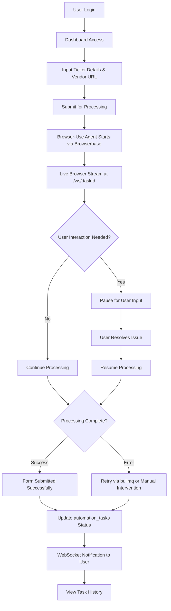
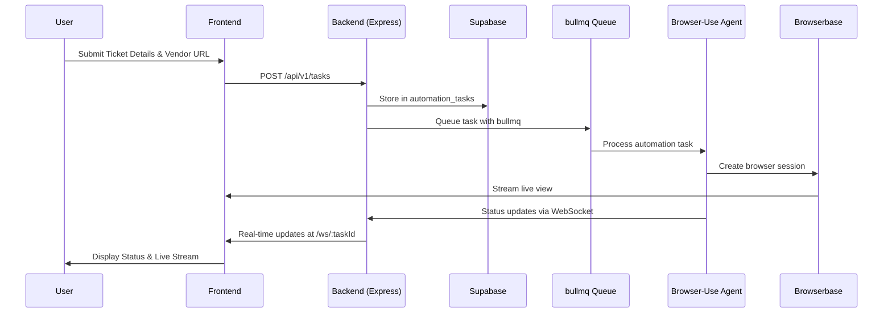

# Project Requirement Document

**Project Overview**

---

This document outlines the requirements for a SaaS application designed to automate the human manual process of filling out Mexican CFDI 4.0 invoicing forms across vendor portals. The application uses a **Browser-Use agent** to automatically navigate to vendor websites, fill out the required fields (ticket details, user details) in the form, and submit it. The focus is **not** on generating invoices but automating the manual form submission process.

The system aims to improve efficiency and transparency for small businesses and freelancers by automating repetitive tasks, while allowing users to monitor, intervene, and take control if necessary.

### **Primary Objectives**:

- **Automate** the manual process of filling out CFDI 4.0 forms on vendor portals.
- Provide **real-time transparency** through live browser streaming via Browserbase.
- Enable **user intervention** in case the process encounters obstacles (e.g., CAPTCHA, login issues).
- **Improve efficiency** by reducing the need for users to manually fill out forms on vendor portals.
- **Ensure secure, scalable architecture** with multi-tenant support using JWT and Supabase.

---

## **Scope**

### **In-Scope**

- **User Authentication**: Secure user registration and login using JWT for multi-tenant support via Supabase Auth.
- **AI-Powered Automation**: Using the **Browser-Use agent** with Browserbase integration to navigate vendor portals, fill in ticket details, and access user information stored in Supabase.
- **Dual-Pane Live Automation Interface**: A real-time UI with a live browser session (70%) and a status sidebar (30%) to monitor the process.
- **Interactive Session Controls**: Users can **pause**, **resume**, or **take over** the automation session if the agent encounters an issue.
- **Real-Time Status Logging**: Continuous updates on the task's progress through WebSockets, with Spanish logs.
- **Task Status Tracking**: The dashboard will show whether the form was successfully filled, the session was paused, or if manual intervention was needed.
- **Error Handling & Retry Logic**: Handling common errors (e.g., CAPTCHA) with retries and user prompts for intervention using bullmq for robust job processing.
- **Vendor Portal Integration**: The **Browser-Use agent** can interact with **any vendor portal** using generalized prompts to handle the **facturación process** across different vendor websites.
- **User Data Management**: User details (e.g., RFC, fiscal regime, postal code) are securely stored in Supabase and used by the agent for form completion.

### **Out-of-Scope (for MVP)**

- **Advanced Task History Features**: Advanced filtering and sorting are not included; only a simple task list will be provided in V1.
- **Invoice Scraping & Verification**: Content verification through scraping will be deferred.
- **Multi-Language Support**: The MVP will only support Spanish.
- **Tax Calculation**: This is not within the scope for the MVP and will be deferred.
- **Integration with Accounting Software**: This feature will be planned for future releases.
- **Multi-Tenant Enterprise Features**: Enterprise-level scalability is not part of this MVP.

---

## **User Flow**

The user journey is designed to be simple, from login to monitoring the agent's work in real time:



---

## **Key Features**

### **Core Functionalities**

- **User Account & Authentication**: JWT-based authentication via Supabase Auth for secure multi-tenant access.
- **AI Agent Automation (Browser-Use + Browserbase)**: Automates the process of filling in CFDI 4.0 forms and submitting them by navigating vendor portals with live streaming.
- **Dual-Pane Live View**: Real-time visibility of the automation task with a 70% live browser view and a 30% status sidebar showing progress.
- **Interactive Controls**: Users can pause, resume, or take control of the automation task at any time via API endpoints `/api/v1/tasks/:taskId/pause` and `/api/v1/tasks/:taskId/resume`.
- **Real-Time Status Log**: Provides real-time updates of the agent's actions through WebSockets at `/ws/:taskId` with Spanish messages.
- **Task Status Tracking**: The dashboard tracks the status of tasks using the `automation_tasks` table with status values: `PENDING`, `RUNNING`, `PAUSED`, `COMPLETED`, `FAILED`, `INTERVENTION_NEEDED`.
- **Error Handling & Retry Logic**: The system uses bullmq for robust job processing with retries when errors are encountered and prompts users for manual intervention.

### **Technology-Driven Capabilities**

- **Browserbase Integration**: Provides isolated headless browser instances in the cloud with Live View iFrames embedded in our UI for real-time browser session visibility and user takeover capabilities.
- **Custom Browser-Use Agent**: We are cloning and enhancing the open-source Browser-Use library to create a specialized CFDI automation agent with domain-specific prompts and error handling tailored for Mexican vendor portals.
- **CFDI 4.0 Form Handling**: Our customized Browser-Use agent fills out required form fields based on user profile data (RFC, fiscal regime, postal code) and ticket details stored in Supabase.
- **Vendor Portal Automation**: The enhanced agent can handle **any vendor portal** by utilizing generalized prompts and CFDI-specific automation patterns, not tied to specific vendors.
- **Session Management**: User credentials and vendor portal credentials are securely stored in Supabase using the `user_vendor_credentials` table with encrypted passwords.

---

## **Technology Stack**

### **Frontend Stack**

- **React 19**: For dynamic UI development with modern concurrent features.
- **shadcn/ui**: Component library for UI consistency and accessibility.
- **Tailwind CSS**: For responsive design and utility-first styling.
- **Zod**: For schema validation of input fields and type safety.
- **TanStack Table**: For tracking task history display (simplified for MVP).

### **Backend Stack**

- **Node.js/Express**: For handling API requests and business logic.
- **Supabase**: PostgreSQL database, authentication (Supabase Auth), and file storage.
- **bullmq**: Robust Redis-based task queue management for Browser-Use agent jobs.
- **Redis**: For task queuing, session management, and real-time data.
- **JWT**: For secure user authentication integrated with Supabase Auth.

### **Automation Stack**

- **Custom Browser-Use Agent**: Enhanced version of the open-source Browser-Use library, cloned and customized with CFDI-specific automation patterns, error handling, and Mexican vendor portal optimizations.
- **Browserbase**: Serverless headless browser infrastructure providing isolated browser instances with Live View iFrame embedding for real-time session visibility and user takeover control.

### **Database Schema**

- **users**: Managed by Supabase Auth (id, email, created_at)
- **user_profiles**: Stores RFC, fiscal regime, postal code, company details
- **automation_tasks**: Main task tracking with status, vendor_url, ticket_details
- **task_steps**: Detailed step logging for transparency
- **browser_sessions**: Browserbase session management
- **user_vendor_credentials**: Encrypted vendor portal credentials

---

## **System Architecture**



---

## **API Endpoints - STANDARDIZED**

| Method | Endpoint | Description | Auth | Response |
| --- | --- | --- | --- | --- |
| POST | `/api/v1/auth/register` | Register new user | None | `{ message: "User registered" }` |
| POST | `/api/v1/auth/login` | Login and return JWT | None | `{ token: "jwt_token" }` |
| GET | `/api/v1/tasks` | List user tasks | JWT | `[{ id, vendor_url, status, created_at }]` |
| POST | `/api/v1/tasks` | Create new task | JWT | `{ taskId: "uuid", status: "PENDING" }` |
| GET | `/api/v1/tasks/:taskId` | Get task details | JWT | `{ task details and step logs }` |
| POST | `/api/v1/tasks/:taskId/pause` | Pause task | JWT | `{ message: "Task paused" }` |
| POST | `/api/v1/tasks/:taskId/resume` | Resume task | JWT | `{ message: "Task resumed" }` |
| WS | `/ws/:taskId` | Real-time updates | JWT | WebSocket connection |

---

## **Performance Requirements - STANDARDIZED**

### **Performance Targets**

- **API Response Time**: <200ms for standard operations
- **Global Task Timeout**: 3 minutes per automation task
- **Browser Action Timeout**: 10 seconds per individual action
- **Concurrent Sessions**: Support for 10+ simultaneous automation tasks
- **WebSocket Latency**: <500ms for real-time updates
- **Browser Stream Latency**: <500ms via Browserbase

### **Security Requirements**

- **Authentication**: JWT with Supabase Auth for multi-tenant support
- **Data Encryption**: AES-256 for sensitive data (RFC, passwords) at rest and HTTPS/WSS in transit
- **Compliance**: Mexican data protection laws (LFPDPPP)
- **Session Security**: Secure session management with Redis and automatic timeouts
- **API Security**: Rate limiting, CORS restrictions, input validation with Zod

### **Scalability Targets**

- **User Growth**: Scale to 1,000+ concurrent users
- **Queue Management**: bullmq with Redis for efficient task distribution
- **Database**: Supabase auto-scaling for growing data volumes
- **Horizontal Scaling**: Multi-instance deployment capability

---

## **Error Handling Strategy - STANDARDIZED**

### **Error Types & Responses**

- **CAPTCHA Detection**: Pause automation, update status to `INTERVENTION_NEEDED`, request user intervention
- **Login Issues**: Use stored credentials from `user_vendor_credentials`, fallback to user intervention
- **Form Validation Errors**: Automatic retry with bullmq (max 3 attempts), log in `task_steps`
- **Network Timeouts**: Exponential backoff retry via bullmq
- **Browser Errors**: Browserbase session recovery, fallback to new session
- **Unknown Errors**: Log details in `task_steps`, attempt retry, escalate to `FAILED` status

### **Status Management**

All task statuses use standardized values:

- `PENDING`: Task queued but not started
- `RUNNING`: Active automation in progress
- `PAUSED`: User-initiated pause
- `INTERVENTION_NEEDED`: Requires user input (CAPTCHA, login, etc.)
- `COMPLETED`: Successfully submitted
- `FAILED`: Automation unsuccessful after retries

---

## **File Structure Alignment**

```
project-root/
├── frontend/                 # React 19 application
│   ├── src/
│   │   ├── components/
│   │   │   ├── ui/           # shadcn/ui components
│   │   │   ├── automation/   # BrowserView, StatusSidebar
│   │   │   └── forms/        # Task submission forms
│   │   ├── pages/
│   │   │   ├── dashboard/    # Main dashboard
│   │   │   ├── auth/         # Login/register
│   │   │   └── tasks/        # Task management
│   │   ├── hooks/            # Custom React hooks
│   │   └── utils/            # Frontend utilities
├── backend/                  # Node.js/Express backend
│   ├── src/
│   │   ├── routes/
│   │   │   ├── auth.js       # /api/v1/auth/*
│   │   │   └── tasks.js      # /api/v1/tasks/*
│   │   ├── services/
│   │   │   ├── authService.js
│   │   │   ├── taskService.js
│   │   │   └── agentService.js
│   │   ├── models/
│   │   │   ├── user.js       # Supabase user operations
│   │   │   └── task.js       # automation_tasks operations
│   │   ├── middleware/
│   │   │   ├── auth.js       # JWT validation
│   │   │   └── validation.js # Zod validation
│   │   ├── ws/
│   │   │   └── taskSocket.js # WebSocket /ws/:taskId
│   │   └── config/
│   │       ├── db.js         # Supabase client
│   │       └── redis.js      # bullmq configuration
├── automation/               # Browser-Use integration
│   ├── agents/
│   │   └── browser-use/      # Core agent implementation
│   ├── prompts/
│   │   └── cfdi/             # CFDI-specific prompts
│   └── browserbase/
│       └── session-manager/  # Browserbase integration
└── docs/                     # All project documentation

```

---

## **Project Timeline**

The development timeline remains 8 weeks with synchronized milestones across all components:

**Week 1-2: Foundation & Setup**

- Supabase database setup with synchronized schema
- Backend API foundation with standardized endpoints
- Frontend base structure with dual-pane layout
- Browser-Use + Browserbase integration prototype

**Week 3-4: Core Features**

- Complete authentication system with JWT + Supabase Auth
- Task submission and management with bullmq
- Real-time WebSocket implementation at /ws/:taskId
- Live browser streaming integration

**Week 5-6: Integration & Polish**

- End-to-end automation workflow testing
- Error handling and retry logic implementation
- User intervention capabilities
- Performance optimization

**Week 7-8: Finalization & Deployment**

- Security audit and compliance verification
- Load testing with 10+ concurrent sessions
- Documentation finalization
- Production deployment

---

## **Key Success Metrics**

- **Automation Success Rate**: >85% forms completed without intervention
- **User Intervention Response**: <30 seconds from pause to user takeover
- **System Uptime**: >99.9% availability
- **Performance**: All API calls <200ms, WebSocket latency <500ms
- **Security**: Zero data breaches, full LFPDPPP compliance
- **User Satisfaction**: >4.5/5 rating for transparency and control features