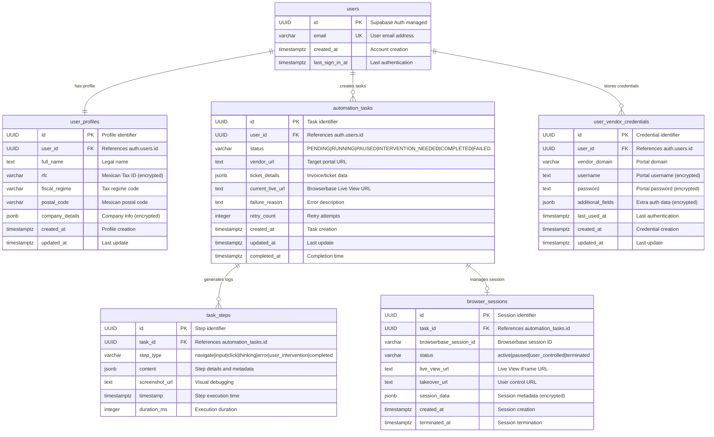
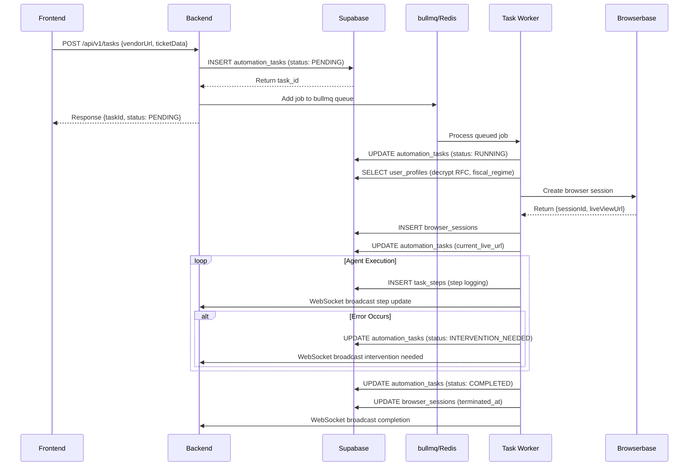
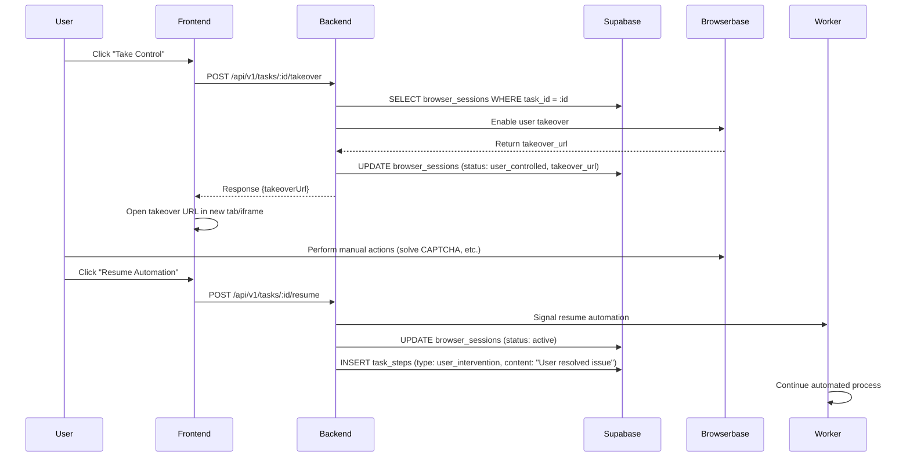

# Schema Design Document

This schema design document outlines the database architecture and relationships for the **CFDI 4.0 Automation Application** that automates the process of filling out Mexican CFDI 4.0 forms across vendor portals. The system uses our **custom-enhanced Browser-Use agent** for task automation, integrates **Supabase PostgreSQL** for structured storage, utilizes **bullmq with Redis** for robust job processing, and integrates **Browserbase** for headless browser infrastructure with Live View iFrame embedding.

---

## **Database Architecture Overview**

### **Primary Database (Supabase PostgreSQL)**

- **Purpose**: Stores all structured data with ACID compliance and Row-Level Security (RLS)
- **Type**: Relational database with PostgreSQL 15.x
- **Key Features**:
    - Row-Level Security for multi-tenant data isolation
    - Real-time subscriptions for live updates
    - Built-in authentication integration
    - Automatic backups and point-in-time recovery

### **Secondary Storage (Redis with bullmq)**

- **Purpose**: High-performance job queuing with retry logic and task scheduling
- **Type**: In-memory data structure store
- **Key Features**:
    - Robust job processing with bullmq
    - Automatic retry with exponential backoff
    - Job prioritization and delayed execution
    - Real-time job monitoring and metrics

---

## **Core Database Schema**

### **users** (Managed by Supabase Auth)

- **Purpose**: Core user authentication and account management
- **Fields**:
    - `id` (UUID) [PK] → Supabase Auth managed primary key
    - `email` (VARCHAR(255)) [UNIQUE] → User email address
    - `created_at` (TIMESTAMPTZ) → Account creation timestamp
    - `last_sign_in_at` (TIMESTAMPTZ) → Last authentication timestamp
    - `email_confirmed_at` (TIMESTAMPTZ) → Email verification timestamp

*Note: This table is fully managed by Supabase Auth service*

### **user_profiles**

- **Purpose**: CFDI-specific user data for form automation
- **Fields**:
    - `id` (UUID) [PK] → Primary key
    - `user_id` (UUID) [FK] → References `auth.users.id`
    - `full_name` (TEXT) → User's complete legal name
    - `rfc` (VARCHAR(13)) [ENCRYPTED] → Mexican Tax ID (RFC)
    - `fiscal_regime` (VARCHAR(10)) → Tax regime code (e.g., "601", "612")
    - `postal_code` (VARCHAR(5)) → Mexican postal code
    - `company_details` (JSONB) [ENCRYPTED] → Flexible company information storage
    - `created_at` (TIMESTAMPTZ) → Profile creation timestamp
    - `updated_at` (TIMESTAMPTZ) → Last profile update

```sql
-- RLS Policy for user_profiles
CREATE POLICY "Users can only access their own profile"
ON user_profiles FOR ALL
USING (auth.uid() = user_id);

```

### **automation_tasks**

- **Purpose**: Central task tracking with comprehensive status management
- **Fields**:
    - `id` (UUID) [PK] → Primary key for task identification
    - `user_id` (UUID) [FK] → References `auth.users.id`
    - `status` (VARCHAR(20)) → Task status with CHECK constraint
    - `vendor_url` (TEXT) → Target vendor portal URL
    - `ticket_details` (JSONB) → Invoice/ticket data structure
    - `current_live_url` (TEXT) → Browserbase Live View URL for real-time monitoring
    - `failure_reason` (TEXT) → Detailed error description if failed
    - `retry_count` (INTEGER) DEFAULT 0 → Number of retry attempts
    - `created_at` (TIMESTAMPTZ) → Task creation timestamp
    - `updated_at` (TIMESTAMPTZ) → Last status update
    - `completed_at` (TIMESTAMPTZ) → Task completion timestamp

```sql
-- Status constraint ensuring data integrity
ALTER TABLE automation_tasks
ADD CONSTRAINT check_status
CHECK (status IN ('PENDING', 'RUNNING', 'PAUSED', 'INTERVENTION_NEEDED', 'COMPLETED', 'FAILED'));

-- RLS Policy for automation_tasks
CREATE POLICY "Users can only access their own tasks"
ON automation_tasks FOR ALL
USING (auth.uid() = user_id);

```

### **task_steps**

- **Purpose**: Detailed step-by-step logging for transparency and debugging
- **Fields**:
    - `id` (UUID) [PK] → Primary key for step identification
    - `task_id` (UUID) [FK] → References `automation_tasks.id`
    - `step_type` (VARCHAR(20)) → Type of action performed
    - `content` (JSONB) → Detailed step information and metadata
    - `screenshot_url` (TEXT) → Optional screenshot for visual debugging
    - `timestamp` (TIMESTAMPTZ) → Precise step execution time
    - `duration_ms` (INTEGER) → Step execution duration in milliseconds

```sql
-- Step type constraint
ALTER TABLE task_steps
ADD CONSTRAINT check_step_type
CHECK (step_type IN ('navigate', 'input', 'click', 'thinking', 'error', 'user_intervention', 'completed'));

-- RLS Policy for task_steps (via task ownership)
CREATE POLICY "Users can see logs for their own tasks"
ON task_steps FOR SELECT
USING (
  EXISTS (
    SELECT 1 FROM automation_tasks
    WHERE automation_tasks.id = task_steps.task_id
      AND automation_tasks.user_id = auth.uid()
  )
);

```

### **browser_sessions**

- **Purpose**: Browserbase session management and Live View integration
- **Fields**:
    - `id` (UUID) [PK] → Primary key for session identification
    - `task_id` (UUID) [FK] → References `automation_tasks.id`
    - `browserbase_session_id` (VARCHAR(255)) → Browserbase session identifier
    - `status` (VARCHAR(20)) → Session status tracking
    - `live_view_url` (TEXT) → Browserbase Live View iFrame URL
    - `takeover_url` (TEXT) → User takeover control URL
    - `session_data` (JSONB) [ENCRYPTED] → Session metadata and configuration
    - `created_at` (TIMESTAMPTZ) → Session creation timestamp
    - `terminated_at` (TIMESTAMPTZ) → Session termination timestamp

```sql
-- Session status constraint
ALTER TABLE browser_sessions
ADD CONSTRAINT check_session_status
CHECK (status IN ('active', 'paused', 'user_controlled', 'terminated'));

```

### **user_vendor_credentials**

- **Purpose**: Secure storage of vendor portal authentication data
- **Fields**:
    - `id` (UUID) [PK] → Primary key for credential identification
    - `user_id` (UUID) [FK] → References `auth.users.id`
    - `vendor_domain` (VARCHAR(255)) → Vendor portal domain
    - `username` (TEXT) [ENCRYPTED] → Portal username
    - `password` (TEXT) [ENCRYPTED] → Portal password (AES-256)
    - `additional_fields` (JSONB) [ENCRYPTED] → Extra authentication data
    - `last_used_at` (TIMESTAMPTZ) → Last successful authentication
    - `created_at` (TIMESTAMPTZ) → Credential creation timestamp
    - `updated_at` (TIMESTAMPTZ) → Last credential update

```sql
-- RLS Policy for user_vendor_credentials
CREATE POLICY "Users can only access their own credentials"
ON user_vendor_credentials FOR ALL
USING (auth.uid() = user_id);

```

---

## **Enhanced Entity Relationship Diagram**



---

## **Advanced Indexing Strategy**

### **Performance Optimization Indexes**

```sql
-- User profile lookups (frequent operation)
CREATE INDEX idx_user_profiles_user_id ON user_profiles (user_id);
CREATE INDEX idx_user_profiles_rfc ON user_profiles USING btree (rfc) WHERE rfc IS NOT NULL;

-- Task management indexes (critical for dashboard performance)
CREATE INDEX idx_automation_tasks_user_status ON automation_tasks (user_id, status);
CREATE INDEX idx_automation_tasks_created_at ON automation_tasks (created_at DESC);
CREATE INDEX idx_automation_tasks_status_updated ON automation_tasks (status, updated_at DESC);

-- Task step logging (for real-time updates)
CREATE INDEX idx_task_steps_task_id_timestamp ON task_steps (task_id, timestamp DESC);
CREATE INDEX idx_task_steps_step_type ON task_steps (step_type);

-- Browser session management
CREATE INDEX idx_browser_sessions_task_id ON browser_sessions (task_id);
CREATE INDEX idx_browser_sessions_browserbase_id ON browser_sessions (browserbase_session_id);
CREATE INDEX idx_browser_sessions_status ON browser_sessions (status);

-- Vendor credentials (for authentication lookup)
CREATE INDEX idx_user_vendor_credentials_user_domain ON user_vendor_credentials (user_id, vendor_domain);
CREATE INDEX idx_user_vendor_credentials_last_used ON user_vendor_credentials (last_used_at DESC);

-- Composite indexes for complex queries
CREATE INDEX idx_tasks_user_status_created ON automation_tasks (user_id, status, created_at DESC);
CREATE INDEX idx_steps_task_type_timestamp ON task_steps (task_id, step_type, timestamp DESC);

```

---

## **Row-Level Security (RLS) Implementation**

### **Comprehensive Security Policies**

```sql
-- Enable RLS on all user-accessible tables
ALTER TABLE user_profiles ENABLE ROW LEVEL SECURITY;
ALTER TABLE automation_tasks ENABLE ROW LEVEL SECURITY;
ALTER TABLE task_steps ENABLE ROW LEVEL SECURITY;
ALTER TABLE browser_sessions ENABLE ROW LEVEL SECURITY;
ALTER TABLE user_vendor_credentials ENABLE ROW LEVEL SECURITY;

-- User Profiles - Complete isolation
CREATE POLICY "user_profiles_isolation"
ON user_profiles FOR ALL
USING (auth.uid() = user_id);

-- Automation Tasks - Owner access only
CREATE POLICY "automation_tasks_owner_access"
ON automation_tasks FOR ALL
USING (auth.uid() = user_id);

-- Task Steps - Access via task ownership
CREATE POLICY "task_steps_via_task_ownership"
ON task_steps FOR SELECT
USING (
  EXISTS (
    SELECT 1 FROM automation_tasks
    WHERE automation_tasks.id = task_steps.task_id
      AND automation_tasks.user_id = auth.uid()
  )
);

-- Task Steps - Insert for system operations
CREATE POLICY "task_steps_system_insert"
ON task_steps FOR INSERT
WITH CHECK (
  EXISTS (
    SELECT 1 FROM automation_tasks
    WHERE automation_tasks.id = task_steps.task_id
      AND automation_tasks.user_id = auth.uid()
  )
);

-- Browser Sessions - Access via task ownership
CREATE POLICY "browser_sessions_via_task_ownership"
ON browser_sessions FOR ALL
USING (
  EXISTS (
    SELECT 1 FROM automation_tasks
    WHERE automation_tasks.id = browser_sessions.task_id
      AND automation_tasks.user_id = auth.uid()
  )
);

-- Vendor Credentials - Complete isolation
CREATE POLICY "vendor_credentials_isolation"
ON user_vendor_credentials FOR ALL
USING (auth.uid() = user_id);

```

---

## **Data Encryption Implementation**

### **Field-Level Encryption Setup**

```sql
-- Install pgcrypto extension for encryption
CREATE EXTENSION IF NOT EXISTS pgcrypto;

-- Encryption functions for sensitive data
CREATE OR REPLACE FUNCTION encrypt_sensitive_data(data TEXT)
RETURNS TEXT AS $
BEGIN
  RETURN encode(
    pgp_sym_encrypt(data, current_setting('app.encryption_key')),
    'base64'
  );
END;
$ LANGUAGE plpgsql SECURITY DEFINER;

CREATE OR REPLACE FUNCTION decrypt_sensitive_data(encrypted_data TEXT)
RETURNS TEXT AS $
BEGIN
  RETURN pgp_sym_decrypt(
    decode(encrypted_data, 'base64'),
    current_setting('app.encryption_key')
  );
END;
$ LANGUAGE plpgsql SECURITY DEFINER;

-- Trigger for automatic RFC encryption
CREATE OR REPLACE FUNCTION encrypt_user_profile_data()
RETURNS TRIGGER AS $
BEGIN
  IF NEW.rfc IS NOT NULL THEN
    NEW.rfc = encrypt_sensitive_data(NEW.rfc);
  END IF;

  IF NEW.company_details IS NOT NULL THEN
    NEW.company_details = to_jsonb(
      encrypt_sensitive_data(NEW.company_details::text)
    );
  END IF;

  RETURN NEW;
END;
$ LANGUAGE plpgsql;

CREATE TRIGGER encrypt_profile_trigger
  BEFORE INSERT OR UPDATE ON user_profiles
  FOR EACH ROW EXECUTE FUNCTION encrypt_user_profile_data();

-- Similar triggers for user_vendor_credentials
CREATE OR REPLACE FUNCTION encrypt_vendor_credentials()
RETURNS TRIGGER AS $
BEGIN
  IF NEW.username IS NOT NULL THEN
    NEW.username = encrypt_sensitive_data(NEW.username);
  END IF;

  IF NEW.password IS NOT NULL THEN
    NEW.password = encrypt_sensitive_data(NEW.password);
  END IF;

  IF NEW.additional_fields IS NOT NULL THEN
    NEW.additional_fields = to_jsonb(
      encrypt_sensitive_data(NEW.additional_fields::text)
    );
  END IF;

  RETURN NEW;
END;
$ LANGUAGE plpgsql;

CREATE TRIGGER encrypt_credentials_trigger
  BEFORE INSERT OR UPDATE ON user_vendor_credentials
  FOR EACH ROW EXECUTE FUNCTION encrypt_vendor_credentials();

```

---

## **System Workflow Data Flow**

### **Task Creation and Processing Flow**



### **User Intervention Workflow**



---

## **Data Analytics and Reporting Schema**

### **Task Performance Metrics**

```sql
-- View for task success rates by vendor
CREATE VIEW task_success_rates AS
SELECT
  EXTRACT(domain FROM vendor_url) as vendor_domain,
  COUNT(*) as total_tasks,
  COUNT(*) FILTER (WHERE status = 'COMPLETED') as completed_tasks,
  COUNT(*) FILTER (WHERE status = 'FAILED') as failed_tasks,
  COUNT(*) FILTER (WHERE status = 'INTERVENTION_NEEDED') as intervention_tasks,
  ROUND(
    (COUNT(*) FILTER (WHERE status = 'COMPLETED')::numeric / COUNT(*)) * 100,
    2
  ) as success_rate_percent
FROM automation_tasks
GROUP BY EXTRACT(domain FROM vendor_url);

-- View for user automation statistics
CREATE VIEW user_automation_stats AS
SELECT
  u.email,
  up.full_name,
  COUNT(at.id) as total_tasks,
  COUNT(at.id) FILTER (WHERE at.status = 'COMPLETED') as completed_tasks,
  AVG(EXTRACT(EPOCH FROM (at.completed_at - at.created_at))) as avg_completion_time_seconds,
  MAX(at.created_at) as last_task_date
FROM users u
JOIN user_profiles up ON u.id = up.user_id
LEFT JOIN automation_tasks at ON u.id = at.user_id
GROUP BY u.id, u.email, up.full_name;

-- View for step-level performance analysis
CREATE VIEW task_step_performance AS
SELECT
  step_type,
  COUNT(*) as total_steps,
  AVG(duration_ms) as avg_duration_ms,
  PERCENTILE_CONT(0.5) WITHIN GROUP (ORDER BY duration_ms) as median_duration_ms,
  PERCENTILE_CONT(0.95) WITHIN GROUP (ORDER BY duration_ms) as p95_duration_ms
FROM task_steps
WHERE duration_ms IS NOT NULL
GROUP BY step_type;

```

---

## **Backup and Recovery Strategy**

### **Automated Backup Configuration**

```sql
-- Enable point-in-time recovery
ALTER SYSTEM SET wal_level = replica;
ALTER SYSTEM SET archive_mode = on;
ALTER SYSTEM SET max_wal_senders = 3;

-- Create backup policy function
CREATE OR REPLACE FUNCTION create_backup_policy()
RETURNS void AS $
BEGIN
  -- Daily full backup retention (30 days)
  -- Hourly incremental backups (7 days)
  -- Point-in-time recovery for 30 days

  PERFORM pg_create_restore_point('daily_backup_' || to_char(now(), 'YYYY_MM_DD'));
END;
$ LANGUAGE plpgsql;

-- Schedule daily backups (via cron or scheduler)
SELECT cron.schedule('daily-backup', '0 2 * * *', 'SELECT create_backup_policy();');

```

### **Data Retention Policies**

```sql
-- Function to clean up old data based on retention policies
CREATE OR REPLACE FUNCTION cleanup_old_data()
RETURNS void AS $
BEGIN
  -- Remove completed tasks older than 1 year
  DELETE FROM automation_tasks
  WHERE status = 'COMPLETED'
    AND completed_at < NOW() - INTERVAL '1 year';

  -- Remove failed tasks older than 6 months
  DELETE FROM automation_tasks
  WHERE status = 'FAILED'
    AND updated_at < NOW() - INTERVAL '6 months';

  -- Remove detailed step logs older than 3 months for completed tasks
  DELETE FROM task_steps
  WHERE timestamp < NOW() - INTERVAL '3 months'
    AND EXISTS (
      SELECT 1 FROM automation_tasks
      WHERE automation_tasks.id = task_steps.task_id
        AND automation_tasks.status = 'COMPLETED'
    );

  -- Remove terminated browser sessions older than 30 days
  DELETE FROM browser_sessions
  WHERE status = 'terminated'
    AND terminated_at < NOW() - INTERVAL '30 days';

  -- Log cleanup activity
  INSERT INTO task_steps (task_id, step_type, content, timestamp)
  SELECT
    gen_random_uuid(),
    'system_cleanup',
    jsonb_build_object('action', 'data_retention_cleanup', 'timestamp', NOW()),
    NOW();
END;
$ LANGUAGE plpgsql;

-- Schedule weekly cleanup
SELECT cron.schedule('weekly-cleanup', '0 3 * * 0', 'SELECT cleanup_old_data();');

```

---

## **Monitoring and Health Checks**

### **Database Health Monitoring**

```sql
-- Function to check database health
CREATE OR REPLACE FUNCTION check_database_health()
RETURNS jsonb AS $
DECLARE
  result jsonb;
  active_connections int;
  slow_queries int;
  table_sizes jsonb;
BEGIN
  -- Check active connections
  SELECT count(*) INTO active_connections
  FROM pg_stat_activity
  WHERE state = 'active';

  -- Check for slow queries (>30 seconds)
  SELECT count(*) INTO slow_queries
  FROM pg_stat_activity
  WHERE state = 'active'
    AND query_start < NOW() - INTERVAL '30 seconds';

  -- Get table sizes
  SELECT jsonb_object_agg(schemaname||'.'||tablename, pg_size_pretty(pg_total_relation_size(schemaname||'.'||tablename)))
  INTO table_sizes
  FROM pg_tables
  WHERE schemaname = 'public';

  result := jsonb_build_object(
    'timestamp', NOW(),
    'active_connections', active_connections,
    'slow_queries', slow_queries,
    'table_sizes', table_sizes,
    'status', CASE
      WHEN slow_queries > 5 THEN 'warning'
      WHEN active_connections > 100 THEN 'warning'
      ELSE 'healthy'
    END
  );

  RETURN result;
END;
$ LANGUAGE plpgsql;

-- Table for storing health check history
CREATE TABLE IF NOT EXISTS health_checks (
  id UUID PRIMARY KEY DEFAULT gen_random_uuid(),
  check_type VARCHAR(50) NOT NULL,
  result JSONB NOT NULL,
  status VARCHAR(20) NOT NULL,
  timestamp TIMESTAMPTZ DEFAULT NOW()
);

-- Automated health check logging
CREATE OR REPLACE FUNCTION log_health_check()
RETURNS void AS $
DECLARE
  health_result jsonb;
BEGIN
  SELECT check_database_health() INTO health_result;

  INSERT INTO health_checks (check_type, result, status)
  VALUES ('database_health', health_result, health_result->>'status');
END;
$ LANGUAGE plpgsql;

-- Schedule health checks every 5 minutes
SELECT cron.schedule('health-check', '*/5 * * * *', 'SELECT log_health_check();');

```

---

## **Redis Schema for bullmq Integration**

### **Job Queue Structure**

```tsx
// Job data structure for bullmq
interface AutomationJobData {
  taskId: string;
  userId: string;
  vendorUrl: string;
  ticketData: {
    amount: number;
    concept: string;
    date: string;
    folio?: string;
  };
  userProfile: {
    rfc: string;
    fiscal_regime: string;
    postal_code: string;
    company_details?: object;
  };
  retryCount: number;
  priority: number; // 1-10, higher = more priority
}

// Job options for different scenarios
const jobOptions = {
  // Standard job
  attempts: 3,
  backoff: {
    type: 'exponential',
    delay: 30000, // 30 seconds base delay
  },
  removeOnComplete: 10, // Keep last 10 completed jobs
  removeOnFail: 50,     // Keep last 50 failed jobs for debugging

  // High priority job (paying customers)
  priority: 10,

  // Delayed job (scheduled execution)
  delay: 60000, // 1 minute delay

  // Job with custom timeout
  jobId: `task-${taskId}`, // Unique job ID for tracking
};

```

### **Redis Key Patterns**

```
// Job queues
bull:automation-tasks:waiting
bull:automation-tasks:active
bull:automation-tasks:completed
bull:automation-tasks:failed

// Session data (temporary, 1 hour TTL)
session:${taskId}:status
session:${taskId}:live_view_url
session:${taskId}:agent_state

// User rate limiting (per user limits)
rate_limit:user:${userId}:tasks   // 10 tasks per hour
rate_limit:user:${userId}:concurrent // 3 concurrent tasks

// System metrics (5 minute TTL)
metrics:tasks:active_count
metrics:tasks:success_rate
metrics:browser_sessions:active_count

```

---

## **Migration Scripts**

### **Initial Schema Setup**

```sql
-- Migration: 001_initial_schema.sql
BEGIN;

-- Create user_profiles table
CREATE TABLE user_profiles (
  id UUID PRIMARY KEY DEFAULT gen_random_uuid(),
  user_id UUID NOT NULL REFERENCES auth.users(id) ON DELETE CASCADE,
  full_name TEXT NOT NULL,
  rfc VARCHAR(13),
  fiscal_regime VARCHAR(10),
  postal_code VARCHAR(5),
  company_details JSONB,
  created_at TIMESTAMPTZ DEFAULT NOW(),
  updated_at TIMESTAMPTZ DEFAULT NOW(),

  CONSTRAINT unique_user_profile UNIQUE(user_id),
  CONSTRAINT valid_rfc CHECK (rfc ~ '^[A-Z]{4}[0-9]{6}[A-Z0-9]{3}),
  CONSTRAINT valid_postal_code CHECK (postal_code ~ '^[0-9]{5})
);

-- Create automation_tasks table
CREATE TABLE automation_tasks (
  id UUID PRIMARY KEY DEFAULT gen_random_uuid(),
  user_id UUID NOT NULL REFERENCES auth.users(id) ON DELETE CASCADE,
  status VARCHAR(20) NOT NULL DEFAULT 'PENDING',
  vendor_url TEXT NOT NULL,
  ticket_details JSONB NOT NULL,
  current_live_url TEXT,
  failure_reason TEXT,
  retry_count INTEGER DEFAULT 0,
  created_at TIMESTAMPTZ DEFAULT NOW(),
  updated_at TIMESTAMPTZ DEFAULT NOW(),
  completed_at TIMESTAMPTZ,

  CONSTRAINT check_status CHECK (status IN ('PENDING', 'RUNNING', 'PAUSED', 'INTERVENTION_NEEDED', 'COMPLETED', 'FAILED')),
  CONSTRAINT valid_vendor_url CHECK (vendor_url ~ '^https?://.*'),
  CONSTRAINT max_retries CHECK (retry_count <= 5)
);

-- Create remaining tables...
-- (task_steps, browser_sessions, user_vendor_credentials)

-- Enable RLS
ALTER TABLE user_profiles ENABLE ROW LEVEL SECURITY;
ALTER TABLE automation_tasks ENABLE ROW LEVEL SECURITY;

-- Create policies
CREATE POLICY "user_profiles_isolation" ON user_profiles FOR ALL USING (auth.uid() = user_id);
CREATE POLICY "automation_tasks_owner_access" ON automation_tasks FOR ALL USING (auth.uid() = user_id);

-- Create indexes
CREATE INDEX idx_user_profiles_user_id ON user_profiles (user_id);
CREATE INDEX idx_automation_tasks_user_status ON automation_tasks (user_id, status);

COMMIT;

```

This synchronized schema design provides a robust foundation for the CFDI automation platform, ensuring data integrity, security, and optimal performance while supporting all the advanced features like real-time monitoring, user intervention, and comprehensive audit logging.