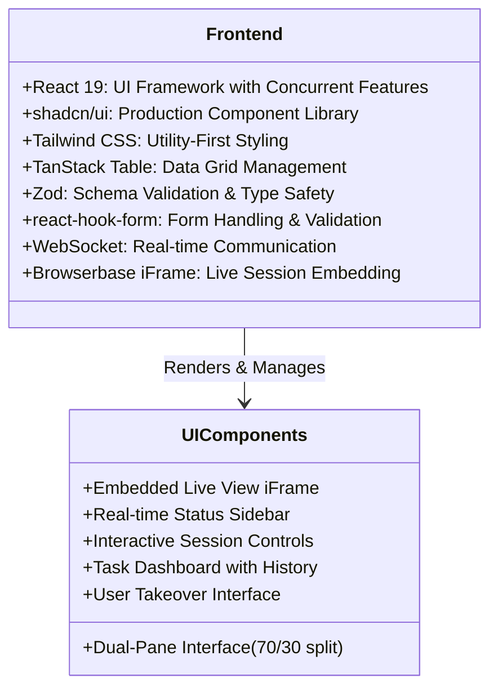
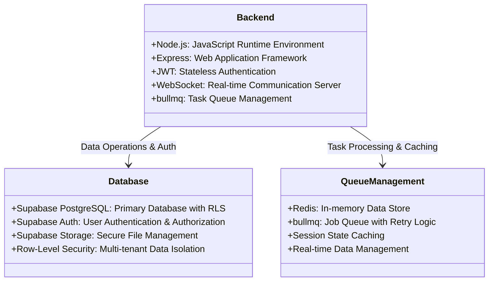
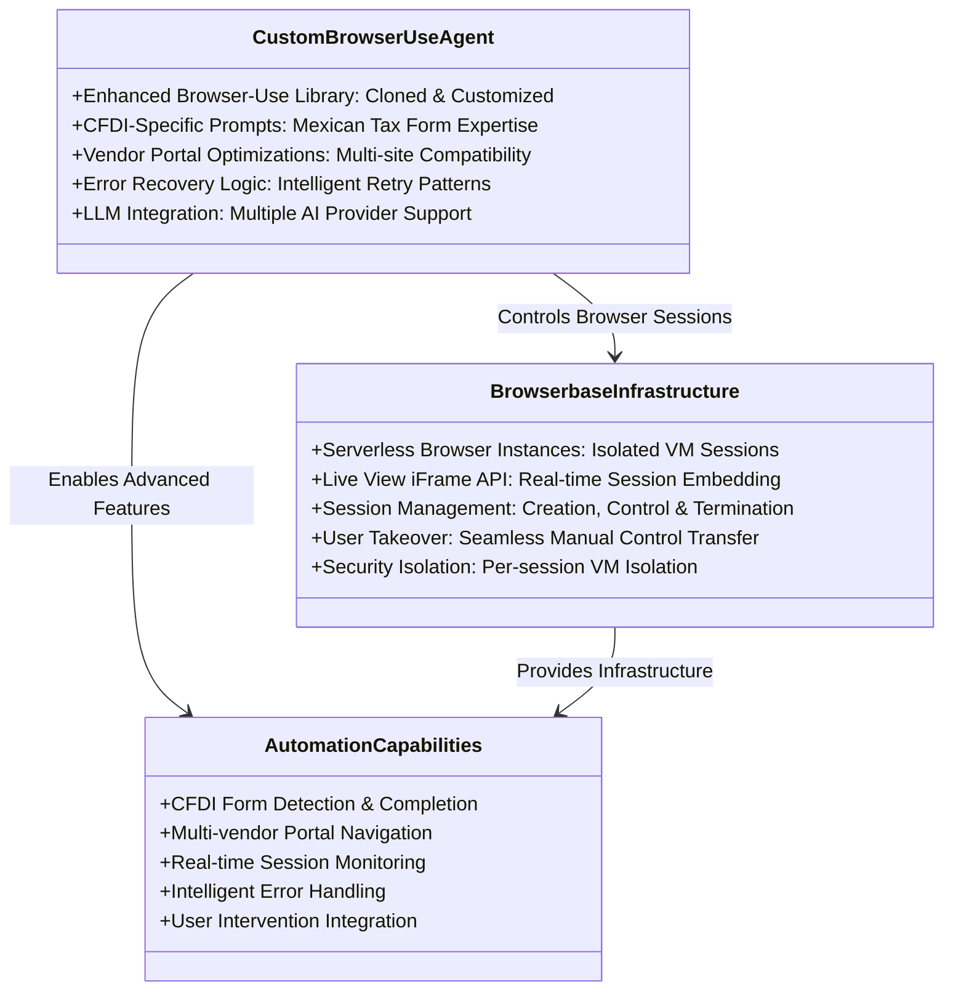
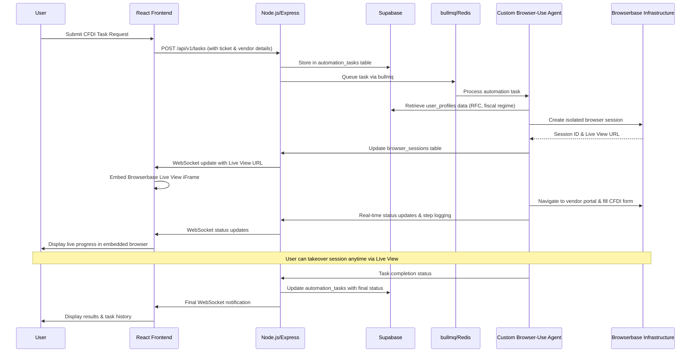
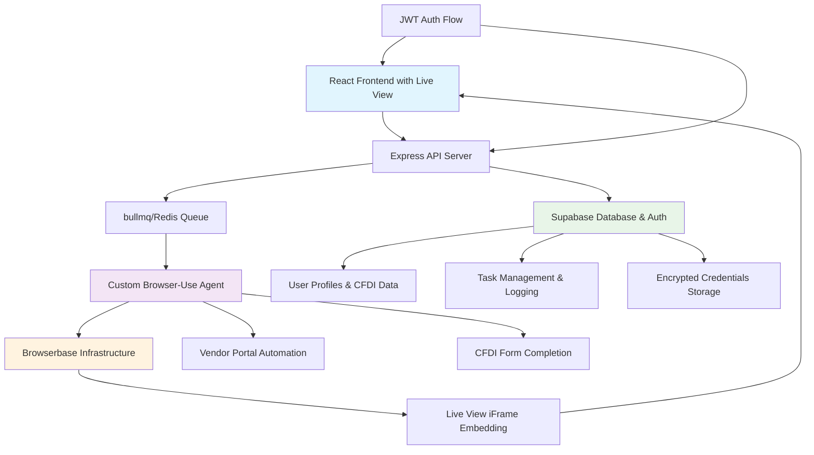
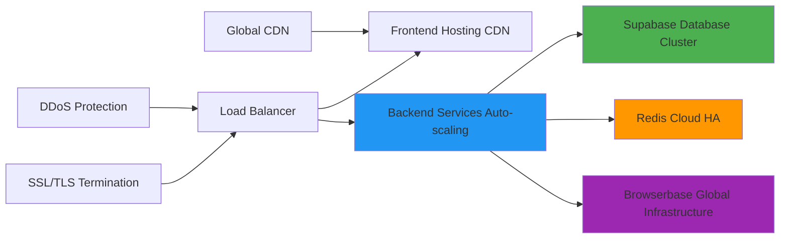
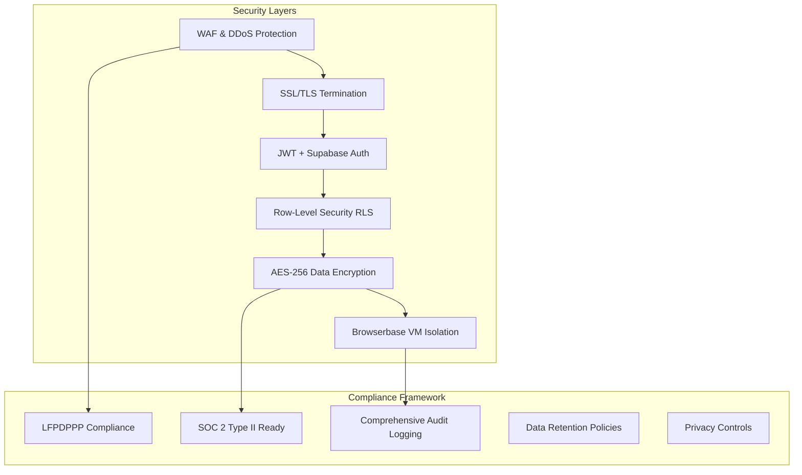

# Technology Stack Documentation

## Technology Stack Overview

The technology stack is designed to support a SaaS application that automates the manual process of filling out Mexican CFDI 4.0 invoicing forms across vendor portals. The stack leverages **our custom-enhanced Browser-Use AI agent** with **Browserbase's headless browser infrastructure** for real-time transparency, enabling small businesses and freelancers to automate repetitive form submission tasks while maintaining full visibility and control through embedded Live View iFrames.

**Primary Objectives:**

- Automate CFDI 4.0 form completion across diverse vendor portals using our enhanced Browser-Use agent
- Provide real-time transparency through embedded Browserbase Live View iFrames (not streaming)
- Enable seamless user intervention and takeover capabilities via browser session control
- Ensure secure, scalable multi-tenant architecture with Supabase backend and JWT authentication
- Deliver efficient task processing with robust error handling and retry logic via bullmq

---

## Frontend Technologies

The frontend is built as a dynamic and responsive single-page application (SPA), enabling user interactions, embedded Live View browser sessions, and real-time updates via WebSockets.

### Core Framework & Libraries:

- **React 19**: Modern UI framework with concurrent features for dynamic user interfaces and component-based architecture
- **shadcn/ui**: Production-ready component library ensuring UI consistency and accessibility compliance
- **Tailwind CSS**: Utility-first CSS framework for responsive design and rapid styling development
- **TanStack Table**: High-performance data grid solution for task history tracking and management
- **Zod**: TypeScript-first schema validation for form inputs, API responses, and data integrity
- **react-hook-form**: Performance-focused form library with built-in validation and error handling

### Real-Time Integration & Session Management:

- **WebSocket Client**: Real-time communication for task status updates and step logging at `/ws/:taskId`
- **Browserbase Live View iFrame**: Embedded browser session visibility with user takeover controls
- **JWT Authentication**: Secure token-based authentication integrated with Supabase Auth
- **Session State Management**: React Context for global state and local component state management



---

## Backend Technologies

The backend handles API requests, manages business logic, orchestrates automation tasks, and integrates with Supabase for data persistence and Browserbase for browser session management.

### Core Backend Components:

- **Node.js/Express**: Server-side runtime and web framework for RESTful API development
- **Supabase**: Comprehensive backend-as-a-service providing PostgreSQL database with Row-Level Security, Supabase Auth, and secure file storage
- **bullmq with Redis**: Robust task queue management with retry logic, delayed jobs, and job prioritization
- **JWT**: JSON Web Tokens for secure stateless authentication and authorization
- **WebSocket Server**: Real-time communication for live status updates and task monitoring

### Database & Storage Architecture:

- **PostgreSQL (via Supabase)**: Primary relational database with ACID compliance for user data, task records, and application state
- **Supabase Auth**: Managed authentication service with multi-tenant support and Row-Level Security policies
- **Supabase Storage**: Secure file storage for user documents, session recordings, and task artifacts
- **Redis**: In-memory data store for task queuing, session caching, and real-time data management



---

## AI & Automation Technologies

This layer is responsible for automating interactions with vendor portals, filling out CFDI 4.0 forms, and handling user interventions through our custom-enhanced Browser-Use agent and Browserbase infrastructure.

### Custom Browser Automation Stack:

- **Enhanced Browser-Use Agent**: Cloned and customized version of the open-source Browser-Use library with CFDI-specific prompts, Mexican vendor portal optimizations, and enhanced error handling
- **Browserbase Infrastructure**: Serverless headless browser platform providing isolated browser instances with Live View iFrame generation and session management APIs

### Advanced Automation Capabilities:

- **CFDI-Specific Form Recognition**: Specialized AI prompts for detecting and filling Mexican tax form fields (RFC, fiscal regime, postal codes)
- **Vendor Portal Adaptation**: Dynamic prompt adjustment for different vendor website structures and layouts
- **Intelligent Error Recovery**: Automated retry logic with pattern recognition for common failure points
- **Seamless User Takeover**: Real-time transition from agent control to manual user control via embedded Live View



---

## System Architecture Integration

The system follows a modern microservices architecture with clear separation of concerns and seamless integration between all components.

### Comprehensive Data Flow Architecture:



### Enhanced Component Integration:



---

## Enhanced Database Schema Integration

### Core Tables (Synchronized with Schema Design Document):

- **users**: Managed by Supabase Auth (id, email, created_at)
- **user_profiles**: CFDI-specific data (rfc, fiscal_regime, postal_code, company_details)
- **automation_tasks**: Main task tracking (status, vendor_url, ticket_details, current_live_url)
- **task_steps**: Detailed step logging for real-time updates and debugging
- **browser_sessions**: Browserbase session management (session_id, status, session_data)
- **user_vendor_credentials**: Encrypted vendor portal credentials with AES-256 encryption

### Database Performance & Security:

- **Row-Level Security (RLS)**: Multi-tenant data isolation ensuring users only access their own data
- **Connection Pooling**: Optimized database connections via Supabase's built-in pooling
- **Automated Backups**: Daily backups with point-in-time recovery capabilities
- **Audit Logging**: Comprehensive tracking of all data operations for compliance

---

## Deployment Infrastructure

### Cloud-Native Hosting & Infrastructure:

- **Frontend Deployment**: Modern web hosting platform (Vercel/Netlify) with edge caching and global CDN
- **Backend Deployment**: Containerized deployment on cloud platforms (Railway/Render/Fly.io) with auto-scaling
- **Database**: Supabase managed PostgreSQL with automatic scaling and maintenance
- **Cache/Queue**: Redis Cloud or managed Redis service with high availability
- **Browser Infrastructure**: Browserbase serverless platform with global data centers

### Enhanced Performance Requirements:

- **API Response Time**: <200ms for standard operations, <100ms for cached responses
- **Global Task Timeout**: 3 minutes maximum per automation task
- **Browser Action Timeout**: 10 seconds per individual browser action
- **Concurrent Sessions**: Support for 50+ simultaneous automation tasks via Browserbase auto-scaling
- **WebSocket Latency**: <300ms for real-time status updates
- **Live View iFrame Load**: <2 seconds for embedded browser session visibility
- **Database Query Performance**: <50ms for indexed queries, <200ms for complex joins



---

## Advanced Security Architecture

### Multi-Layer Security Implementation:

- **Multi-tenant JWT Authentication**: Secure token-based access control via Supabase Auth with automatic refresh
- **End-to-End Encryption**: HTTPS/WSS for all communications, AES-256 for data at rest
- **Browser Session Isolation**: Dedicated VM instances per task via Browserbase with no cross-contamination
- **Data Protection Compliance**: Full LFPDPPP (Mexican data protection law) compliance with audit trails

### Enhanced Compliance & Data Protection:

- **Mexican Data Protection Laws (LFPDPPP)**: Complete compliance with local regulations
- **Encrypted Sensitive Data**: RFC, fiscal regime, vendor credentials encrypted with AES-256
- **Audit Trail Logging**: Comprehensive logging of all data access and modifications
- **Session Recording Controls**: Configurable recording policies via Browserbase API
- **Access Control**: Role-based permissions with Row-Level Security enforcement



---

## Scalability & Performance Optimization

### Horizontal Scaling Strategy:

- **User Scalability**: Architecture designed for 5,000+ concurrent users via Supabase auto-scaling
- **Task Processing**: bullmq with Redis clustering for high-throughput job processing
- **Browser Sessions**: Browserbase auto-scaling infrastructure handling 100+ concurrent sessions
- **Database Scaling**: Supabase read replicas and connection pooling for optimal performance
- **Microservices Ready**: Modular architecture enabling future service separation and scaling

### Performance Optimization Techniques:

- **Intelligent Caching Strategy**: Redis-based caching for user profiles, vendor configurations, and session data
- **Database Query Optimization**: Indexed queries, prepared statements, and optimized table relationships
- **CDN Integration**: Global content delivery for static assets and frontend resources
- **Load Balancing**: Intelligent request distribution across multiple backend instances
- **Resource Pooling**: Efficient connection pooling for database, Redis, and external API connections

---

## Technology Dependencies & Integration

### Core External Services:

- **Supabase Ecosystem**: Database (PostgreSQL), Authentication (Supabase Auth), Storage, and Edge Functions
- **Browserbase Platform**: Headless browser infrastructure with Live View API and session management
- **Redis Infrastructure**: In-memory data store for bullmq job queuing and session caching
- **Custom Browser-Use Agent**: Enhanced open-source library with CFDI-specific automation capabilities

### Development & Quality Assurance:

- **TypeScript**: End-to-end type safety across frontend and backend codebases
- **ESLint/Prettier**: Automated code quality enforcement and consistent formatting standards
- **Testing Frameworks**: Jest, React Testing Library, and Playwright for comprehensive test coverage
- **CI/CD Pipeline**: Automated testing, building, and deployment with quality gates
- **Performance Monitoring**: Real-time application performance monitoring and alerting

### API Integration Standards:

- **RESTful API Design**: Consistent HTTP methods, status codes, and response formats
- **OpenAPI Specification**: Complete API documentation with interactive testing capabilities
- **WebSocket Protocol**: Real-time bidirectional communication for live updates
- **Browserbase SDK**: Official SDK integration for browser session management
- **Supabase Client Libraries**: Official client libraries for database and auth operations

---

## Monitoring & Observability Framework

### Comprehensive Health Monitoring:

- **Application Performance Monitoring (APM)**: Real-time tracking of response times, throughput, and error rates
- **Infrastructure Monitoring**: Server resources, database performance, and Redis queue metrics
- **Browser Session Monitoring**: Browserbase session success rates, duration, and failure analysis
- **User Experience Monitoring**: Frontend performance, WebSocket latency, and user interaction tracking

### Advanced Logging & Analytics:

- **Structured Logging**: JSON-formatted logs with correlation IDs for distributed tracing
- **Error Tracking & Alerting**: Automated error detection with intelligent alerting thresholds
- **Business Metrics**: Task completion rates, user engagement, and automation success analytics
- **Security Monitoring**: Authentication failures, suspicious activity detection, and compliance auditing

### Backup & Disaster Recovery:

- **Automated Database Backups**: Daily incremental backups with point-in-time recovery via Supabase
- **Cross-Region Redundancy**: Multi-region deployment strategy for high availability
- **Data Retention Policies**: Configurable retention periods for different data types and compliance requirements
- **Disaster Recovery Testing**: Regular DR drills and automated failover procedures

---

## Future Technology Roadmap

### Next-Generation Enhancements:

- **AI/ML Integration**: Machine learning models for form field recognition and vendor portal adaptation
- **Advanced Analytics**: Predictive analytics for task success rates and performance optimization
- **Multi-Language Support**: Internationalization framework for English and indigenous language support
- **Mobile SDK**: Native mobile applications for iOS and Android with offline capabilities
- **API Marketplace**: Third-party integrations with popular Mexican accounting and ERP systems

### Technology Evolution Path:

- **Microservices Migration**: Gradual transition to containerized microservices architecture
- **Edge Computing**: Edge deployment for reduced latency in different Mexican regions
- **Advanced AI Capabilities**: Integration with latest LLM models and computer vision for enhanced automation
- **Blockchain Integration**: Secure audit trails and immutable compliance records
- **Real-Time Collaboration**: Multi-user session sharing and collaborative task management

---

## Development Environment & Tooling

### Local Development Setup:

```bash
# Core technology versions
Node.js: 20.x LTS
Python: 3.11+ (for Browser-Use agent development)
TypeScript: 5.x
React: 19.x
PostgreSQL: 15.x (via Supabase)
Redis: 7.x

```

### Development Tools & Standards:

- **Package Management**: npm/yarn with lockfile management and security auditing
- **Code Quality**: ESLint, Prettier, Husky pre-commit hooks, and SonarQube integration
- **Testing Strategy**: Unit tests (95%+ coverage), integration tests, and end-to-end automation testing
- **Documentation**: JSDoc, OpenAPI specs, and comprehensive README documentation
- **Version Control**: Git with conventional commits and automated release management

### Production Deployment Stack:

- **Containerization**: Docker with multi-stage builds and optimized image sizes
- **Orchestration**: Kubernetes or Docker Swarm for container orchestration
- **CI/CD Pipeline**: GitHub Actions/GitLab CI with automated testing and deployment
- **Environment Management**: Infrastructure as Code (IaC) with Terraform or Pulumi
- **Secrets Management**: Secure credential storage with rotation policies

---

## Cost Optimization & Resource Management

### Efficient Resource Utilization:

- **Supabase Pricing**: Optimized for growth with predictable scaling costs
- **Browserbase Usage**: Efficient session management to minimize browser-hour consumption
- **Redis Optimization**: Smart caching strategies to reduce memory usage and costs
- **CDN Efficiency**: Optimized content delivery to minimize bandwidth costs

### Performance vs. Cost Balance:

- **Auto-scaling Policies**: Intelligent scaling based on actual usage patterns
- **Resource Monitoring**: Continuous monitoring of resource utilization and cost optimization
- **Caching Strategies**: Aggressive caching to reduce database queries and API calls
- **Session Optimization**: Efficient browser session lifecycle management

This synchronized technology stack documentation provides a comprehensive foundation for the CFDI automation platform, ensuring all components work together seamlessly while maintaining accuracy about Browserbase's headless browser infrastructure capabilities and our custom Browser-Use agent implementation.

Technology Docs: 

 https://supabase.com/docs

https://docs.browserbase.com/introduction/what-is-browserbase

https://docs.browser-use.com/introduction

[https://github.com/browser-use/browser-use](https://github.com/browser-use/browser-use)

https://redis.io/docs/latest/